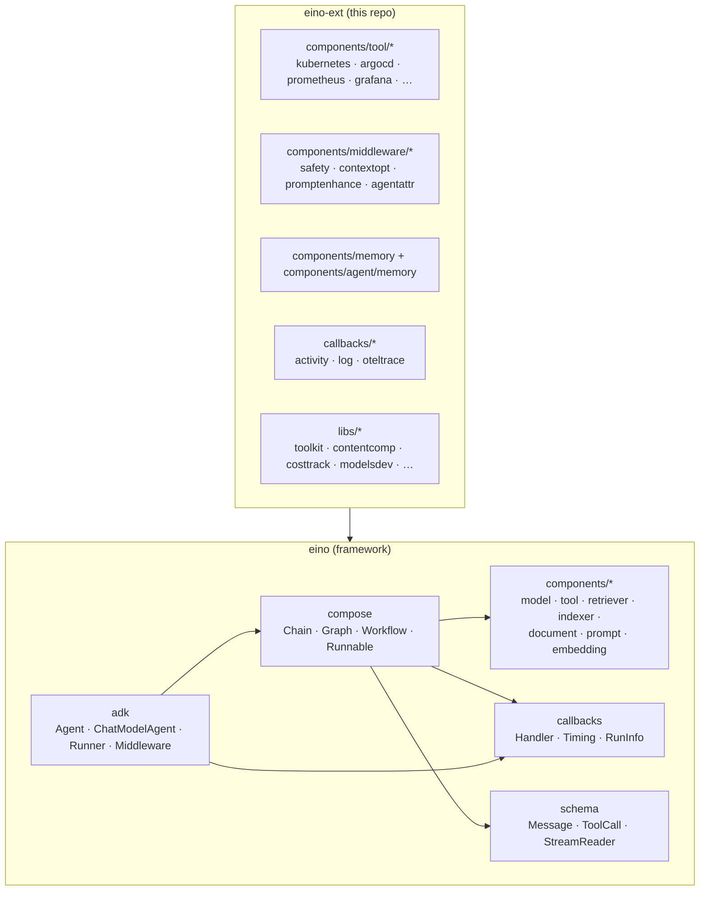
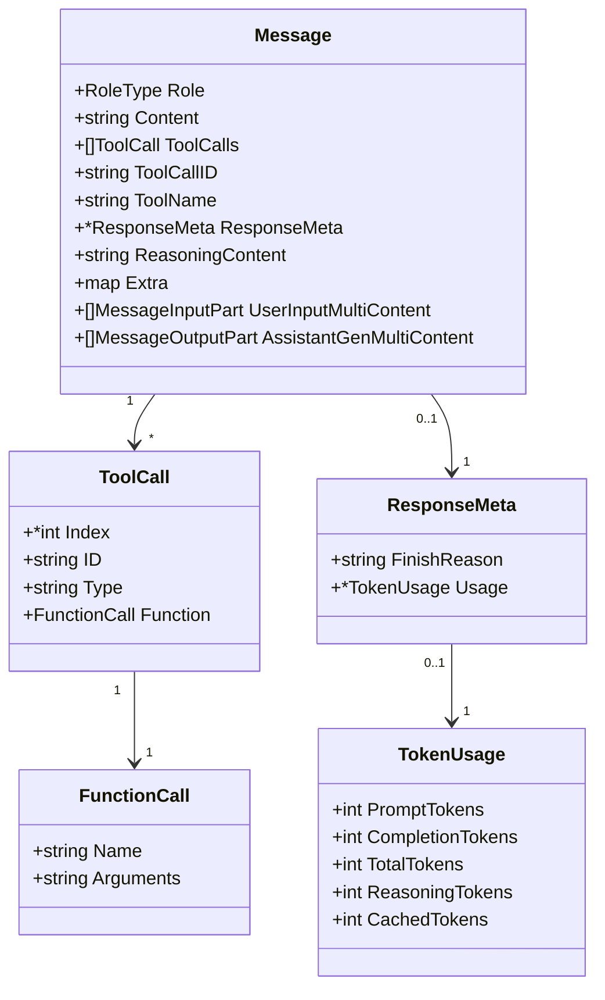
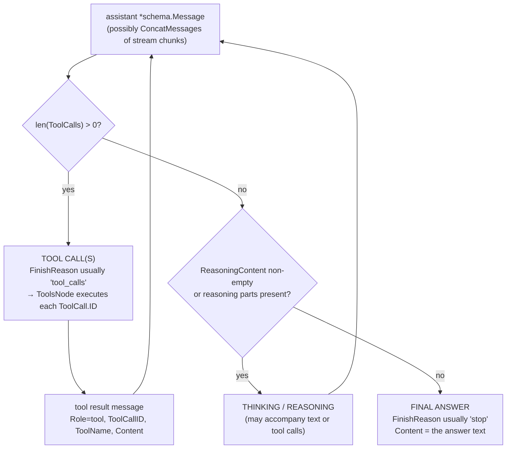
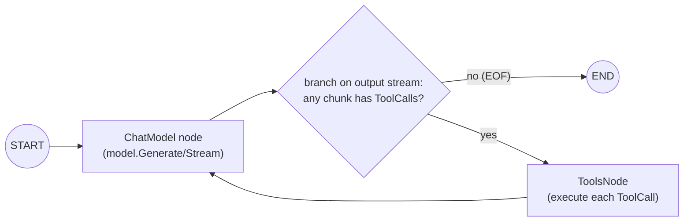
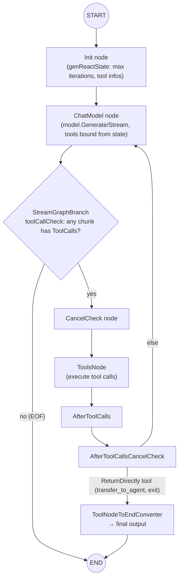
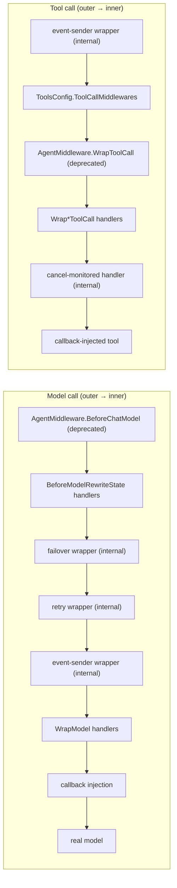
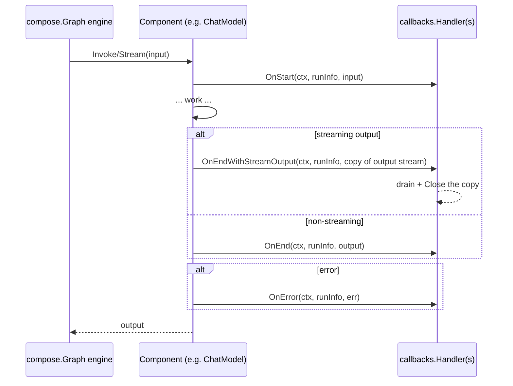

# eino framework & adk — Technical design

> **Scope:** the [eino](https://github.com/cloudwego/eino) framework (pinned at
> `v0.9.12` in this repository) and its `adk` subpackage (Agent Development Kit).
> This document explains how the framework works: the component abstractions, how
> messages flow, how to identify thinking / tool calls / the final answer, the
> agent loop, the callback system, and the adk APIs.
>
> **Companion documents:**
> - [`02-eino-ext-shared-libraries.en.md`](./02-eino-ext-shared-libraries.en.md) —
>   design of the eino-ext shared libraries built on top of eino.
> - Français : [`01-eino-framework-and-adk.fr.md`](./01-eino-framework-and-adk.fr.md)

---

## 1. Introduction

**eino** is CloudWeGo's LLM application framework for Go. Its core idea: every
piece of an LLM application (chat models, tools, retrievers, document loaders,
prompt templates, embedders, indexers) is a **component** behind a small interface,
and applications are built by **composing** those components into chains and
graphs (**`compose`**). On top of that, the **`adk`** subpackage provides an
agent-oriented API: a `ChatModelAgent` that runs the model → tools → model loop,
with events, middleware, session state, interrupts/resume, and cancellation.

**eino-ext** (this repository) is the community extension layer: tool families
(kubernetes, argocd, prometheus, grafana, …), adk middlewares (safety, context
optimization, prompt enhancement), memory/history, cost tracking, and callbacks
(activity stream, logging, OpenTelemetry). It never reimplements eino — it builds
on its abstractions.



---

## 2. eino at a glance

### 2.1 Component abstractions

eino defines one interface per abstraction. Components are implementations;
`compose` wires them together.

| Abstraction | Package | Core interface | Purpose |
|---|---|---|---|
| Chat model | `components/model` | `BaseChatModel` (alias of `BaseModel[*schema.Message]`), `ToolCallingChatModel` | Generate / Stream text from messages; bind tools |
| Tool | `components/tool` | `BaseTool`, `InvokableTool`, `StreamableTool`, `EnhancedInvokableTool`, `EnhancedStreamableTool` | Executable functions the model can call |
| Prompt template | `components/prompt` | `ChatTemplate` | Render `[]*schema.Message` from variables |
| Retriever | `components/retriever` | `Retriever` | Fetch `[]*schema.Document` for a query |
| Indexer | `components/indexer` | `Indexer` | Store documents |
| Document | `components/document` | `Loader`, `Parser`, `Transformer` | Load / parse / transform documents |
| Embedding | `components/embedding` | `Embedder` | Text → vectors |

Each component also carries **callbacks** (see §9): the graph engine notifies
registered `callbacks.Handler`s at well-defined timings (`OnStart`, `OnEnd`, …)
for every component execution.

### 2.2 Orchestration — `compose`

`compose` turns components into runnable pipelines:

- **`Runnable[I, O]`** — the universal interface: `Invoke`, `Stream`, `Collect`,
  `Transform`. Components that implement only some paradigms are auto-converted.
- **`Chain[I, O]`** — a linear, builder-style pipeline (`AppendChatModel`,
  `AppendToolsNode`, `AppendLambda`, …).
- **`Graph[I, O]`** — a general graph (`AddChatModelNode`, `AddToolsNode`,
  `AddEdge`, `AddBranch`, `Compile`). Two execution modes: **Pregel**
  (`NodeTriggerMode = AnyPredecessor`, default, cycles allowed — needed for the
  model ↔ tools loop) and **DAG** (`AllPredecessor`).
- **`Workflow[I, O]`** — a graph with declarative field mapping between nodes
  (`AddInput` with `FieldMapping`, `SetStaticValue`, …).

### 2.3 The message — `schema`

Everything flows as `*schema.Message` (see §4). Streaming flows as
`*schema.StreamReader[*schema.Message]` (see §6).

---

## 3. Components in detail

### 3.1 Chat model — `components/model`

```go
// Generic over the message type; sealed to *schema.Message or *schema.AgenticMessage.
type BaseModel[M messageType] interface {
    Generate(ctx context.Context, input []M, opts ...Option) (M, error)
    Stream(ctx context.Context, input []M, opts ...Option) (*schema.StreamReader[M], error)
}
type BaseChatModel = BaseModel[*schema.Message]   // alias
type AgenticModel  = BaseModel[*schema.AgenticMessage]

type ToolCallingChatModel interface {
    BaseChatModel
    WithTools(tools []*schema.ToolInfo) (ToolCallingChatModel, error) // immutable
}
// type ChatModel (BindTools) — Deprecated: use ToolCallingChatModel.
```

`model.Option` configures a call: `WithTools`, `WithTemperature`, `WithMaxTokens`,
`WithModel`, `WithTopP`, `WithStop`, `WithToolChoice(schema.ToolChoice, allowedToolNames...)`,
`WithToolSearchTool`, `WithDeferredTools`, `WithAgenticToolChoice`, plus
implementation-specific options via `WrapImplSpecificOptFn[T]` /
`GetImplSpecificOptions[T]`.

`schema.ToolChoice` constants: `ToolChoiceForbidden` (`"forbidden"`),
`ToolChoiceAllowed` (`"allowed"`), `ToolChoiceForced` (`"forced"`).

Callbacks payloads (`components/model/callback_extra.go`):
`model.CallbackInput{Messages, Tools, ToolChoice, Config, Extra}` and
`model.CallbackOutput{Message, Config, TokenUsage, Extra}` (with `Conv*` helpers
accepting raw `[]*schema.Message` forms).

### 3.2 Tool — `components/tool`

```go
type BaseTool interface {
    Info(ctx context.Context) (*schema.ToolInfo, error)
}
type InvokableTool interface {
    BaseTool
    InvokableRun(ctx context.Context, argumentsInJSON string, opts ...Option) (string, error)
}
type StreamableTool interface {
    BaseTool
    StreamableRun(ctx context.Context, argumentsInJSON string, opts ...Option) (*schema.StreamReader[string], error)
}
type EnhancedInvokableTool interface {
    BaseTool
    InvokableRun(ctx context.Context, toolArgument *schema.ToolArgument, opts ...Option) (*schema.ToolResult, error)
}
type EnhancedStreamableTool interface {
    BaseTool
    StreamableRun(ctx context.Context, toolArgument *schema.ToolArgument, opts ...Option) (*schema.StreamReader[*schema.ToolResult], error)
}
```

When a tool implements both standard and enhanced interfaces, `ToolsNode`
prioritizes the enhanced one. `tool.Option` carries implementation-specific
options (`WrapImplSpecificOptFn[T]` / `GetImplSpecificOptions[T]`).

`components/tool/utils` builds tools from plain Go functions:

```go
searchTool, err := utils.InferTool("search", "search the web",
    func(ctx context.Context, q struct{ Query string `json:"query"` }) (string, error) { ... })
// InferTool reflects the input struct into a JSON schema (ParamsOneOf),
// JSON-decodes the arguments, and JSON-encodes the result.
// Variants: InferStreamTool, InferOptionableTool, InferEnhancedTool,
// NewTool(desc, fn), NewStreamTool, NewEnhancedTool, GoStruct2ParamsOneOf[T], GoStruct2ToolInfo[T].
```

`schema.ToolInfo{Name, Desc, Extra, *ParamsOneOf}` describes a tool to the model.
`ParamsOneOf` is built either from `map[string]*ParameterInfo`
(`NewParamsOneOfByParams`) or from a full JSON Schema (`NewParamsOneOfByJSONSchema`);
`ToJSONSchema()` normalizes both.

Tool interrupts (`components/tool/interrupt.go`): `tool.Interrupt(ctx, info)`,
`tool.StatefulInterrupt(ctx, info, state)`, `tool.CompositeInterrupt(ctx, info, state, errs...)`,
`tool.GetInterruptState[T](ctx)`, `tool.GetResumeContext[T](ctx)`.

### 3.3 ToolsNode — the tool executor in `compose`

```go
type ToolsNodeConfig struct {
    Tools                []tool.BaseTool
    ToolAliases          map[string]ToolAliasConfig
    UnknownToolsHandler  func(ctx, name, input string) (string, error)
    ExecuteSequentially  bool   // default: parallel tool calls
    ToolArgumentsHandler func(ctx, name, arguments string) (string, error)
    ToolCallMiddlewares  []ToolMiddleware
}
func NewToolNode(ctx context.Context, conf *ToolsNodeConfig) (*ToolsNode, error) // singular "Tool"
```

`ToolsNode.Invoke(ctx, *schema.Message) ([]*schema.Message, error)` takes the
assistant message carrying `ToolCalls`, executes each call (parallel by default),
and returns one **tool message** per call, in order:
`schema.ToolMessage(result, callID, schema.WithToolName(name))`.

`ToolMiddleware` wraps the four endpoint types (`InvokableToolMiddleware`,
`StreamableToolMiddleware`, `EnhancedInvokableToolMiddleware`,
`EnhancedStreamableToolMiddleware`); the first middleware in the slice is the
outermost.

---

## 4. Messages — `schema.Message`

`schema.Message` is the single currency of eino: model input, model output, user
input, tool output.

```go
type RoleType string
const (
    Assistant RoleType = "assistant"
    User      RoleType = "user"
    System    RoleType = "system"
    Tool      RoleType = "tool"
)

type FunctionCall struct {
    Name      string `json:"name,omitempty"`
    Arguments string `json:"arguments,omitempty"` // JSON string
}
type ToolCall struct {
    Index    *int              `json:"index,omitempty"` // stream chunk merge key
    ID       string            `json:"id"`
    Type     string            `json:"type"`            // usually "function"
    Function FunctionCall      `json:"function"`
    Extra    map[string]any    `json:"extra,omitempty"`
}

type ResponseMeta struct {
    FinishReason string      // model-defined: "stop", "length", "tool_calls", "content_filter", …
    Usage        *TokenUsage
    LogProbs     *LogProbs
}
type TokenUsage struct {
    PromptTokens            int
    PromptTokenDetails      PromptTokenDetails      // {CachedTokens}
    CompletionTokens        int
    TotalTokens             int
    CompletionTokensDetails CompletionTokensDetails // {ReasoningTokens}
}

type Message struct {
    Role       RoleType
    Content    string                  // user text in / model text out
    MultiContent []ChatMessagePart    // Deprecated
    UserInputMultiContent    []MessageInputPart  // user multimodal input
    AssistantGenMultiContent []MessageOutputPart // model multimodal output
    Name       string
    ToolCalls  []ToolCall              // assistant only
    ToolCallID string                   // tool message only (correlates to ToolCall.ID)
    ToolName   string                   // tool message only
    ResponseMeta *ResponseMeta
    ReasoningContent string             // flat reasoning/thinking field
    Extra      map[string]any          // custom metadata (markers, IDs, …)
}
```



### 4.1 Multimodal content

```go
type ChatMessagePartType string
const (
    ChatMessagePartTypeText            = "text"
    ChatMessagePartTypeImageURL        = "image_url"
    ChatMessagePartTypeAudioURL        = "audio_url"
    ChatMessagePartTypeVideoURL        = "video_url"
    ChatMessagePartTypeFileURL         = "file_url"
    ChatMessagePartTypeReasoning       = "reasoning"
    ChatMessagePartTypeToolSearchResult = "tool_search_result"
)
// Input parts: MessageInputPart{Type, Text, Image *MessageInputImage, Audio, Video, File, …}
// Output parts: MessageOutputPart{Type, Text, Image/Audio/Video, Reasoning *MessageOutputReasoning, StreamingMeta, …}
type MessageOutputReasoning struct {
    Text      string // thought summary or raw reasoning
    Signature string // encrypted reasoning tokens to pass back to the model
}
```

Media parts carry `MessagePartCommon{URL *string, Base64Data *string, MIMEType string}`.

### 4.2 Constructors

```go
func SystemMessage(content string) *Message
func UserMessage(content string) *Message
func AssistantMessage(content string, toolCalls []ToolCall) *Message
func ToolMessage(content string, toolCallID string, opts ...ToolMessageOption) *Message // WithToolName(name)
```

### 4.3 Extra markers

`Message.Extra map[string]any` is the extension point. eino-ext uses boolean
markers extensively (e.g. `memory.SummaryMarkerKey`, `memory.IncompleteMarkerKey`,
`memory.EphemeralMarkerKey`, `contextopt.PruneMarkerKey`) — see the companion doc.

---

## 5. Identifying thinking, tool calls, and the final answer

Given an assistant `*schema.Message` produced by a model (possibly reassembled
from a stream), here is how to classify it:

| What | Where | Rule |
|---|---|---|
| **Thinking / reasoning** | `msg.ReasoningContent` (flat string) and/or `msg.AssistantGenMultiContent` parts with `Type == ChatMessagePartTypeReasoning` (`part.Reasoning.Text`, `part.Reasoning.Signature`) | non-empty reasoning ⇒ the model is "thinking" |
| **Tool call(s)** | `msg.ToolCalls` (non-empty); typically `msg.ResponseMeta.FinishReason == "tool_calls"` | assistant message requesting tool execution |
| **Final answer** | `msg.Role == Assistant`, `len(msg.ToolCalls) == 0`, text in `msg.Content` (or text parts), usually `FinishReason == "stop"` | the model is done |
| **Tool result** | `msg.Role == Tool`, `msg.ToolCallID` set (correlates to the assistant `ToolCall.ID`), `msg.ToolName` set, result in `msg.Content` | fed back to the model |

`FinishReason` is **model-defined**; the common values are `"stop"`, `"length"`,
`"tool_calls"`, `"content_filter"`. Never rely on it alone — combine with the
presence of `ToolCalls`.



In the **adk** event stream, the same classification is pre-computed for you:
`adk.MessageVariant{Role, ToolName, IsStreaming, Message, MessageStream}` —
`Role == schema.Assistant` is a model output, `Role == schema.Tool` (with
`ToolName`) is a tool result, and `GetMessage()` concatenates a stream.

---

## 6. Streaming — `schema.StreamReader`

```go
type StreamReader[T any] struct{ /* read-once */ }
func (sr *StreamReader[T]) Recv() (T, error)     // io.EOF at end
func (sr *StreamReader[T]) Close()
func (sr *StreamReader[T]) Copy(n int) []*StreamReader[T] // fan-out; original unusable after
func (sr *StreamReader[T]) SetAutomaticClose()

func Pipe[T any](cap int) (*StreamReader[T], *StreamWriter[T]) // StreamWriter: Send(chunk, err); Close()
func StreamReaderFromArray[T any](arr []T) *StreamReader[T]
func StreamReaderWithConvert[T, D any](sr *StreamReader[T], convert func(T) (D, error), opts ...ConvertOption) *StreamReader[D]
// ConvertOption: WithErrWrapper(func(error) error), WithOnEOF(func() (any, error)); sentinel ErrNoValue skips a chunk
func MergeStreamReaders[T any](srs []*StreamReader[T]) *StreamReader[T]
func MergeNamedStreamReaders[T any](srs map[string]*StreamReader[T]) *StreamReader[T] // emits *SourceEOF per source
```

**Chunk merging.** Streams are merged by registered concat functions
(`compose.RegisterStreamChunkConcatFunc[T]`). `schema` registers at init:

- `ConcatMessages([]*Message) (*Message, error)` — Content/ReasoningContent
  concatenated; **tool-call chunks merged by `ToolCall.Index`** (arguments
  concatenated; ID/type/name must match); last non-empty `FinishReason` wins;
  `Usage` merged per-field max; `Extra` merged; multimodal parts merged by type +
  `StreamingMeta.Index`.
- `ConcatMessageStream(sr)`, `ConcatMessageArray`, `ConcatToolResults`,
  `ConcatAgenticMessages`, `ConcatAgenticMessagesArray`.

This is what powers `Invoke` on a stream-only node and what
`adk.MessageVariant.GetMessage()` uses to materialize a streamed event.

---

## 7. Orchestration — `compose`

### 7.1 Runnable, Chain, Graph, Workflow

```go
type Runnable[I, O any] interface {
    Invoke(ctx context.Context, input I, opts ...Option) (O, error)
    Stream(ctx context.Context, input I, opts ...Option) (*schema.StreamReader[O], error)
    Collect(ctx context.Context, input *schema.StreamReader[I], opts ...Option) (O, error)
    Transform(ctx context.Context, input *schema.StreamReader[I], opts ...Option) (*schema.StreamReader[O], error)
}
```

```go
// Chain — linear builder
ch := compose.NewChain[[]*schema.Message, *schema.Message]()
ch.AppendChatModel(model).AppendToolsNode(toolsNode) // etc.
runnable, err := ch.Compile(ctx, compose.WithMaxRunSteps(25))

// Graph — general graph
g := compose.NewGraph[[]*schema.Message, *schema.Message]()
g.AddChatModelNode("model", chatModel)
toolsNode, _ := compose.NewToolNode(ctx, &compose.ToolsNodeConfig{Tools: tools})
g.AddToolsNode("tools", toolsNode)
g.AddEdge(compose.START, "model")
g.AddBranch("model", compose.NewStreamGraphBranch(toolCallCheck, map[string]bool{"tools": true, compose.END: true}))
g.AddEdge("tools", "model")
runnable, _ := g.Compile(ctx)

// Workflow — graph + field mapping
wf := compose.NewWorkflow[Input, Output]()
node := wf.AddChatModelNode("model", m)
node.AddInput("input", compose.FieldMapping...) // or SetStaticValue
```

### 7.2 The agent loop (the pattern adk generalizes)



A branch condition consumes the model's output stream chunk by chunk and returns
`"tools"` as soon as a chunk carries `ToolCalls`, or `compose.END` on EOF.

### 7.3 Lambda

```go
compose.AnyLambda[I, O, TOption](invoke, stream, collect, transform, opts...) (*Lambda, error)
compose.InvokableLambda[I, O](invokeWOOpt, opts...) *Lambda
compose.StreamableLambda / CollectableLambda / TransformableLambda (+ WithOption variants)
compose.ToList[I](), compose.MessageParser[T](schema.MessageParser[T])
// LambdaOpt: WithLambdaCallbackEnable(bool), WithLambdaType(string)
```

### 7.4 Call options & compile options

Call options (`compose.Option`): `WithCallbacks(...)`, `WithChatModelOption(...)`,
`WithToolsNodeOption(...)`, `WithChatTemplateOption(...)`, `WithLambdaOption(...)`,
`WithEmbeddingOption/WithRetrieverOption/WithLoaderOption/WithDocumentTransformerOption/WithIndexerOption(...)`,
`WithRuntimeMaxSteps(int)`, `WithCheckPointID(id)`, `WithWriteToCheckPointID(id)`,
`WithForceNewRun()`, `WithStateModifier(sm)`, `WithGraphInterrupt(ctx)`.
Options are targetable: `.DesignateNode("key")` / `.DesignateNodeWithPath(...)`.

Compile options: `WithMaxRunSteps`, `WithGraphName`, `WithNodeTriggerMode`,
`WithGraphCompileCallbacks`, `WithFanInMergeConfig`, `WithCheckPointStore`,
`WithSerializer`, `WithInterruptBeforeNodes/AfterNodes`.

### 7.5 Graph state

```go
compose.WithGenLocalState[S](func(ctx) S)            // NewGraphOption
compose.StatePreHandler[I, S]  func(ctx, in I, state S) (I, error)
compose.StatePostHandler[O, S] func(ctx, out O, state S) (O, error)
compose.StreamStatePreHandler[I, S]  func(ctx, *StreamReader[I], S) (*StreamReader[I], error)
compose.StreamStatePostHandler[O, S] func(ctx, *StreamReader[O], S) (*StreamReader[O], error)
compose.ProcessState[S](ctx, func(ctx, S) error) error // mutex-protected; inner shadows outer
```
Attached per node via `WithStatePreHandler` / `WithStatePostHandler` /
`WithStreamStatePreHandler` / `WithStreamStatePostHandler` (GraphAddNodeOpt).

### 7.6 Branches

```go
compose.NewGraphBranch[T](condition GraphBranchCondition[T], endNodes map[string]bool) *GraphBranch
compose.NewStreamGraphBranch[T](condition StreamGraphBranchCondition[T], endNodes map[string]bool) *GraphBranch
compose.NewGraphMultiBranch / NewStreamGraphMultiBranch
// NodeTriggerMode: AnyPredecessor (Pregel, default, cycles) | AllPredecessor (DAG)
```

### 7.7 Interrupts & checkpoints (compose level)

```go
compose.Interrupt(ctx, info any) error
compose.StatefulInterrupt(ctx, info any, state any) error
compose.CompositeInterrupt(ctx, info any, state any, errs ...error) error
compose.ExtractInterruptInfo(err) (*InterruptInfo, bool)
compose.GetInterruptState[T](ctx) (wasInterrupted, hasState bool, state T)
type InterruptInfo struct { State any; BeforeNodes, AfterNodes, RerunNodes []string; RerunNodesExtra map[string]any; SubGraphs map[string]*InterruptInfo; InterruptContexts []*InterruptCtx }
type CheckPointStore interface { Get(ctx, id string) ([]byte, bool, error); Set(ctx, id string, data []byte) error } // = core.CheckPointStore
type Serializer interface { Marshal(v any) ([]byte, error); Unmarshal(data []byte, v any) error }
compose.Address / AddressSegment / AddressSegmentType ("node" | "tool" | "runnable")
```

A component interrupts by returning the special error from
`compose.Interrupt(...)`; with a `CheckPointStore` configured, the run state is
persisted under a checkpoint ID and can be resumed (`WithCheckPointID`).

---

## 8. The `adk` subpackage (Agent Development Kit)

`adk` is eino's agent-oriented layer. Instead of hand-building the model ↔ tools
graph, you declare a **`ChatModelAgent`** and run it through a **`Runner`**.

### 8.1 Agent, Runner, run options

```go
// adk/interface.go
type Agent = TypedAgent[*schema.Message] // generic over *schema.Message | *schema.AgenticMessage
type TypedAgent[M MessageType] interface {
    Name(ctx context.Context) string
    Description(ctx context.Context) string
    Run(ctx context.Context, input *TypedAgentInput[M], options ...AgentRunOption) *AsyncIterator[*TypedAgentEvent[M]]
}
type ResumableAgent = TypedResumableAgent[*schema.Message] // adds Resume(ctx, *ResumeInfo, ...)

type TypedAgentInput[M MessageType] struct {
    Messages        []M
    EnableStreaming bool
}
type AgentInput = TypedAgentInput[*schema.Message]
```

```go
// adk/runner.go — there is NO package-level adk.Run; use a Runner (or agent.Run directly)
runner := adk.NewRunner(ctx, adk.RunnerConfig{Agent: agent, EnableStreaming: true, CheckPointStore: store})
iter := runner.Run(ctx, []adk.Message{schema.UserMessage("hi")}, opts...) // *adk.AsyncIterator[*adk.AgentEvent]
iter := runner.Query(ctx, "hi", opts...)
iter, err := runner.Resume(ctx, checkPointID, opts...)
iter, err := runner.ResumeWithParams(ctx, checkPointID, &adk.ResumeParams{Targets: map[string]any{...}}, opts...)
```

Run options (`adk.AgentRunOption`, functional options, targetable with
`DesignateAgent(name...)`):

```go
adk.WithSessionValues(map[string]any{...})
adk.WithCallbacks(handlers ...callbacks.Handler)
adk.WithChatModelOptions(opts ...model.Option)
adk.WithToolOptions(opts ...tool.Option)
adk.WithAgentToolRunOptions(map[string][]adk.AgentRunOption)
adk.WithCheckPointID(id string)
adk.WithCancel() (adk.AgentRunOption, adk.AgentCancelFunc)
// (deprecated) adk.WithHistoryModifier(...), adk.WithSkipTransferMessages()
```

### 8.2 Events

```go
type AgentEvent = TypedAgentEvent[*schema.Message]
type TypedAgentEvent[M MessageType] struct {
    AgentName string
    RunPath   []RunStep
    Output    *TypedAgentOutput[M]   // MessageOutput *TypedMessageVariant[M]; CustomizedOutput any
    Action    *AgentAction           // Exit | Interrupted | TransferToAgent | BreakLoop | CustomizedAction
    Err       error                  // may be *adk.CancelError; interrupt info in Action.Interrupted
}
type MessageVariant struct {           // = TypedMessageVariant[*schema.Message]
    IsStreaming   bool
    Message       *schema.Message
    MessageStream *schema.StreamReader[*schema.Message]
    Role          schema.RoleType       // Assistant (model output) or Tool (tool result)
    ToolName      string                // non-empty when Role == Tool
}
func (mv *MessageVariant) GetMessage() (*schema.Message, error) // concats stream

func adk.EventFromMessage(msg *schema.Message, stream *schema.StreamReader[*schema.Message], role schema.RoleType, toolName string) *AgentEvent

// iteration
for {
    ev, ok := iter.Next()   // AsyncIterator[*AgentEvent]
    if !ok { break }
    if ev.Err != nil { /* ... */ }
    msg, _, _ := adk.GetMessage(ev) // materialize (concats streaming events)
}
```

### 8.3 ChatModelAgent — the ReAct loop

```go
type ChatModelAgentConfig struct { // = TypedChatModelAgentConfig[*schema.Message]
    Name          string
    Description   string
    Instruction   string                 // system prompt; f-string placeholders filled from SessionValues
    Model         model.BaseChatModel    // must support WithTools when tools are used
    ToolsConfig   ToolsConfig            // ToolsNodeConfig + ReturnDirectly map[string]bool + EmitInternalEvents bool
    GenModelInput adk.TypedGenModelInput[*schema.Message] // default: system(instruction) + input messages
    Exit          tool.BaseTool          // optional exit tool
    OutputKey     string                 // session key where the final output content is stored
    MaxIterations int                    // default 20
    Handlers      []adk.ChatModelAgentMiddleware
    Middlewares   []adk.AgentMiddleware  // Deprecated struct-based middleware
    ModelRetryConfig    *adk.TypedModelRetryConfig[*schema.Message]
    ModelFailoverConfig *adk.ModelFailoverConfig
}
agent, err := adk.NewChatModelAgent(ctx, &adk.ChatModelAgentConfig{...})
```

Internally (`adk/react.go`, `newReact`) the agent is a compiled `compose.Graph`
(Pregel mode, cycles allowed) with graph-local state, wrapped in a Chain:



- **Max iterations:** default **20** (`MaxIterations <= 0` ⇒ 20). Exceeding it
  yields `adk.ErrExceedMaxIterations` (`"exceeds max iterations"`).
- **Stop conditions:** no tool calls → END; a `ReturnDirectly` tool
  (`transfer_to_agent`, `exit`) → its result becomes the final output; max
  iterations exceeded → error event; interrupt → `Action.Interrupted`; cancel →
  `Err = *CancelError`; `Action.Exit` → the flow agent stops.
- **State** (`adk/react.go`): messages, tool infos, `RemainingIterations`,
  `ToolGenActions`, `ReturnDirectlyEvent`, retry attempt, tool message IDs.
- **Retry** (`adk/retry_chatmodel.go`): `TypedModelRetryConfig{MaxRetries,
  ShouldRetry func(ctx, *TypedRetryContext[M]) *TypedRetryDecision[M], BackoffFunc}`;
  streaming is fully consumed before the retry decision; events still stream live.
- **Failover** (`adk/failover_chatmodel.go`): `ModelFailoverConfig{MaxRetries,
  ShouldFailover func(ctx, outputMessage M, outputErr error) bool, GetFailoverModel}`.

### 8.4 Middleware — `adk.ChatModelAgentMiddleware`

```go
type ChatModelAgentMiddleware = TypedChatModelAgentMiddleware[*schema.Message]
type TypedChatModelAgentMiddleware[M MessageType] interface {
    BeforeAgent(ctx, *ChatModelAgentContext) (context.Context, *ChatModelAgentContext, error)
    AfterAgent(ctx, *TypedChatModelAgentState[M]) (context.Context, error)
    BeforeModelRewriteState(ctx, *TypedChatModelAgentState[M], *TypedModelContext[M]) (context.Context, *TypedChatModelAgentState[M], error)
    AfterModelRewriteState(ctx, *TypedChatModelAgentState[M], *TypedModelContext[M]) (context.Context, *TypedChatModelAgentState[M], error)
    WrapInvokableToolCall(ctx, endpoint InvokableToolCallEndpoint, tCtx *ToolContext) (InvokableToolCallEndpoint, error)
    WrapStreamableToolCall(ctx, endpoint StreamableToolCallEndpoint, tCtx *ToolContext) (StreamableToolCallEndpoint, error)
    WrapEnhancedInvokableToolCall(ctx, endpoint EnhancedInvokableToolCallEndpoint, tCtx *ToolContext) (EnhancedInvokableToolCallEndpoint, error)
    WrapEnhancedStreamableToolCall(ctx, endpoint EnhancedStreamableToolCallEndpoint, tCtx *ToolContext) (EnhancedStreamableToolCallEndpoint, error)
    WrapModel(ctx, m model.BaseModel[M], mc *TypedModelContext[M]) (model.BaseModel[M], error)
}
type BaseChatModelAgentMiddleware struct{} // no-op impls of all 9; embed it
type ToolContext struct { Name string; CallID string }
type ModelContext struct { Tools []*schema.ToolInfo /*Deprecated*/; ModelRetryConfig; ModelFailoverConfig }
```

Execution order (first registered handler = outermost):



Middleware utilities: `adk.SetRunLocalValue/GetRunLocalValue/DeleteRunLocalValue`
(run-scoped, gob-serialized into checkpoint state; custom types need
`schema.RegisterName[T]`), `adk.SendEvent(ctx, event)` (custom events),
`adk.SendToolGenAction(ctx, toolName, action)`, `adk.EnsureMessageID/GetMessageID`.
Prebuilt middlewares live in `adk/middlewares/` (`agentsmd`, `dynamictool`,
`filesystem`, `patchtoolcalls`, `plantask`, `reduction`, `skill`, `summarization`).

### 8.5 Session & history

```go
adk.WithSessionValues(map[string]any{...})   // run option
adk.AddSessionValue(ctx, key, value) / adk.AddSessionValues(ctx, kvs)
adk.GetSessionValue(ctx, key) (any, bool) / adk.GetSessionValues(ctx) map[string]any
```

- Session values are a per-run `map[string]any`, shared across agents in a run,
  used to f-string-format the `Instruction`, persisted in checkpoints.
- **There is no cross-run history store in adk.** Within a run, the `flowAgent`
  records every event into the run session and rebuilds each agent's input from
  it (with a `HistoryRewriter`). Across runs, the caller passes the full
  `[]Message` history to `Runner.Run` each turn. Persistence of history is the
  application's job (eino-ext provides it — see the companion doc).

### 8.6 Interrupt / resume

```go
type InterruptInfo struct { Data any; InterruptContexts []*InterruptCtx }
type ResumeInfo struct { EnableStreaming bool; WasInterrupted bool; InterruptState any; IsResumeTarget bool; ResumeData any }
// tools/agents interrupt via tool.Interrupt / tool.StatefulInterrupt / tool.CompositeInterrupt
// (or compose.* inside graph nodes); adk.Interrupt/StatefulInterrupt/CompositeInterrupt wrap them into events
// resume: runner.Resume / runner.ResumeWithParams with ResumeParams.Targets (address → resume data)
// inside a resumed tool: tool.GetInterruptState[T](ctx), tool.GetResumeContext[T](ctx)
```

With a `CheckPointStore` configured, the Runner persists a gob checkpoint
(run context + session events + interrupt state) under the checkpoint ID; the
event stream emits an event with `Action.Interrupted`. `ChatModelAgent.Resume`
restores its state (messages, remaining iterations, …).

### 8.7 Cancellation

```go
opt, cancelFn := adk.WithCancel()                    // AgentRunOption + AgentCancelFunc
handle, ok := cancelFn(adk.WithAgentCancelMode(adk.CancelAfterToolCalls), adk.WithAgentCancelTimeout(d), adk.WithRecursive())
err := handle.Wait()                                 // nil | ErrCancelTimeout | ErrExecutionEnded
// CancelMode bitmask: CancelImmediate=0, CancelAfterChatModel, CancelAfterToolCalls (safe points)
// a cancel surfaces as *adk.CancelError in event.Err; in-flight streams get adk.ErrStreamCanceled
```

### 8.8 TurnLoop — push-based event loop

For long-running/interactive agents: `adk.NewTurnLoop[T, M](TurnLoopConfig{GenInput,
PrepareAgent, OnAgentEvents, Store, CheckpointID})` with `Run` (non-blocking),
`Push(item, WithPreempt(safePoint)...)`, `Stop(WithGraceful()...)`, `Wait()`.
Safe points: `AfterChatModel`, `AfterToolCalls`, `AnySafePoint`.

### 8.9 Composition: flows, transfer, AgentTool, DeepAgent

All transfer/workflow composition is marked **NOT RECOMMENDED** in v0.9.12 in
favor of `ChatModelAgent` + `AgentTool` or `DeepAgent`:

- **Workflow agents** (`adk/workflow.go`): `NewSequentialAgent`,
  `NewParallelAgent`, `NewLoopAgent` (loop supports `BreakLoopAction`).
- **Transfer flow** (`adk/flow.go`): `adk.SetSubAgents(ctx, agent, subAgents)`;
  a `transfer_to_agent` tool is auto-added; `flowAgent` re-routes to the
  destination agent with the same run context; history is rebuilt with a
  `HistoryRewriter` (`adk.AgentWithOptions`, `WithHistoryRewriter`).
- **Deterministic transfer** (`adk/deterministic_transfer.go`):
  `adk.AgentWithDeterministicTransferTo(ctx, &adk.DeterministicTransferConfig{Agent, ToAgentNames})`.
- **Agent-as-tool (recommended)** (`adk/agent_tool.go`):
  ```go
  agentTool := adk.NewAgentTool(ctx, subAgent)                 // options: WithFullChatHistoryAsInput(), WithAgentInputSchema(...)
  // use agentTool as a tool.BaseTool inside the parent's ToolsConfig.Tools
  ```
- **Prebuilt** (`adk/prebuilt/`): `deep` (DeepAgent: `deep.New(ctx, *deep.Config)`
  with built-in `write_todos`, `task`, filesystem/shell tools), `supervisor`,
  `planexecute`.

---

## 9. The callback system — `callbacks`

Callbacks are how eino components report their lifecycle to observers
(logging, tracing, metrics, activity streams) **without** the components knowing
about those observers.

### 9.1 The Handler interface

```go
type Handler interface {
    OnStart(ctx context.Context, info *RunInfo, input CallbackInput) context.Context
    OnEnd(ctx context.Context, info *RunInfo, output CallbackOutput) context.Context
    OnError(ctx context.Context, info *RunInfo, err error) context.Context
    OnStartWithStreamInput(ctx context.Context, info *RunInfo, input *schema.StreamReader[CallbackInput]) context.Context
    OnEndWithStreamOutput(ctx context.Context, info *RunInfo, output *schema.StreamReader[CallbackOutput]) context.Context
}
type CallbackInput any
type CallbackOutput any
type RunInfo struct {
    Name      string               // node name or explicit name
    Type      string               // implementation identity (components.Typer), e.g. "OpenAI"
    Component components.Component // e.g. components.ComponentOfChatModel
}
type CallbackTiming uint8
const (
    TimingOnStart CallbackTiming = iota
    TimingOnEnd
    TimingOnError
    TimingOnStartWithStreamInput
    TimingOnEndWithStreamOutput
)
type TimingChecker interface { Needed(ctx context.Context, info *RunInfo, timing CallbackTiming) bool }
```

Rules of the contract:

- The `context.Context` returned by one timing of the **same handler** is passed
  to its next timing (state passing via `context.WithValue`). No ordering
  guarantees between different handlers.
- Stream timings hand each handler a **copied** `StreamReader` that **must be
  closed** (else the pipeline leaks).
- Never mutate callback input/output (shared pointers).

### 9.2 Component constants

`components.ComponentOfPrompt`, `ComponentOfAgenticPrompt`, `ComponentOfChatModel`,
`ComponentOfAgenticModel`, `ComponentOfEmbedding`, `ComponentOfIndexer`,
`ComponentOfRetriever`, `ComponentOfLoader`, `ComponentOfTransformer`,
`ComponentOfTool`; compose-internal: `ComponentOfGraph`, `ComponentOfWorkflow`,
`ComponentOfChain`, `ComponentOfPassthrough`, `ComponentOfToolsNode`,
`ComponentOfAgenticToolsNode`, `ComponentOfLambda`; adk: `ComponentOfAgent`,
`ComponentOfAgenticAgent`.

### 9.3 Registration

```go
// global (init time, not thread-safe)
callbacks.AppendGlobalHandlers(h1, h2)
// per graph run (targetable)
runnable.Invoke(ctx, in, compose.WithCallbacks(h).DesignateNode("nodeKey"))
// per agent run (targetable)
runner.Query(ctx, "hi", adk.WithCallbacks(h).DesignateAgent("agentName"))
// compile-time (graph structure introspection)
compose.WithGraphCompileCallbacks(...) / compose.InitGraphCompileCallbacks(...)
```

### 9.4 Aspect injection (for component authors)

Components that implement `components.Checker` (`IsCallbacksEnabled() bool`)
invoke callbacks themselves via (`callbacks/aspect_inject.go`):
`callbacks.OnStart[T](ctx, input)`, `callbacks.OnEnd[T](ctx, output)`,
`callbacks.OnError(ctx, err)`, `callbacks.OnStartWithStreamInput[T]`,
`callbacks.OnEndWithStreamOutput[T]`, `callbacks.EnsureRunInfo(ctx, typ, comp)`,
`callbacks.ReuseHandlers(ctx, info)`, `callbacks.InitCallbacks(ctx, info, handlers...)`.

Higher-level typed dispatch: `utils/callbacks.NewHandlerHelper()` with per-component
builder methods, e.g. `.ChatModel(&model.CallbackHandler{OnStart: ..., OnEnd: ...}).Handler()`.



---

## 10. Quick reference — end-to-end (v0.9.12)

```go
// 1. tool
searchTool, _ := utils.InferTool("search", "search the web",
    func(ctx context.Context, q struct {
        Query string `json:"query"`
    }) (string, error) { return doSearch(q.Query), nil })

// 2. agent
agent, _ := adk.NewChatModelAgent(ctx, &adk.ChatModelAgentConfig{
    Name:        "assistant",
    Instruction: "You are helpful. User: {User}",
    Model:       chatModel, // model.ToolCallingChatModel
    ToolsConfig: adk.ToolsConfig{
        ToolsNodeConfig: compose.ToolsNodeConfig{Tools: []tool.BaseTool{searchTool}},
    },
    MaxIterations: 10,
    Handlers:      []adk.ChatModelAgentMiddleware{myHandler}, // embed *adk.BaseChatModelAgentMiddleware
})

// 3. run
runner := adk.NewRunner(ctx, adk.RunnerConfig{Agent: agent, EnableStreaming: true})
iter := runner.Query(ctx, "hi",
    adk.WithSessionValues(map[string]any{"User": "bob"}),
    adk.WithCallbacks(h),
)
for {
    ev, ok := iter.Next()
    if !ok {
        break
    }
    if ev.Err != nil {
        // may be *adk.CancelError; interrupt info in ev.Action.Interrupted
    }
    if ev.Action != nil && ev.Action.Interrupted != nil {
        // interrupt → checkpoint; resume via runner.ResumeWithParams
    }
    msg, _, _ := adk.GetMessage(ev) // *schema.Message (concats stream if streaming)
    // msg.Role / msg.ToolCalls / msg.ToolCallID+ToolName /
    // msg.ReasoningContent / msg.ResponseMeta.FinishReason
    _ = msg
}
```

---

## 11. Version notes (v0.9.12 specifics)

These details differ from older eino versions and matter when reading code:

- No package-level `adk.Run` / no `RunOptions` type — use `adk.Runner` +
  `adk.AgentRunOption`.
- `compose.NewToolNode` (singular); the type is `ToolsNode`.
- Call options are `compose.WithChatModelOption` / `compose.WithToolsNodeOption`.
- Callback timings are `callbacks.TimingOnStart` / `TimingOnEnd` / … (older
  `callbacks.OnStart`-style constants are gone).
- `model.ToolChoice` constants live in `schema`; `model.WithToolChoice(schema.ToolChoice, ...)`.
- No `RawChatModel`; `model.BaseChatModel` is an alias of the generic
  `model.BaseModel[*schema.Message]`; `model.ChatModel` (`BindTools`) is deprecated
  in favor of `model.ToolCallingChatModel` (`WithTools`).
- adk is generic over the message type (`TypedAgent[M]`) with the new
  `schema.AgenticMessage`; `Agent`/`ChatModelAgent`/`Runner` are the
  `*schema.Message` instantiations.
- Transfer/workflow agents are marked NOT RECOMMENDED; prefer `ChatModelAgent` +
  `adk.NewAgentTool` or `DeepAgent`.

---

## 12. Implementation deep-dives

The sections above describe the concepts and the public API. This section explains
**how the implementation actually works** — the internal mechanics, code paths,
and algorithms — so a developer can read, modify, and debug the framework.

### 12.1 How `ConcatMessages` merges stream chunks (`schema/message.go`)

When a model streams, each chunk is a partial `*schema.Message`.
`ConcatMessages(chunks)` reassembles them into one:

- **`Content` / `ReasoningContent`**: plain string concatenation, in chunk order.
- **`ToolCalls`**: chunks are grouped by `ToolCall.Index` (`concatToolCalls`).
  Within a group, `ID`, `Type`, and `Function.Name` must be identical across
  chunks (otherwise it errors: `"cannot concat ToolCalls with different tool
  id"`); `Function.Arguments` are string-concatenated (the model streams the JSON
  argument string in pieces). Chunks with a nil `Index` pass through unchanged.
  The merged list is sorted by `Index`.
- **`ResponseMeta.FinishReason`**: the last non-empty value wins (the final chunk
  carries the real finish reason).
- **`Usage`**: merged per-field with `max` (the final chunk carries the totals).
- **`Extra`**: merged (later chunks win on key conflicts).
- **Multimodal parts** (`concatAssistantMultiContent`): consecutive parts of the
  same `Type` and the same `StreamingMeta.Index` are merged — text concatenated,
  reasoning concatenated (last non-empty `Signature` kept), base64 audio
  concatenated.

This is the function behind `adk.MessageVariant.GetMessage()`, `compose`'s
`Invoke`-on-a-stream conversion, and the memory runner's answer concatenation.

### 12.2 How a `compose` graph executes (the engine)

`graph.Compile()` produces a `Runnable`. On `Invoke`/`Stream`, the engine
(`compose/graph_run.go`, `compose/pregel.go`) runs:

1. **Triggering**: a node becomes runnable when its trigger mode is satisfied —
   `AnyPredecessor` (default): as soon as any one predecessor emits;
   `AllPredecessor` (DAG): only when all predecessors have emitted. `START` is
   triggered by the run input.
2. **Execution**: each runnable node executes with the input(s) from its
   predecessors. Fan-out: one output goes to all successors. Fan-in: a node's
   inputs are merged (e.g. message slices appended in predecessor order).
3. **Branches**: after a node, `GraphBranch` conditions are evaluated (a
   `StreamGraphBranch` may consume the output stream to decide); the chosen end
   node(s) are triggered.
4. **State**: graph-local state (`WithGenLocalState`) is created once per run and
   threaded through `StatePreHandler` (can rewrite the input) and
   `StatePostHandler` (can rewrite the output) around every node.
   `compose.ProcessState` reads/mutates it under a mutex.
5. **Streaming**: in `Stream` mode, each node's output `StreamReader` is fanned
   out (`Copy`) to all consumers; the engine concatenates chunks for nodes that
   need a full value (via the registered concat func, e.g. `ConcatMessages`).
6. **Termination**: when `END` is reached (or no node is runnable), the run
   completes; `MaxRunSteps` bounds the number of node executions.

The agent loop (§7.2) is exactly this: `ChatModel` emits → the branch inspects
the stream → `ToolsNode` runs → its output feeds back into `ChatModel` (a cycle,
which is why Pregel/`AnyPredecessor` mode is required).

### 12.3 How `ChatModelAgent` builds its ReAct graph (`adk/react.go`, `newReact`)

`NewChatModelAgent` compiles a `compose.Graph` with graph-local state
`typedState[M]` and wraps it in a `Chain` (`AppendLambda(genModelInput)` →
`AppendGraph`). The nodes and edges:

- **Init node** (`genReactState`): initializes the state — `Messages` = input,
  `ToolInfos` = the configured tools (+ `transfer_to_agent` / `exit` when
  applicable), `RemainingIterations` = `MaxIterations` (default 20),
  `ToolGenActions` = {}.
- **ChatModel node**: `WithStatePreHandler` decrements `RemainingIterations`
  and errors with `ErrExceedMaxIterations` when it reaches 0; the model call is
  wrapped by `typedStateModelWrapper`, which binds `model.WithTools(state.ToolInfos)`
  and persists the output messages back into the state.
- **Branch** (`toolCallCheck`, a `StreamGraphBranch`): consumes the model's output
  stream chunk by chunk; returns the `cancelCheck` node as soon as a chunk has
  `len(ToolCalls) > 0`, else `compose.END` on EOF.
- **CancelCheck / AfterToolCallsCancelCheck nodes**: check the cancel context at
  safe points.
- **ToolsNode**: executes the tool calls (via `compose.NewToolNode`), returns
  tool messages; tool events carry `AgentAction`s popped from
  `state.ToolGenActions`.
- **AfterToolCalls**: hook point (`WithAfterToolCallsHook`).
- **ReturnDirectly path**: if the called tool is in `ReturnDirectly` (e.g.
  `transfer_to_agent`, `exit`), `ToolNodeToEndConverter` turns the tool result
  into the final output and the graph ends.

`genModelInput` (the default `GenModelInput`) builds the model input as
`[system(instruction formatted with SessionValues)] + input.Messages`. The state
is the single source of truth: middlewares read/rewrite it in
`BeforeModelRewriteState`/`AfterModelRewriteState`, and it is gob-serialized for
checkpoints.

### 12.4 How middleware wraps a tool call (`adk/handler.go`, `adk/wrappers.go`)

Each `Wrap*ToolCall(ctx, endpoint, tCtx)` returns a **new endpoint** that wraps
the previous one; the framework composes them into a chain. For a tool call, the
effective chain (outer → inner) is:

```
eventSenderToolWrapper (internal: turns the result into an AgentEvent)
  → ToolsConfig.ToolCallMiddlewares
    → AgentMiddleware.WrapToolCall (deprecated)
      → WrapInvokableToolCall / WrapStreamableToolCall / ... handlers (first registered = outermost)
        → cancelMonitoredToolHandler (internal: innermost, checks cancel)
          → callback-injected tool (eino callbacks fire around the real tool)
            → tool.InvokableRun / StreamableRun
```

Concretely, a middleware's `WrapInvokableToolCall` looks like:

```go
func (m *MyMiddleware) WrapInvokableToolCall(_ context.Context, endpoint adk.InvokableToolCallEndpoint, tCtx *adk.ToolContext) (adk.InvokableToolCallEndpoint, error) {
    return func(ctx context.Context, args string, opts ...tool.Option) (string, error) {
        log.Printf("calling %s", tCtx.Name)          // before
        out, err := endpoint(ctx, args, opts...)     // call the next (inner) endpoint
        log.Printf("done %s", tCtx.Name)             // after
        return out, err
    }, nil
}
```

The same pattern applies to `WrapModel` (wraps `model.BaseModel.Generate/Stream`)
and `Before/AfterModelRewriteState` (rewrites the state around the model call).

### 12.5 How callbacks are dispatched (`internal/callbacks`)

- **Registration**: `AppendGlobalHandlers` appends to a global list (init-time).
  `compose.WithCallbacks` / `adk.WithCallbacks` attach handlers to a specific
  run (scopable with `DesignateNode` / `DesignateAgent`).
- **RunInfo**: built per component execution — `Name` (node name), `Type` (the
  component's `GetType()`, e.g. `"OpenAI"`, else reflection), `Component` (e.g.
  `ComponentOfChatModel`).
- **Dispatch**: the engine (or the component itself when it implements
  `components.Checker`) calls, per handler, in order: `OnStart` → (work) →
  `OnEnd` / `OnError`. The `context.Context` returned by a handler's `OnStart`
  is threaded into **that same handler's** `OnEnd` (so a handler can stash
  per-call state in the ctx). There is no ordering guarantee between different
  handlers.
- **Stream timings**: `OnStartWithStreamInput` / `OnEndWithStreamOutput` receive
  a `*schema.StreamReader` that is a **per-handler copy**
  (`StreamReader.Copy(n)`); each handler **must `Close()`** its copy, otherwise
  the pipeline leaks.
- **TimingChecker**: a handler can implement `Needed(ctx, info, timing) bool` to
  skip expensive stream timings (eino-ext's activity handler skips them when the
  bus has no subscribers).
- **Aspect injection**: component authors call `callbacks.OnStart[T](ctx, input)`
  etc. (from `callbacks/aspect_inject.go`), which look up the handlers from the
  ctx and invoke them.
