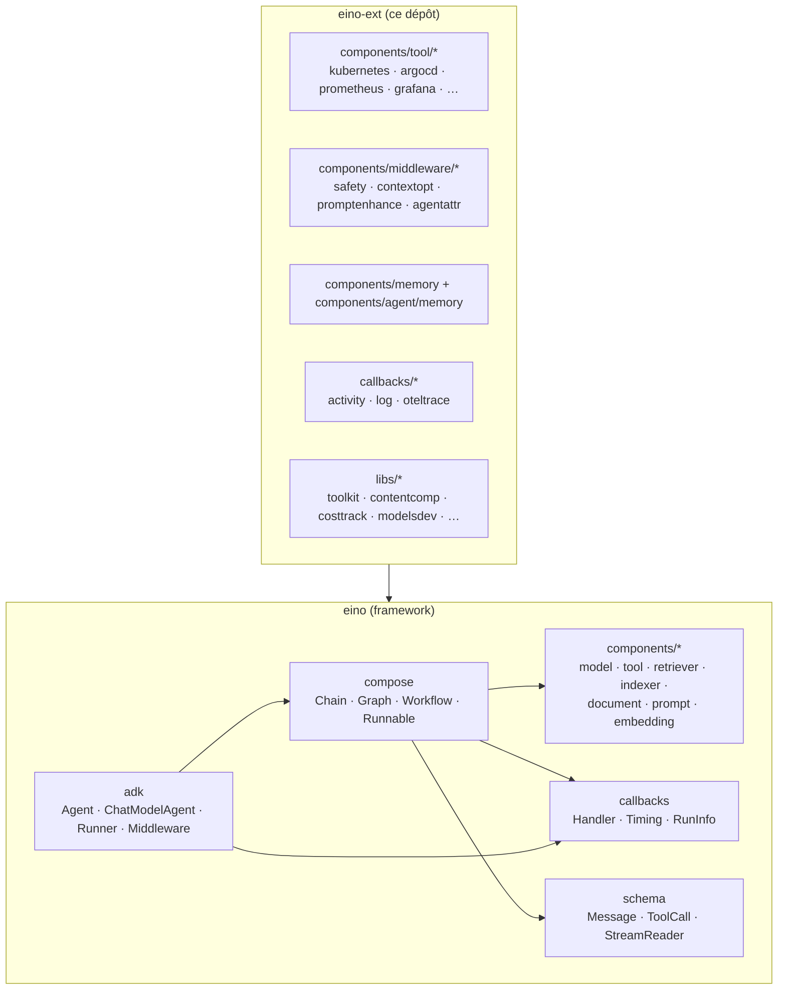
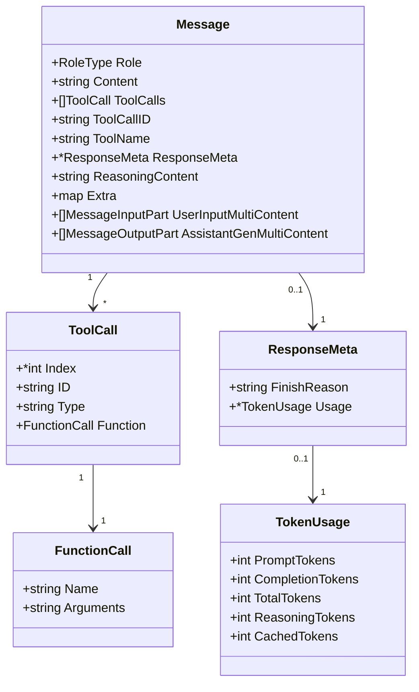
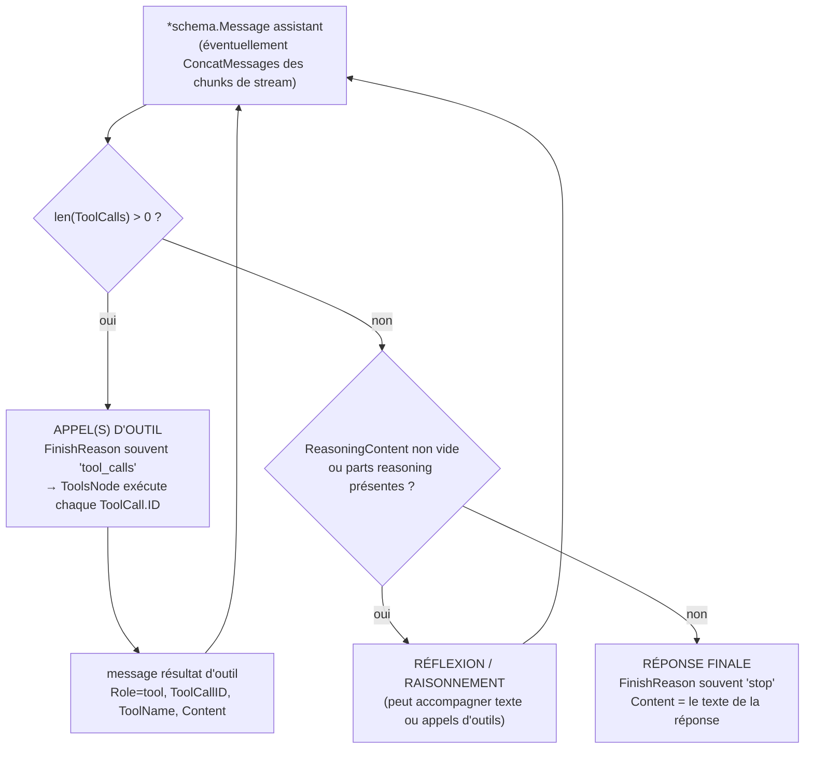
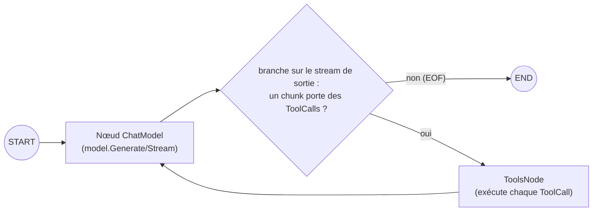
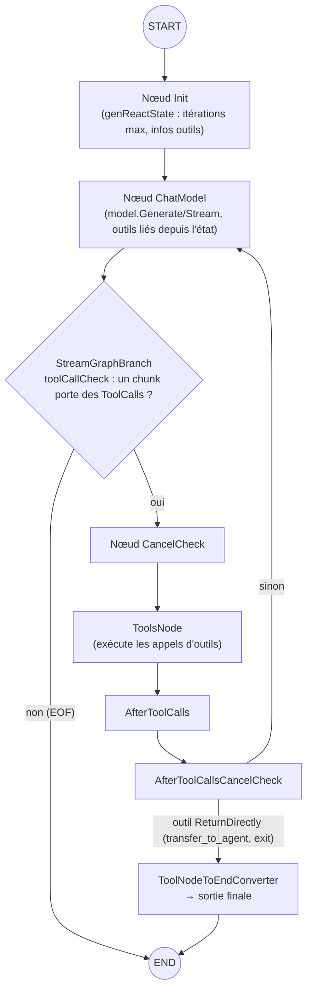
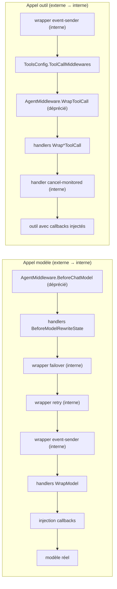
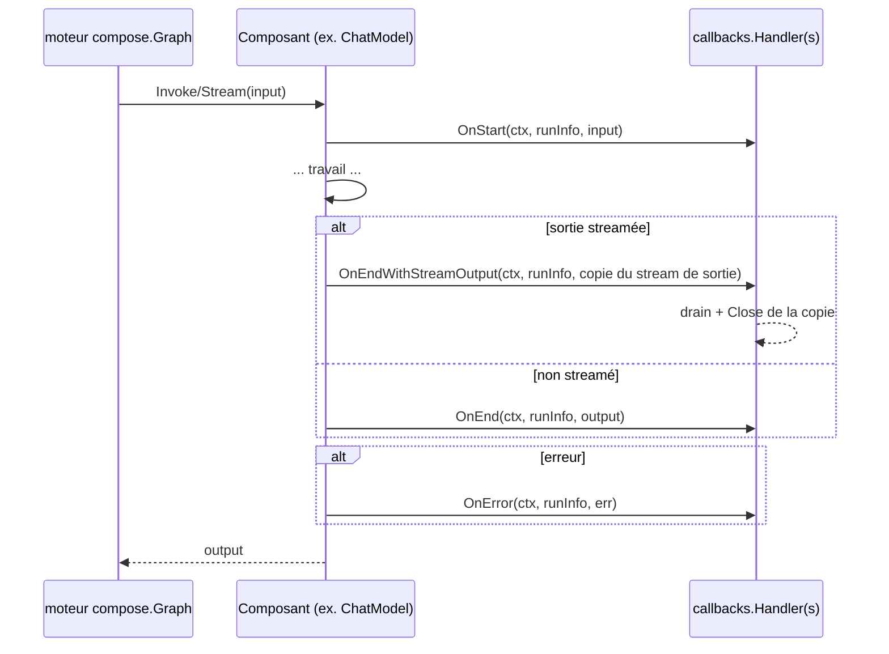

# eino framework & adk — Conception technique

> **Portée :** le framework [eino](https://github.com/cloudwego/eino) (version
> `v0.9.12` épinglée dans ce dépôt) et son sous-package `adk` (Agent Development
> Kit). Ce document explique le fonctionnement du framework : les abstractions de
> composants, le flux des messages, comment identifier la réflexion / les appels
> d'outils / la réponse finale, la boucle agent, le système de callbacks, et les
> API de l'adk.
>
> **Documents associés :**
> - [`02-eino-ext-shared-libraries.fr.md`](./02-eino-ext-shared-libraries.fr.md) —
>   conception des bibliothèques partagées eino-ext construites sur eino.
> - English : [`01-eino-framework-and-adk.en.md`](./01-eino-framework-and-adk.en.md)

---

## 1. Introduction

**eino** est le framework d'applications LLM de CloudWeGo pour Go. Son idée
centrale : chaque élément d'une application LLM (modèles de chat, outils,
retrievers, chargeurs de documents, templates de prompt, embarqueurs, indexeurs)
est un **composant** derrière une petite interface, et les applications se
construisent en **composant** ces composants en chaînes et graphes
(**`compose`**). Par-dessus, le sous-package **`adk`** fournit une API orientée
agent : un `ChatModelAgent` qui exécute la boucle modèle → outils → modèle, avec
événements, middlewares, état de session, interruptions/reprise et annulation.

**eino-ext** (ce dépôt) est la couche d'extensions communautaire : familles
d'outils (kubernetes, argocd, prometheus, grafana, …), middlewares adk (safety,
optimisation de contexte, amélioration de prompt), mémoire/historique, suivi des
coûts, et callbacks (flux d'activité, journalisation, OpenTelemetry). Il ne
réimplémente jamais eino — il se construit sur ses abstractions.



---

## 2. eino en un coup d'œil

### 2.1 Abstractions de composants

eino définit une interface par abstraction. Les composants en sont les
implémentations ; `compose` les relie entre eux.

| Abstraction | Package | Interface cœur | Rôle |
|---|---|---|---|
| Modèle de chat | `components/model` | `BaseChatModel` (alias de `BaseModel[*schema.Message]`), `ToolCallingChatModel` | Générer / streamer du texte à partir de messages ; lier des outils |
| Outil | `components/tool` | `BaseTool`, `InvokableTool`, `StreamableTool`, `EnhancedInvokableTool`, `EnhancedStreamableTool` | Fonctions exécutables appelables par le modèle |
| Template de prompt | `components/prompt` | `ChatTemplate` | Rendre `[]*schema.Message` à partir de variables |
| Retriever | `components/retriever` | `Retriever` | Récupérer `[]*schema.Document` pour une requête |
| Indexeur | `components/indexer` | `Indexer` | Stocker des documents |
| Document | `components/document` | `Loader`, `Parser`, `Transformer` | Charger / parser / transformer des documents |
| Embedding | `components/embedding` | `Embedder` | Texte → vecteurs |

Chaque composant porte aussi des **callbacks** (voir §9) : le moteur de graphe
notifie les `callbacks.Handler` enregistrés à des timings bien définis (`OnStart`,
`OnEnd`, …) pour chaque exécution de composant.

### 2.2 Orchestration — `compose`

`compose` transforme les composants en pipelines exécutables :

- **`Runnable[I, O]`** — l'interface universelle : `Invoke`, `Stream`, `Collect`,
  `Transform`. Les composants qui n'implémentent que certains paradigmes sont
  auto-convertis.
- **`Chain[I, O]`** — un pipeline linéaire, style builder (`AppendChatModel`,
  `AppendToolsNode`, `AppendLambda`, …).
- **`Graph[I, O]`** — un graphe général (`AddChatModelNode`, `AddToolsNode`,
  `AddEdge`, `AddBranch`, `Compile`). Deux modes d'exécution : **Pregel**
  (`NodeTriggerMode = AnyPredecessor`, par défaut, cycles autorisés — nécessaire
  pour la boucle modèle ↔ outils) et **DAG** (`AllPredecessor`).
- **`Workflow[I, O]`** — un graphe avec mapping de champs déclaratif entre nœuds
  (`AddInput` avec `FieldMapping`, `SetStaticValue`, …).

### 2.3 Le message — `schema`

Tout circule sous forme de `*schema.Message` (voir §4). Le streaming circule
sous forme de `*schema.StreamReader[*schema.Message]` (voir §6).

---

## 3. Les composants en détail

### 3.1 Modèle de chat — `components/model`

```go
// Générique sur le type de message ; scellé à *schema.Message ou *schema.AgenticMessage.
type BaseModel[M messageType] interface {
    Generate(ctx context.Context, input []M, opts ...Option) (M, error)
    Stream(ctx context.Context, input []M, opts ...Option) (*schema.StreamReader[M], error)
}
type BaseChatModel = BaseModel[*schema.Message]   // alias
type AgenticModel  = BaseModel[*schema.AgenticMessage]

type ToolCallingChatModel interface {
    BaseChatModel
    WithTools(tools []*schema.ToolInfo) (ToolCallingChatModel, error) // immutable
}
// type ChatModel (BindTools) — Déprécié : utiliser ToolCallingChatModel.
```

`model.Option` configure un appel : `WithTools`, `WithTemperature`, `WithMaxTokens`,
`WithModel`, `WithTopP`, `WithStop`, `WithToolChoice(schema.ToolChoice, allowedToolNames...)`,
`WithToolSearchTool`, `WithDeferredTools`, `WithAgenticToolChoice`, plus des
options spécifiques à l'implémentation via `WrapImplSpecificOptFn[T]` /
`GetImplSpecificOptions[T]`.

Constantes `schema.ToolChoice` : `ToolChoiceForbidden` (`"forbidden"`),
`ToolChoiceAllowed` (`"allowed"`), `ToolChoiceForced` (`"forced"`).

Payloads de callbacks (`components/model/callback_extra.go`) :
`model.CallbackInput{Messages, Tools, ToolChoice, Config, Extra}` et
`model.CallbackOutput{Message, Config, TokenUsage, Extra}` (avec des helpers
`Conv*` acceptant les formes brutes `[]*schema.Message`).

### 3.2 Outil — `components/tool`

```go
type BaseTool interface {
    Info(ctx context.Context) (*schema.ToolInfo, error)
}
type InvokableTool interface {
    BaseTool
    InvokableRun(ctx context.Context, argumentsInJSON string, opts ...Option) (string, error)
}
type StreamableTool interface {
    BaseTool
    StreamableRun(ctx context.Context, argumentsInJSON string, opts ...Option) (*schema.StreamReader[string], error)
}
type EnhancedInvokableTool interface {
    BaseTool
    InvokableRun(ctx context.Context, toolArgument *schema.ToolArgument, opts ...Option) (*schema.ToolResult, error)
}
type EnhancedStreamableTool interface {
    BaseTool
    StreamableRun(ctx context.Context, toolArgument *schema.ToolArgument, opts ...Option) (*schema.StreamReader[*schema.ToolResult], error)
}
```

Quand un outil implémente à la fois les interfaces standard et enhanced,
`ToolsNode` privilégie l'enhanced. `tool.Option` transporte des options
spécifiques à l'implémentation (`WrapImplSpecificOptFn[T]` / `GetImplSpecificOptions[T]`).

`components/tool/utils` construit des outils à partir de fonctions Go simples :

```go
searchTool, err := utils.InferTool("search", "rechercher sur le web",
    func(ctx context.Context, q struct{ Query string `json:"query"` }) (string, error) { ... })
// InferTool reflète la struct d'entrée en schéma JSON (ParamsOneOf),
// décode les arguments en JSON, et encode le résultat en JSON.
// Variantes : InferStreamTool, InferOptionableTool, InferEnhancedTool,
// NewTool(desc, fn), NewStreamTool, NewEnhancedTool, GoStruct2ParamsOneOf[T], GoStruct2ToolInfo[T].
```

`schema.ToolInfo{Name, Desc, Extra, *ParamsOneOf}` décrit un outil pour le
modèle. `ParamsOneOf` se construit soit à partir de `map[string]*ParameterInfo`
(`NewParamsOneOfByParams`), soit à partir d'un JSON Schema complet
(`NewParamsOneOfByJSONSchema`) ; `ToJSONSchema()` normalise les deux.

Interruptions d'outils (`components/tool/interrupt.go`) : `tool.Interrupt(ctx, info)`,
`tool.StatefulInterrupt(ctx, info, state)`, `tool.CompositeInterrupt(ctx, info, state, errs...)`,
`tool.GetInterruptState[T](ctx)`, `tool.GetResumeContext[T](ctx)`.

### 3.3 ToolsNode — l'exécuteur d'outils dans `compose`

```go
type ToolsNodeConfig struct {
    Tools                []tool.BaseTool
    ToolAliases          map[string]ToolAliasConfig
    UnknownToolsHandler  func(ctx, name, input string) (string, error)
    ExecuteSequentially  bool   // par défaut : appels d'outils en parallèle
    ToolArgumentsHandler func(ctx, name, arguments string) (string, error)
    ToolCallMiddlewares  []ToolMiddleware
}
func NewToolNode(ctx context.Context, conf *ToolsNodeConfig) (*ToolsNode, error) // « Tool » au singulier
```

`ToolsNode.Invoke(ctx, *schema.Message) ([]*schema.Message, error)` prend le
message assistant portant les `ToolCalls`, exécute chaque appel (en parallèle par
défaut), et retourne un **message outil** par appel, dans l'ordre :
`schema.ToolMessage(result, callID, schema.WithToolName(name))`.

`ToolMiddleware` enveloppe les quatre types d'endpoints (`InvokableToolMiddleware`,
`StreamableToolMiddleware`, `EnhancedInvokableToolMiddleware`,
`EnhancedStreamableToolMiddleware`) ; le premier middleware de la slice est le
plus externe.

---

## 4. Les messages — `schema.Message`

`schema.Message` est la monnaie unique d'eino : entrée modèle, sortie modèle,
entrée utilisateur, sortie d'outil.

```go
type RoleType string
const (
    Assistant RoleType = "assistant"
    User      RoleType = "user"
    System    RoleType = "system"
    Tool      RoleType = "tool"
)

type FunctionCall struct {
    Name      string `json:"name,omitempty"`
    Arguments string `json:"arguments,omitempty"` // chaîne JSON
}
type ToolCall struct {
    Index    *int              `json:"index,omitempty"` // clé de fusion des chunks de stream
    ID       string            `json:"id"`
    Type     string            `json:"type"`            // souvent « function »
    Function FunctionCall      `json:"function"`
    Extra    map[string]any    `json:"extra,omitempty"`
}

type ResponseMeta struct {
    FinishReason string      // défini par le modèle : « stop », « length », « tool_calls », « content_filter », …
    Usage        *TokenUsage
    LogProbs     *LogProbs
}
type TokenUsage struct {
    PromptTokens            int
    PromptTokenDetails      PromptTokenDetails      // {CachedTokens}
    CompletionTokens        int
    TotalTokens             int
    CompletionTokensDetails CompletionTokensDetails // {ReasoningTokens}
}

type Message struct {
    Role       RoleType
    Content    string                  // texte utilisateur en entrée / texte modèle en sortie
    MultiContent []ChatMessagePart    // Déprécié
    UserInputMultiContent    []MessageInputPart  // entrée multimodale utilisateur
    AssistantGenMultiContent []MessageOutputPart // sortie multimodale du modèle
    Name       string
    ToolCalls  []ToolCall              // assistant uniquement
    ToolCallID string                   // message outil uniquement (corréle ToolCall.ID)
    ToolName   string                   // message outil uniquement
    ResponseMeta *ResponseMeta
    ReasoningContent string             // champ plat de raisonnement/réflexion
    Extra      map[string]any          // métadonnées custom (marqueurs, IDs, …)
}
```



### 4.1 Contenu multimodal

```go
type ChatMessagePartType string
const (
    ChatMessagePartTypeText            = "text"
    ChatMessagePartTypeImageURL        = "image_url"
    ChatMessagePartTypeAudioURL        = "audio_url"
    ChatMessagePartTypeVideoURL        = "video_url"
    ChatMessagePartTypeFileURL         = "file_url"
    ChatMessagePartTypeReasoning       = "reasoning"
    ChatMessagePartTypeToolSearchResult = "tool_search_result"
)
// Parts d'entrée : MessageInputPart{Type, Text, Image *MessageInputImage, Audio, Video, File, …}
// Parts de sortie : MessageOutputPart{Type, Text, Image/Audio/Video, Reasoning *MessageOutputReasoning, StreamingMeta, …}
type MessageOutputReasoning struct {
    Text      string // résumé de la pensée ou texte brut de raisonnement
    Signature string // tokens de raisonnement chiffrés à renvoyer au modèle
}
```

Les parts média portent `MessagePartCommon{URL *string, Base64Data *string, MIMEType string}`.

### 4.2 Constructeurs

```go
func SystemMessage(content string) *Message
func UserMessage(content string) *Message
func AssistantMessage(content string, toolCalls []ToolCall) *Message
func ToolMessage(content string, toolCallID string, opts ...ToolMessageOption) *Message // WithToolName(name)
```

### 4.3 Marqueurs Extra

`Message.Extra map[string]any` est le point d'extension. eino-ext utilise
largement des marqueurs booléens (ex. `memory.SummaryMarkerKey`,
`memory.IncompleteMarkerKey`, `memory.EphemeralMarkerKey`,
`contextopt.PruneMarkerKey`) — voir le document associé.

---

## 5. Identifier la réflexion, les appels d'outils et la réponse finale

Étant donné un `*schema.Message` assistant produit par un modèle (éventuellement
réassemblé à partir d'un stream), voici comment le classer :

| Quoi | Où | Règle |
|---|---|---|
| **Réflexion / raisonnement** | `msg.ReasoningContent` (chaîne plate) et/ou parts `msg.AssistantGenMultiContent` avec `Type == ChatMessagePartTypeReasoning` (`part.Reasoning.Text`, `part.Reasoning.Signature`) | raisonnement non vide ⇒ le modèle « réfléchit » |
| **Appel(s) d'outil** | `msg.ToolCalls` (non vide) ; typiquement `msg.ResponseMeta.FinishReason == "tool_calls"` | message assistant demandant l'exécution d'outils |
| **Réponse finale** | `msg.Role == Assistant`, `len(msg.ToolCalls) == 0`, texte dans `msg.Content` (ou parts texte), souvent `FinishReason == "stop"` | le modèle a terminé |
| **Résultat d'outil** | `msg.Role == Tool`, `msg.ToolCallID` renseigné (corréle l'`ToolCall.ID` de l'assistant), `msg.ToolName` renseigné, résultat dans `msg.Content` | renvoyé au modèle |

`FinishReason` est **défini par le modèle** ; les valeurs courantes sont
`"stop"`, `"length"`, `"tool_calls"`, `"content_filter"`. Ne jamais s'y fier
seul — combiner avec la présence de `ToolCalls`.



Dans le flux d'événements **adk**, la même classification est pré-calculée :
`adk.MessageVariant{Role, ToolName, IsStreaming, Message, MessageStream}` —
`Role == schema.Assistant` est une sortie modèle, `Role == schema.Tool` (avec
`ToolName`) est un résultat d'outil, et `GetMessage()` concatène un stream.

---

## 6. Le streaming — `schema.StreamReader`

```go
type StreamReader[T any] struct{ /* lecture unique */ }
func (sr *StreamReader[T]) Recv() (T, error)     // io.EOF à la fin
func (sr *StreamReader[T]) Close()
func (sr *StreamReader[T]) Copy(n int) []*StreamReader[T] // fan-out ; l'original inutilisable après
func (sr *StreamReader[T]) SetAutomaticClose()

func Pipe[T any](cap int) (*StreamReader[T], *StreamWriter[T]) // StreamWriter : Send(chunk, err) ; Close()
func StreamReaderFromArray[T any](arr []T) *StreamReader[T]
func StreamReaderWithConvert[T, D any](sr *StreamReader[T], convert func(T) (D, error), opts ...ConvertOption) *StreamReader[D]
// ConvertOption : WithErrWrapper(func(error) error), WithOnEOF(func() (any, error)) ; le sentinelle ErrNoValue ignore un chunk
func MergeStreamReaders[T any](srs []*StreamReader[T]) *StreamReader[T]
func MergeNamedStreamReaders[T any](srs map[string]*StreamReader[T]) *StreamReader[T] // émet *SourceEOF par source
```

**Fusion des chunks.** Les streams sont fusionnés par des fonctions de concat
enregistrées (`compose.RegisterStreamChunkConcatFunc[T]`). `schema` enregistre à
l'init :

- `ConcatMessages([]*Message) (*Message, error)` — Content/ReasoningContent
  concaténés ; **chunks d'appels d'outils fusionnés par `ToolCall.Index`**
  (arguments concaténés ; ID/type/name doivent correspondre) ; dernier
  `FinishReason` non vide gagne ; `Usage` fusionné champ par champ au max ;
  `Extra` fusionné ; parts multimodales fusionnées par type +
  `StreamingMeta.Index`.
- `ConcatMessageStream(sr)`, `ConcatMessageArray`, `ConcatToolResults`,
  `ConcatAgenticMessages`, `ConcatAgenticMessagesArray`.

C'est ce qui alimente `Invoke` sur un nœud purement streamé et ce que
`adk.MessageVariant.GetMessage()` utilise pour matérialiser un événement streamé.

---

## 7. Orchestration — `compose`

### 7.1 Runnable, Chain, Graph, Workflow

```go
type Runnable[I, O any] interface {
    Invoke(ctx context.Context, input I, opts ...Option) (O, error)
    Stream(ctx context.Context, input I, opts ...Option) (*schema.StreamReader[O], error)
    Collect(ctx context.Context, input *schema.StreamReader[I], opts ...Option) (O, error)
    Transform(ctx context.Context, input *schema.StreamReader[I], opts ...Option) (*schema.StreamReader[O], error)
}
```

```go
// Chain — builder linéaire
ch := compose.NewChain[[]*schema.Message, *schema.Message]()
ch.AppendChatModel(model).AppendToolsNode(toolsNode) // etc.
runnable, err := ch.Compile(ctx, compose.WithMaxRunSteps(25))

// Graph — graphe général
g := compose.NewGraph[[]*schema.Message, *schema.Message]()
g.AddChatModelNode("model", chatModel)
toolsNode, _ := compose.NewToolNode(ctx, &compose.ToolsNodeConfig{Tools: tools})
g.AddToolsNode("tools", toolsNode)
g.AddEdge(compose.START, "model")
g.AddBranch("model", compose.NewStreamGraphBranch(toolCallCheck, map[string]bool{"tools": true, compose.END: true}))
g.AddEdge("tools", "model")
runnable, _ := g.Compile(ctx)

// Workflow — graphe + mapping de champs
wf := compose.NewWorkflow[Input, Output]()
node := wf.AddChatModelNode("model", m)
node.AddInput("input", compose.FieldMapping...) // ou SetStaticValue
```

### 7.2 La boucle agent (le pattern que généralise l'adk)



Une condition de branchement consomme le stream de sortie du modèle chunk par
chunk et retourne `"tools"` dès qu'un chunk porte des `ToolCalls`, ou
`compose.END` à l'EOF.

### 7.3 Lambda

```go
compose.AnyLambda[I, O, TOption](invoke, stream, collect, transform, opts...) (*Lambda, error)
compose.InvokableLambda[I, O](invokeWOOpt, opts...) *Lambda
compose.StreamableLambda / CollectableLambda / TransformableLambda (+ variantes WithOption)
compose.ToList[I](), compose.MessageParser[T](schema.MessageParser[T])
// LambdaOpt : WithLambdaCallbackEnable(bool), WithLambdaType(string)
```

### 7.4 Options d'appel & options de compilation

Options d'appel (`compose.Option`) : `WithCallbacks(...)`,
`WithChatModelOption(...)`, `WithToolsNodeOption(...)`,
`WithChatTemplateOption(...)`, `WithLambdaOption(...)`,
`WithEmbeddingOption/WithRetrieverOption/WithLoaderOption/WithDocumentTransformerOption/WithIndexerOption(...)`,
`WithRuntimeMaxSteps(int)`, `WithCheckPointID(id)`, `WithWriteToCheckPointID(id)`,
`WithForceNewRun()`, `WithStateModifier(sm)`, `WithGraphInterrupt(ctx)`.
Les options sont ciblables : `.DesignateNode("key")` / `.DesignateNodeWithPath(...)`.

Options de compilation : `WithMaxRunSteps`, `WithGraphName`, `WithNodeTriggerMode`,
`WithGraphCompileCallbacks`, `WithFanInMergeConfig`, `WithCheckPointStore`,
`WithSerializer`, `WithInterruptBeforeNodes/AfterNodes`.

### 7.5 État de graphe

```go
compose.WithGenLocalState[S](func(ctx) S)            // NewGraphOption
compose.StatePreHandler[I, S]  func(ctx, in I, state S) (I, error)
compose.StatePostHandler[O, S] func(ctx, out O, state S) (O, error)
compose.StreamStatePreHandler[I, S]  func(ctx, *StreamReader[I], S) (*StreamReader[I], error)
compose.StreamStatePostHandler[O, S] func(ctx, *StreamReader[O], S) (*StreamReader[O], error)
compose.ProcessState[S](ctx, func(ctx, S) error) error // protégé par mutex ; l'interne masque l'externe
```
Attachés par nœud via `WithStatePreHandler` / `WithStatePostHandler` /
`WithStreamStatePreHandler` / `WithStreamStatePostHandler` (GraphAddNodeOpt).

### 7.6 Branchements

```go
compose.NewGraphBranch[T](condition GraphBranchCondition[T], endNodes map[string]bool) *GraphBranch
compose.NewStreamGraphBranch[T](condition StreamGraphBranchCondition[T], endNodes map[string]bool) *GraphBranch
compose.NewGraphMultiBranch / NewStreamGraphMultiBranch
// NodeTriggerMode : AnyPredecessor (Pregel, défaut, cycles) | AllPredecessor (DAG)
```

### 7.7 Interruptions & checkpoints (niveau compose)

```go
compose.Interrupt(ctx, info any) error
compose.StatefulInterrupt(ctx, info any, state any) error
compose.CompositeInterrupt(ctx, info any, state any, errs ...error) error
compose.ExtractInterruptInfo(err) (*InterruptInfo, bool)
compose.GetInterruptState[T](ctx) (wasInterrupted, hasState bool, state T)
type InterruptInfo struct { State any; BeforeNodes, AfterNodes, RerunNodes []string; RerunNodesExtra map[string]any; SubGraphs map[string]*InterruptInfo; InterruptContexts []*InterruptCtx }
type CheckPointStore interface { Get(ctx, id string) ([]byte, bool, error); Set(ctx, id string, data []byte) error } // = core.CheckPointStore
type Serializer interface { Marshal(v any) ([]byte, error); Unmarshal(data []byte, v any) error }
compose.Address / AddressSegment / AddressSegmentType (« node » | « tool » | « runnable »)
```

Un composant interrompt en retournant l'erreur spéciale de
`compose.Interrupt(...)` ; avec un `CheckPointStore` configuré, l'état du run est
persisté sous un ID de checkpoint et peut être repris (`WithCheckPointID`).

---

## 8. Le sous-package `adk` (Agent Development Kit)

`adk` est la couche orientée agent d'eino. Au lieu de construire à la main le
graphe modèle ↔ outils, on déclare un **`ChatModelAgent`** et on l'exécute via un
**`Runner`**.

### 8.1 Agent, Runner, options de run

```go
// adk/interface.go
type Agent = TypedAgent[*schema.Message] // générique sur *schema.Message | *schema.AgenticMessage
type TypedAgent[M MessageType] interface {
    Name(ctx context.Context) string
    Description(ctx context.Context) string
    Run(ctx context.Context, input *TypedAgentInput[M], options ...AgentRunOption) *AsyncIterator[*TypedAgentEvent[M]]
}
type ResumableAgent = TypedResumableAgent[*schema.Message] // ajoute Resume(ctx, *ResumeInfo, ...)

type TypedAgentInput[M MessageType] struct {
    Messages        []M
    EnableStreaming bool
}
type AgentInput = TypedAgentInput[*schema.Message]
```

```go
// adk/runner.go — il n'existe PAS de adk.Run au niveau package ; utiliser un Runner (ou agent.Run directement)
runner := adk.NewRunner(ctx, adk.RunnerConfig{Agent: agent, EnableStreaming: true, CheckPointStore: store})
iter := runner.Run(ctx, []adk.Message{schema.UserMessage("hi")}, opts...) // *adk.AsyncIterator[*adk.AgentEvent]
iter := runner.Query(ctx, "hi", opts...)
iter, err := runner.Resume(ctx, checkPointID, opts...)
iter, err := runner.ResumeWithParams(ctx, checkPointID, &adk.ResumeParams{Targets: map[string]any{...}}, opts...)
```

Options de run (`adk.AgentRunOption`, options fonctionnelles, ciblables avec
`DesignateAgent(name...)`) :

```go
adk.WithSessionValues(map[string]any{...})
adk.WithCallbacks(handlers ...callbacks.Handler)
adk.WithChatModelOptions(opts ...model.Option)
adk.WithToolOptions(opts ...tool.Option)
adk.WithAgentToolRunOptions(map[string][]adk.AgentRunOption)
adk.WithCheckPointID(id string)
adk.WithCancel() (adk.AgentRunOption, adk.AgentCancelFunc)
// (déprécié) adk.WithHistoryModifier(...), adk.WithSkipTransferMessages()
```

### 8.2 Événements

```go
type AgentEvent = TypedAgentEvent[*schema.Message]
type TypedAgentEvent[M MessageType] struct {
    AgentName string
    RunPath   []RunStep
    Output    *TypedAgentOutput[M]   // MessageOutput *TypedMessageVariant[M] ; CustomizedOutput any
    Action    *AgentAction           // Exit | Interrupted | TransferToAgent | BreakLoop | CustomizedAction
    Err       error                  // peut être *adk.CancelError ; info d'interruption dans Action.Interrupted
}
type MessageVariant struct {           // = TypedMessageVariant[*schema.Message]
    IsStreaming   bool
    Message       *schema.Message
    MessageStream *schema.StreamReader[*schema.Message]
    Role          schema.RoleType       // Assistant (sortie modèle) ou Tool (résultat d'outil)
    ToolName      string                // non vide quand Role == Tool
}
func (mv *MessageVariant) GetMessage() (*schema.Message, error) // concatène le stream

func adk.EventFromMessage(msg *schema.Message, stream *schema.StreamReader[*schema.Message], role schema.RoleType, toolName string) *AgentEvent

// itération
for {
    ev, ok := iter.Next()   // AsyncIterator[*AgentEvent]
    if !ok { break }
    if ev.Err != nil { /* ... */ }
    msg, _, _ := adk.GetMessage(ev) // matérialise (concatène les événements streamés)
}
```

### 8.3 ChatModelAgent — la boucle ReAct

```go
type ChatModelAgentConfig struct { // = TypedChatModelAgentConfig[*schema.Message]
    Name          string
    Description   string
    Instruction   string                 // prompt système ; placeholders f-string remplis depuis SessionValues
    Model         model.BaseChatModel    // doit supporter WithTools quand des outils sont utilisés
    ToolsConfig   ToolsConfig            // ToolsNodeConfig + ReturnDirectly map[string]bool + EmitInternalEvents bool
    GenModelInput adk.TypedGenModelInput[*schema.Message] // défaut : system(instruction) + messages d'entrée
    Exit          tool.BaseTool          // outil de sortie optionnel
    OutputKey     string                 // clé de session où le contenu de sortie final est stocké
    MaxIterations int                    // défaut 20
    Handlers      []adk.ChatModelAgentMiddleware
    Middlewares   []adk.AgentMiddleware  // middleware struct-based déprécié
    ModelRetryConfig    *adk.TypedModelRetryConfig[*schema.Message]
    ModelFailoverConfig *adk.ModelFailoverConfig
}
agent, err := adk.NewChatModelAgent(ctx, &adk.ChatModelAgentConfig{...})
```

En interne (`adk/react.go`, `newReact`) l'agent est un `compose.Graph` compilé
(mode Pregel, cycles autorisés) avec un état local au graphe, enveloppé dans une
Chain :



- **Itérations max :** défaut **20** (`MaxIterations <= 0` ⇒ 20). Dépasser
  produit `adk.ErrExceedMaxIterations` (`"exceeds max iterations"`).
- **Conditions d'arrêt :** pas d'appels d'outils → END ; un outil
  `ReturnDirectly` (`transfer_to_agent`, `exit`) → son résultat devient la sortie
  finale ; itérations max dépassées → événement d'erreur ; interruption →
  `Action.Interrupted` ; annulation → `Err = *CancelError` ; `Action.Exit` → le
  flow agent s'arrête.
- **État** (`adk/react.go`) : messages, infos d'outils, `RemainingIterations`,
  `ToolGenActions`, `ReturnDirectlyEvent`, tentative de retry, IDs de messages d'outils.
- **Retry** (`adk/retry_chatmodel.go`) : `TypedModelRetryConfig{MaxRetries,
  ShouldRetry func(ctx, *TypedRetryContext[M]) *TypedRetryDecision[M], BackoffFunc}` ;
  le streaming est entièrement consommé avant la décision de retry ; les
  événements continuent de streamer en direct.
- **Failover** (`adk/failover_chatmodel.go`) : `ModelFailoverConfig{MaxRetries,
  ShouldFailover func(ctx, outputMessage M, outputErr error) bool, GetFailoverModel}`.

### 8.4 Middleware — `adk.ChatModelAgentMiddleware`

```go
type ChatModelAgentMiddleware = TypedChatModelAgentMiddleware[*schema.Message]
type TypedChatModelAgentMiddleware[M MessageType] interface {
    BeforeAgent(ctx, *ChatModelAgentContext) (context.Context, *ChatModelAgentContext, error)
    AfterAgent(ctx, *TypedChatModelAgentState[M]) (context.Context, error)
    BeforeModelRewriteState(ctx, *TypedChatModelAgentState[M], *TypedModelContext[M]) (context.Context, *TypedChatModelAgentState[M], error)
    AfterModelRewriteState(ctx, *TypedChatModelAgentState[M], *TypedModelContext[M]) (context.Context, *TypedChatModelAgentState[M], error)
    WrapInvokableToolCall(ctx, endpoint InvokableToolCallEndpoint, tCtx *ToolContext) (InvokableToolCallEndpoint, error)
    WrapStreamableToolCall(ctx, endpoint StreamableToolCallEndpoint, tCtx *ToolContext) (StreamableToolCallEndpoint, error)
    WrapEnhancedInvokableToolCall(ctx, endpoint EnhancedInvokableToolCallEndpoint, tCtx *ToolContext) (EnhancedInvokableToolCallEndpoint, error)
    WrapEnhancedStreamableToolCall(ctx, endpoint EnhancedStreamableToolCallEndpoint, tCtx *ToolContext) (EnhancedStreamableToolCallEndpoint, error)
    WrapModel(ctx, m model.BaseModel[M], mc *TypedModelContext[M]) (model.BaseModel[M], error)
}
type BaseChatModelAgentMiddleware struct{} // impls no-op des 9 méthodes ; l'embarquer
type ToolContext struct { Name string; CallID string }
type ModelContext struct { Tools []*schema.ToolInfo /*Déprécié*/; ModelRetryConfig; ModelFailoverConfig }
```

Ordre d'exécution (premier handler enregistré = plus externe) :



Utilitaires middleware : `adk.SetRunLocalValue/GetRunLocalValue/DeleteRunLocalValue`
(à portée run, sérialisés en gob dans l'état de checkpoint ; les types custom
nécessitent `schema.RegisterName[T]`), `adk.SendEvent(ctx, event)` (événements
custom), `adk.SendToolGenAction(ctx, toolName, action)`,
`adk.EnsureMessageID/GetMessageID`. Les middlewares pré-construits sont dans
`adk/middlewares/` (`agentsmd`, `dynamictool`, `filesystem`, `patchtoolcalls`,
`plantask`, `reduction`, `skill`, `summarization`).

### 8.5 Session & historique

```go
adk.WithSessionValues(map[string]any{...})   // option de run
adk.AddSessionValue(ctx, key, value) / adk.AddSessionValues(ctx, kvs)
adk.GetSessionValue(ctx, key) (any, bool) / adk.GetSessionValues(ctx) map[string]any
```

- Les valeurs de session sont un `map[string]any` par run, partagées entre agents
  d'un même run, utilisées pour formater l'`Instruction` en f-string, persistées
  dans les checkpoints.
- **Il n'existe pas de store d'historique inter-runs dans l'adk.** Au sein d'un
  run, le `flowAgent` enregistre chaque événement dans la session du run et
  reconstruit l'entrée de chaque agent à partir de celle-ci (avec un
  `HistoryRewriter`). D'un run à l'autre, l'appelant passe l'historique complet
  `[]Message` à `Runner.Run` à chaque tour. La persistance de l'historique est le
  travail de l'application (eino-ext la fournit — voir le document associé).

### 8.6 Interruption / reprise

```go
type InterruptInfo struct { Data any; InterruptContexts []*InterruptCtx }
type ResumeInfo struct { EnableStreaming bool; WasInterrupted bool; InterruptState any; IsResumeTarget bool; ResumeData any }
// les outils/agents interrompent via tool.Interrupt / tool.StatefulInterrupt / tool.CompositeInterrupt
// (ou compose.* dans les nœuds de graphe) ; adk.Interrupt/StatefulInterrupt/CompositeInterrupt les enveloppent en événements
// reprise : runner.Resume / runner.ResumeWithParams avec ResumeParams.Targets (adresse → données de reprise)
// dans un outil repris : tool.GetInterruptState[T](ctx), tool.GetResumeContext[T](ctx)
```

Avec un `CheckPointStore` configuré, le Runner persiste un checkpoint gob
(contexte de run + événements de session + état d'interruption) sous l'ID de
checkpoint ; le flux d'événements émet un événement avec `Action.Interrupted`.
`ChatModelAgent.Resume` restaure son état (messages, itérations restantes, …).

### 8.7 Annulation

```go
opt, cancelFn := adk.WithCancel()                    // AgentRunOption + AgentCancelFunc
handle, ok := cancelFn(adk.WithAgentCancelMode(adk.CancelAfterToolCalls), adk.WithAgentCancelTimeout(d), adk.WithRecursive())
err := handle.Wait()                                 // nil | ErrCancelTimeout | ErrExecutionEnded
// CancelMode bitmask : CancelImmediate=0, CancelAfterChatModel, CancelAfterToolCalls (points sûrs)
// une annulation apparaît comme *adk.CancelError dans event.Err ; les streams en cours reçoivent adk.ErrStreamCanceled
```

### 8.8 TurnLoop — boucle d'événements push-based

Pour les agents long-running/interactifs : `adk.NewTurnLoop[T, M](TurnLoopConfig{GenInput,
PrepareAgent, OnAgentEvents, Store, CheckpointID})` avec `Run` (non bloquant),
`Push(item, WithPreempt(safePoint)...)`, `Stop(WithGraceful()...)`, `Wait()`.
Points sûrs : `AfterChatModel`, `AfterToolCalls`, `AnySafePoint`.

### 8.9 Composition : flows, transfert, AgentTool, DeepAgent

Toute composition par transfert/workflow est marquée **NOT RECOMMENDED** dans la
v0.9.12 au profit de `ChatModelAgent` + `AgentTool` ou `DeepAgent` :

- **Agents workflow** (`adk/workflow.go`) : `NewSequentialAgent`,
  `NewParallelAgent`, `NewLoopAgent` (la boucle supporte `BreakLoopAction`).
- **Flow par transfert** (`adk/flow.go`) : `adk.SetSubAgents(ctx, agent, subAgents)` ;
  un outil `transfer_to_agent` est auto-ajouté ; le `flowAgent` redirige vers
  l'agent destination avec le même contexte de run ; l'historique est reconstruit
  avec un `HistoryRewriter` (`adk.AgentWithOptions`, `WithHistoryRewriter`).
- **Transfert déterministe** (`adk/deterministic_transfer.go`) :
  `adk.AgentWithDeterministicTransferTo(ctx, &adk.DeterministicTransferConfig{Agent, ToAgentNames})`.
- **Agent-comme-outil (recommandé)** (`adk/agent_tool.go`) :
  ```go
  agentTool := adk.NewAgentTool(ctx, subAgent)                 // options : WithFullChatHistoryAsInput(), WithAgentInputSchema(...)
  // utiliser agentTool comme tool.BaseTool dans le ToolsConfig.Tools du parent
  ```
- **Pré-construits** (`adk/prebuilt/`) : `deep` (DeepAgent : `deep.New(ctx, *deep.Config)`
  avec `write_todos`, `task`, outils filesystem/shell intégrés), `supervisor`,
  `planexecute`.

---

## 9. Le système de callbacks — `callbacks`

Les callbacks sont le moyen pour les composants eino de rapporter leur cycle de
vie à des observateurs (journalisation, tracing, métriques, flux d'activité)
**sans** que les composants connaissent ces observateurs.

### 9.1 L'interface Handler

```go
type Handler interface {
    OnStart(ctx context.Context, info *RunInfo, input CallbackInput) context.Context
    OnEnd(ctx context.Context, info *RunInfo, output CallbackOutput) context.Context
    OnError(ctx context.Context, info *RunInfo, err error) context.Context
    OnStartWithStreamInput(ctx context.Context, info *RunInfo, input *schema.StreamReader[CallbackInput]) context.Context
    OnEndWithStreamOutput(ctx context.Context, info *RunInfo, output *schema.StreamReader[CallbackOutput]) context.Context
}
type CallbackInput any
type CallbackOutput any
type RunInfo struct {
    Name      string               // nom du nœud ou nom explicite
    Type      string               // identité d'implémentation (components.Typer), ex. « OpenAI »
    Component components.Component // ex. components.ComponentOfChatModel
}
type CallbackTiming uint8
const (
    TimingOnStart CallbackTiming = iota
    TimingOnEnd
    TimingOnError
    TimingOnStartWithStreamInput
    TimingOnEndWithStreamOutput
)
type TimingChecker interface { Needed(ctx context.Context, info *RunInfo, timing CallbackTiming) bool }
```

Règles du contrat :

- Le `context.Context` retourné par un timing du **même handler** est passé à son
  timing suivant (passage d'état via `context.WithValue`). Aucune garantie
  d'ordre entre handlers différents.
- Les timings de stream remettent à chaque handler un `StreamReader` **copié** qui
  **doit être fermé** (sinon le pipeline fuit).
- Ne jamais muter les entrées/sorties de callback (pointeurs partagés).

### 9.2 Constantes de composant

`components.ComponentOfPrompt`, `ComponentOfAgenticPrompt`, `ComponentOfChatModel`,
`ComponentOfAgenticModel`, `ComponentOfEmbedding`, `ComponentOfIndexer`,
`ComponentOfRetriever`, `ComponentOfLoader`, `ComponentOfTransformer`,
`ComponentOfTool` ; internes à compose : `ComponentOfGraph`, `ComponentOfWorkflow`,
`ComponentOfChain`, `ComponentOfPassthrough`, `ComponentOfToolsNode`,
`ComponentOfAgenticToolsNode`, `ComponentOfLambda` ; adk : `ComponentOfAgent`,
`ComponentOfAgenticAgent`.

### 9.3 Enregistrement

```go
// global (au démarrage, non thread-safe)
callbacks.AppendGlobalHandlers(h1, h2)
// par run de graphe (ciblable)
runnable.Invoke(ctx, in, compose.WithCallbacks(h).DesignateNode("nodeKey"))
// par run d'agent (ciblable)
runner.Query(ctx, "hi", adk.WithCallbacks(h).DesignateAgent("agentName"))
// au moment de la compilation (introspection de la structure du graphe)
compose.WithGraphCompileCallbacks(...) / compose.InitGraphCompileCallbacks(...)
```

### 9.4 Injection d'aspects (pour les auteurs de composants)

Les composants qui implémentent `components.Checker` (`IsCallbacksEnabled() bool`)
invoquent eux-mêmes les callbacks via (`callbacks/aspect_inject.go`) :
`callbacks.OnStart[T](ctx, input)`, `callbacks.OnEnd[T](ctx, output)`,
`callbacks.OnError(ctx, err)`, `callbacks.OnStartWithStreamInput[T]`,
`callbacks.OnEndWithStreamOutput[T]`, `callbacks.EnsureRunInfo(ctx, typ, comp)`,
`callbacks.ReuseHandlers(ctx, info)`, `callbacks.InitCallbacks(ctx, info, handlers...)`.

Dispatch typé de plus haut niveau : `utils/callbacks.NewHandlerHelper()` avec des
méthodes builder par composant, ex.
`.ChatModel(&model.CallbackHandler{OnStart: ..., OnEnd: ...}).Handler()`.



---

## 10. Référence rapide — de bout en bout (v0.9.12)

```go
// 1. outil
searchTool, _ := utils.InferTool("search", "rechercher sur le web",
    func(ctx context.Context, q struct {
        Query string `json:"query"`
    }) (string, error) { return doSearch(q.Query), nil })

// 2. agent
agent, _ := adk.NewChatModelAgent(ctx, &adk.ChatModelAgentConfig{
    Name:        "assistant",
    Instruction: "Tu es utile. Utilisateur : {User}",
    Model:       chatModel, // model.ToolCallingChatModel
    ToolsConfig: adk.ToolsConfig{
        ToolsNodeConfig: compose.ToolsNodeConfig{Tools: []tool.BaseTool{searchTool}},
    },
    MaxIterations: 10,
    Handlers:      []adk.ChatModelAgentMiddleware{myHandler}, // embarquer *adk.BaseChatModelAgentMiddleware
})

// 3. exécution
runner := adk.NewRunner(ctx, adk.RunnerConfig{Agent: agent, EnableStreaming: true})
iter := runner.Query(ctx, "hi",
    adk.WithSessionValues(map[string]any{"User": "bob"}),
    adk.WithCallbacks(h),
)
for {
    ev, ok := iter.Next()
    if !ok {
        break
    }
    if ev.Err != nil {
        // peut être *adk.CancelError ; info d'interruption dans ev.Action.Interrupted
    }
    if ev.Action != nil && ev.Action.Interrupted != nil {
        // interruption → checkpoint ; reprise via runner.ResumeWithParams
    }
    msg, _, _ := adk.GetMessage(ev) // *schema.Message (concatène le stream si streaming)
    // msg.Role / msg.ToolCalls / msg.ToolCallID+ToolName /
    // msg.ReasoningContent / msg.ResponseMeta.FinishReason
    _ = msg
}
```

---

## 11. Notes de version (spécificités v0.9.12)

Ces détails diffèrent des anciennes versions d'eino et comptent quand on lit du
code :

- Pas de `adk.Run` au niveau package / pas de type `RunOptions` — utiliser
  `adk.Runner` + `adk.AgentRunOption`.
- `compose.NewToolNode` (au singulier) ; le type est `ToolsNode`.
- Les options d'appel sont `compose.WithChatModelOption` / `compose.WithToolsNodeOption`.
- Les timings de callback sont `callbacks.TimingOnStart` / `TimingOnEnd` / … (les
  anciennes constantes style `callbacks.OnStart` ont disparu).
- Les constantes `model.ToolChoice` vivent dans `schema` ;
  `model.WithToolChoice(schema.ToolChoice, ...)`.
- Pas de `RawChatModel` ; `model.BaseChatModel` est un alias du générique
  `model.BaseModel[*schema.Message]` ; `model.ChatModel` (`BindTools`) est déprécié
  au profit de `model.ToolCallingChatModel` (`WithTools`).
- l'adk est générique sur le type de message (`TypedAgent[M]`) avec le nouveau
  `schema.AgenticMessage` ; `Agent`/`ChatModelAgent`/`Runner` sont les
  instanciations `*schema.Message`.
- Les agents par transfert/workflow sont marqués NOT RECOMMENDED ; préférer
  `ChatModelAgent` + `adk.NewAgentTool` ou `DeepAgent`.

---

## 12. Plongées dans l'implémentation

Les sections précédentes décrivent les concepts et l'API publique. Cette
section explique **comment l'implémentation fonctionne réellement** — les
mécanismes internes, les chemins de code et les algorithmes — pour qu'un
développeur puisse lire, modifier et déboguer le framework.

### 12.1 Comment `ConcatMessages` fusionne les chunks de stream (`schema/message.go`)

Quand un modèle streame, chaque chunk est un `*schema.Message` partiel.
`ConcatMessages(chunks)` les réassemble en un seul :

- **`Content` / `ReasoningContent`** : concaténation de chaînes, dans l'ordre
  des chunks.
- **`ToolCalls`** : les chunks sont groupés par `ToolCall.Index`
  (`concatToolCalls`). Dans un groupe, `ID`, `Type` et `Function.Name` doivent
  être identiques d'un chunk à l'autre (sinon erreur :
  `« cannot concat ToolCalls with different tool id »`) ; `Function.Arguments`
  sont concaténés (le modèle streame la chaîne JSON des arguments par morceaux).
  Les chunks avec un `Index` nil passent tels quels. La liste fusionnée est
  triée par `Index`.
- **`ResponseMeta.FinishReason`** : la dernière valeur non vide gagne (le chunk
  final porte le vrai finish reason).
- **`Usage`** : fusionné champ par champ avec `max` (le chunk final porte les
  totaux).
- **`Extra`** : fusionné (les chunks suivants gagnent en cas de conflit de clé).
- **Parts multimodales** (`concatAssistantMultiContent`) : les parts consécutives
  de même `Type` et de même `StreamingMeta.Index` sont fusionnées — texte
  concaténé, raisonnement concaténé (dernier `Signature` non vide conservé),
  audio base64 concaténé.

C'est la fonction derrière `adk.MessageVariant.GetMessage()`, la conversion
`Invoke`-sur-un-stream de `compose`, et la concaténation de la réponse dans le
runner mémoire.

### 12.2 Comment un graphe `compose` s'exécute (le moteur)

`graph.Compile()` produit un `Runnable`. À `Invoke`/`Stream`, le moteur
(`compose/graph_run.go`, `compose/pregel.go`) exécute :

1. **Déclenchement** : un nœud devient exécutable quand son mode de déclenchement
   est satisfait — `AnyPredecessor` (défaut) : dès qu'un prédécesseur émet ;
   `AllPredecessor` (DAG) : seulement quand tous les prédécesseurs ont émis.
   `START` est déclenché par l'entrée du run.
2. **Exécution** : chaque nœud exécutable tourne avec l'entrée de ses
   prédécesseurs. Fan-out : une sortie va à tous les successeurs. Fan-in : les
   entrées d'un nœud sont fusionnées (ex. slices de messages ajoutées dans
   l'ordre des prédécesseurs).
3. **Branches** : après un nœud, les conditions `GraphBranch` sont évaluées (un
   `StreamGraphBranch` peut consommer le stream de sortie pour décider) ; le(s)
   nœud(s) final(aux) choisi(s) sont déclenchés.
4. **État** : l'état local au graphe (`WithGenLocalState`) est créé une fois par
   run et enfilé à travers `StatePreHandler` (peut réécrire l'entrée) et
   `StatePostHandler` (peut réécrire la sortie) autour de chaque nœud.
   `compose.ProcessState` le lit/mute sous un mutex.
5. **Streaming** : en mode `Stream`, le `StreamReader` de sortie de chaque nœud
   est fan-out (`Copy`) vers tous les consommateurs ; le moteur concatène les
   chunks pour les nœuds qui ont besoin d'une valeur complète (via la fonction de
   concat enregistrée, ex. `ConcatMessages`).
6. **Terminaison** : quand `END` est atteint (ou qu'aucun nœud n'est
   exécutable), le run se termine ; `MaxRunSteps` borne le nombre d'exécutions de
   nœuds.

La boucle agent (§7.2) est exactement cela : `ChatModel` émet → la branche
inspecte le stream → `ToolsNode` tourne → sa sortie retourne dans `ChatModel`
(un cycle, d'où la nécessité du mode Pregel/`AnyPredecessor`).

### 12.3 Comment `ChatModelAgent` construit son graphe ReAct (`adk/react.go`, `newReact`)

`NewChatModelAgent` compile un `compose.Graph` avec un état local `typedState[M]`
et l'enveloppe dans une `Chain` (`AppendLambda(genModelInput)` → `AppendGraph`).
Les nœuds et arêtes :

- **Nœud Init** (`genReactState`) : initialise l'état — `Messages` = entrée,
  `ToolInfos` = les outils configurés (+ `transfer_to_agent` / `exit` quand
  applicable), `RemainingIterations` = `MaxIterations` (défaut 20),
  `ToolGenActions` = {}.
- **Nœud ChatModel** : `WithStatePreHandler` décrémente `RemainingIterations` et
  échoue avec `ErrExceedMaxIterations` à 0 ; l'appel modèle est enveloppé par
  `typedStateModelWrapper`, qui lie `model.WithTools(state.ToolInfos)` et persiste
  les messages de sortie dans l'état.
- **Branche** (`toolCallCheck`, un `StreamGraphBranch`) : consomme le stream de
  sortie du modèle chunk par chunk ; retourne le nœud `cancelCheck` dès qu'un
  chunk a `len(ToolCalls) > 0`, sinon `compose.END` à l'EOF.
- **Nœuds CancelCheck / AfterToolCallsCancelCheck** : vérifient le contexte
  d'annulation aux points sûrs.
- **ToolsNode** : exécute les appels d'outils (via `compose.NewToolNode`),
  retourne les messages d'outils ; les événements d'outils portent les
  `AgentAction` dépilés de `state.ToolGenActions`.
- **AfterToolCalls** : point d'accroche (`WithAfterToolCallsHook`).
- **Chemin ReturnDirectly** : si l'outil appelé est dans `ReturnDirectly` (ex.
  `transfer_to_agent`, `exit`), `ToolNodeToEndConverter` transforme le résultat de
  l'outil en sortie finale et le graphe se termine.

`genModelInput` (le `GenModelInput` par défaut) construit l'entrée du modèle
comme `[system(instruction formatée avec les SessionValues)] + input.Messages`.
L'état est la source unique de vérité : les middlewares le lisent/réécrivent dans
`BeforeModelRewriteState`/`AfterModelRewriteState`, et il est sérialisé en gob
pour les checkpoints.

### 12.4 Comment un middleware enveloppe un appel d'outil (`adk/handler.go`, `adk/wrappers.go`)

Chaque `Wrap*ToolCall(ctx, endpoint, tCtx)` retourne un **nouvel endpoint** qui
enveloppe le précédent ; le framework les compose en une chaîne. Pour un appel
d'outil, la chaîne effective (externe → interne) est :

```
eventSenderToolWrapper (interne : transforme le résultat en AgentEvent)
  → ToolsConfig.ToolCallMiddlewares
    → AgentMiddleware.WrapToolCall (déprécié)
      → handlers WrapInvokableToolCall / WrapStreamableToolCall / ... (premier enregistré = plus externe)
        → cancelMonitoredToolHandler (interne : le plus interne, vérifie l'annulation)
          → outil avec callbacks injectés (les callbacks eino se déclenchent autour du vrai outil)
            → tool.InvokableRun / StreamableRun
```

Concrètement, le `WrapInvokableToolCall` d'un middleware ressemble à :

```go
func (m *MyMiddleware) WrapInvokableToolCall(_ context.Context, endpoint adk.InvokableToolCallEndpoint, tCtx *adk.ToolContext) (adk.InvokableToolCallEndpoint, error) {
    return func(ctx context.Context, args string, opts ...tool.Option) (string, error) {
        log.Printf("appel de %s", tCtx.Name)          // avant
        out, err := endpoint(ctx, args, opts...)     // appelle le prochain endpoint (interne)
        log.Printf("fin %s", tCtx.Name)              // après
        return out, err
    }, nil
}
```

Le même pattern s'applique à `WrapModel` (enveloppe
`model.BaseModel.Generate/Stream`) et à `Before/AfterModelRewriteState` (réécrit
l'état autour de l'appel modèle).

### 12.5 Comment les callbacks sont dispatchés (`internal/callbacks`)

- **Enregistrement** : `AppendGlobalHandlers` ajoute à une liste globale (au
  démarrage). `compose.WithCallbacks` / `adk.WithCallbacks` attachent des
  handlers à un run spécifique (scopables avec `DesignateNode` /
  `DesignateAgent`).
- **RunInfo** : construit par exécution de composant — `Name` (nom du nœud),
  `Type` (le `GetType()` du composant, ex. `« OpenAI »`, sinon réflexion),
  `Component` (ex. `ComponentOfChatModel`).
- **Dispatch** : le moteur (ou le composant lui-même quand il implémente
  `components.Checker`) appelle, par handler, dans l'ordre : `OnStart` →
  (travail) → `OnEnd` / `OnError`. Le `context.Context` retourné par le
  `OnStart` d'un handler est enfilé dans **le `OnEnd` de ce même handler** (un
  handler peut ainsi stasher de l'état par appel dans le ctx). Aucune garantie
  d'ordre entre handlers différents.
- **Timings de stream** : `OnStartWithStreamInput` / `OnEndWithStreamOutput`
  reçoivent un `*schema.StreamReader` qui est une **copie par handler**
  (`StreamReader.Copy(n)`) ; chaque handler **doit `Close()`** sa copie, sinon
  le pipeline fuit.
- **TimingChecker** : un handler peut implémenter `Needed(ctx, info, timing)
  bool` pour sauter les timings de stream coûteux (le handler d'activity
  d'eino-ext les saute quand le bus n'a pas d'abonnés).
- **Injection d'aspects** : les auteurs de composants appellent
  `callbacks.OnStart[T](ctx, input)` etc. (depuis `callbacks/aspect_inject.go`),
  qui retrouvent les handlers depuis le ctx et les invoquent.
