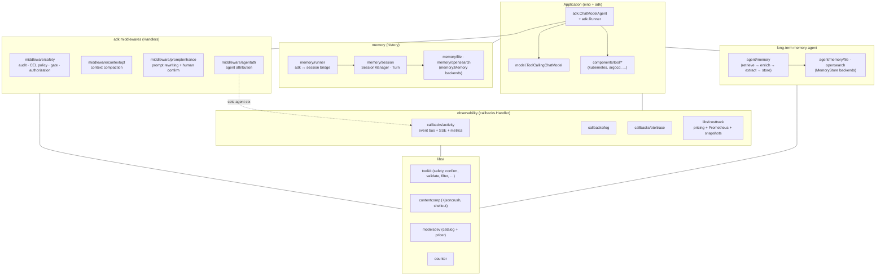
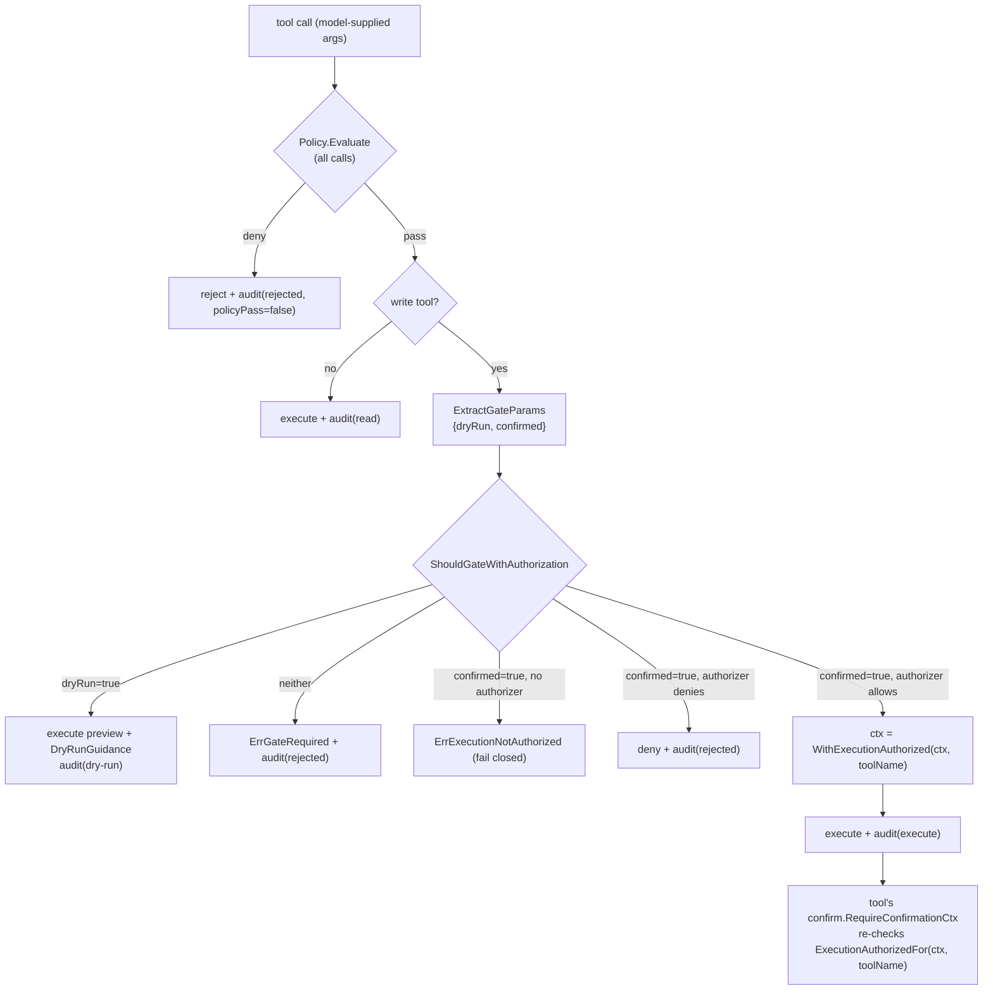
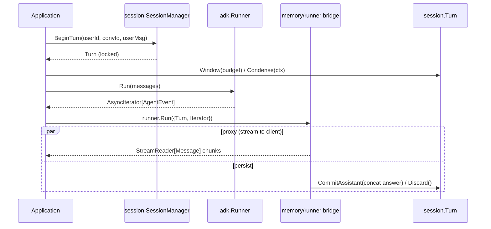
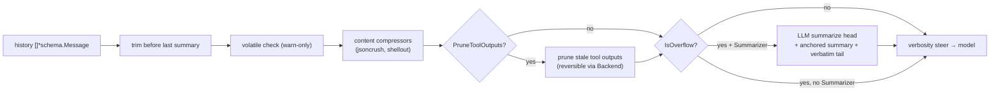
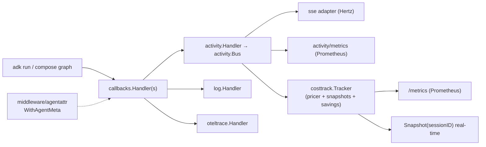
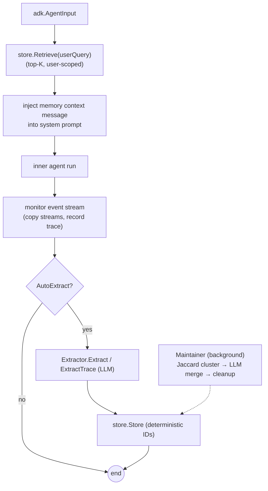
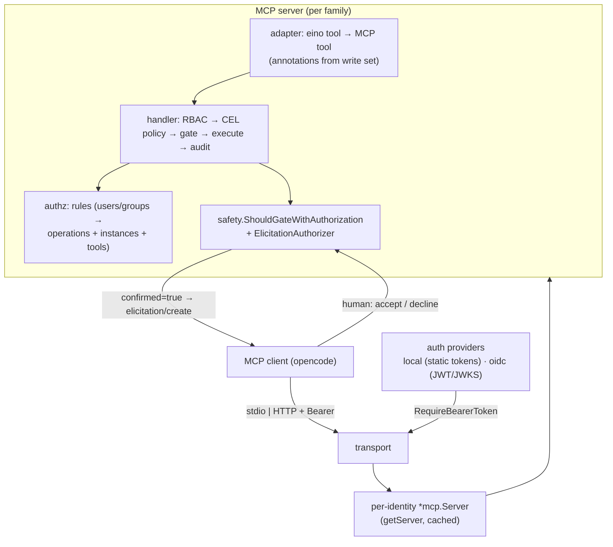

# eino-ext shared libraries — Technical design

> **Scope:** the eino-ext shared libraries in this repository — the safety /
> approval / mutation machinery, conversation memory (history), context
> compaction, cost saving & observability, the long-term memory agent, the
> callbacks, the `libs/` helpers, and the MCP server implementation.
>
> **Companion documents:**
> - [`01-eino-framework-and-adk.en.md`](./01-eino-framework-and-adk.en.md) — the
>   eino framework and its `adk` subpackage (prerequisite reading).
> - Implementation plan: [`.opencode/plans/mcp-servers-per-tool-family.md`](../../.opencode/plans/mcp-servers-per-tool-family.md)
> - Français : [`02-eino-ext-shared-libraries.fr.md`](./02-eino-ext-shared-libraries.fr.md)

---

## 1. Introduction

**eino-ext** extends eino with production-grade building blocks. Its layout:

```
components/   eino component abstractions + project-specific extensions
  tool/       tool families (kubernetes, argocd, prometheus, grafana, …)
  model/      model components (copilot, chatmodel, …)
  middleware/ adk middlewares (safety, contextopt, promptenhance, agentattr)  ← project extension
  memory/     conversation history (memory, session, runner, file, opensearch)
  agent/      adk agents (memory, profilesupervisor)
  document/ indexer/ retriever/ prompt/   (eino components)
callbacks/    callbacks.Handler implementations (activity, log, oteltrace)
libs/         shared, non-component support libraries
  toolkit/    cross-cutting helpers (safety, confirm, validate, filter, …)
  contentcomp costtrack  counter  docid  modelsdev  otelmetrics
  promptenhance  summarizer
```

**Design principles** (from `CONTRIBUTING.md` / `AGENTS.md`):

- Every `Config` has `validate` + `jsonschema` tags; every `New...` calls
  `libs/toolkit/validate.Struct` **after** applying defaults.
- Every constructor takes `ctx context.Context` as first parameter and threads
  it through.
- Errors are wrapped with `emperror.dev/errors`.
- Every package ships a table-driven `*_test.go` and a `README.md`; every
  component ships a `check.go` probe returning `checkup.Results`.
- No license headers. Naming: `ToJSON`, `URL`, `OpenSearch`, `GitHub`, `ID`.
- Shared logic lives in `libs/toolkit/`; duplication across tool packages is
  extracted there.

---

## 2. Architecture overview



---

## 3. Tool families — `components/tool/*`

Every tool family follows the same contract:

| Element | Purpose |
|---|---|
| `Configs` | `map[string]Config` — named instances (clusters for kubernetes, instances for argocd/prometheus/grafana) |
| `NewAllTools(ctx, configs, …)` | build all tools (read + write) as `[]tool.InvokableTool` |
| `NewReadOnlyTools(ctx, configs, …)` | build only read-only tools |
| `WriteToolNames()` | static list of write tool names (drives the safety gate) |
| `NewAllToolsWithSafety(ctx, configs, …, safetyCfg)` | tools + pre-configured safety middleware |
| `Check(ctx, configs)` | `checkup.Results` connectivity/RBAC probe |
| `check.go` + `check_test.go` | the checkup, per CONTRIBUTING |

The **target argument** differs per family and is reused by the safety/authz
layers: `cluster` for kubernetes, `instance` for argocd / prometheus / grafana.

| Family | Instance arg | Read tools | Write tools |
|---|---|---|---|
| `kubernetes` | `cluster` | cluster_list, list, describe, pod_log | pod_exec, resource_create, resource_patch, resource_delete, resource_apply |
| `argocd` | `instance` | instance_list, application_list/describe, certificate_list, cluster_list/describe, project_list/describe, repository_list/describe | application_create, application_delete, application_sync |
| `prometheus` | `instance` | instance_list, metric, target_list | — (none) |
| `grafana` | `instance` | instance_list, dashboard, datasource, query, dashboard_validate | dashboard_write |

Other families present in the repo: `alertmanager`, `github` (15 write tools),
`shell` (Dagger-backed), `file`, `s3`, `websearch`, `opensearch`,
`opensearch_retriever`, `pipe`, `convertor`.

**Contract for write tools** (documented on every `WriteToolNames()`): every name
listed there **MUST honor `dryRun=true` as a no-side-effect preview** — the
safety gate treats dry-run as always-safe, so a tool that mutates during dry-run
would let an unconfirmed model call bypass the gate.

---

## 4. Safety / approval / mutation machinery

Three layers, all reused by the MCP servers (§12). The core invariant:
**real execution of a write tool requires host-app authorization carried in
`context.Context` — never the model-supplied `confirmed=true` argument.**

### 4.1 `libs/toolkit/safety` — shared primitives

| File | Contents |
|---|---|
| `types.go` | `OperationType` (create/update/delete/sync/exec), `Phase` (`read`/`dry-run`/`execute`/`rejected`), `MutabilityLevel` |
| `audit.go` | `AuditEvent{Timestamp, ToolName, CallID, Phase, Operation, Arguments, Result, Error, PolicyPass, Metadata}`, `AuditSink` interface, `AuditSinkFunc`, `LogSink` (logrus), `ChannelSink` (buffered, non-blocking) |
| `policy.go` | `Policy` interface (`Evaluate(ctx, toolName, params)`), `CELPolicy` + `CELRule{Name, Expression, ToolNames}` (cel-go), `PolicyChain` (first failure stops) |
| `gate.go` | `GateParams{DryRun, Confirmed}`, `ExtractGateParams(rawJSON)`, `NewWriteToolSet(names)`, `ShouldGateWithAuthorization(ctx, toolName, writeTools, gp, args, auth)`, `ErrGateRequired`, `DryRunGuidance` (exported guidance text appended to dry-run results) |
| `authorization.go` | `ExecutionAuthorizer` interface (`AuthorizeExecute(ctx, toolName, args) error` — MUST derive the decision from server-side state, never from args), `ErrExecutionNotAuthorized` (fail-closed sentinel), `WithExecutionAuthorized(ctx, toolName)`, `ExecutionAuthorizedFor(ctx, toolName)` |
| `ownership.go` | `CheckOwnership(obj)` — detects managed-by annotations (ArgoCD, Helm, Flux, kubectl) and controller owner references |
| `blocklist.go` | robust command blocklist helpers (shell tool) |

**Gate rules** (`ShouldGateWithAuthorization`), in order:

1. Read-only tool (not in `writeTools`) → allow.
2. `DryRun` → allow (previews are safe; see the `WriteToolNames` contract).
3. Not `Confirmed` → `ErrGateRequired` (the model must dry-run first).
4. `Confirmed` and `auth == nil` → `ErrExecutionNotAuthorized` (**fail closed**).
5. `Confirmed` and the authorizer denies → the authorizer's error, wrapped with
   the tool name (`errors.Is`/`errors.As` preserved).
6. Otherwise → allow.

### 4.2 `libs/toolkit/confirm` — per-tool second layer

```go
confirm.RequireConfirmationCtx(ctx, toolName, dryRun, confirmed bool) error
confirm.RequireConfirmationForActionCtx(ctx, toolName, action string, confirmed bool) error
```

Every write tool calls one of these at the top of its `Invoke`. When executing
(`dryRun=false, confirmed=true`), they additionally require
`safety.ExecutionAuthorizedFor(ctx, toolName)` — so a tool invoked **directly**
(outside the middleware) is also protected. Defense in depth: even if the
middleware wrapper is bypassed, the tool itself refuses.

### 4.3 `components/middleware/safety` — the adk middleware

An `adk.ChatModelAgentMiddleware` (embeds `*adk.BaseChatModelAgentMiddleware`)
registered on `adk.ChatModelAgentConfig.Handlers`:

```go
type Config struct {
    WriteToolNames        []string                    // write/mutative tools (gate applies)
    AuditSink             safety.AuditSink            // default LogSink; receives EVERY call
    Policy                safety.Policy               // CEL; evaluated for ALL calls
    ExecutionAuthorizer   safety.ExecutionAuthorizer  // gates real execution; nil ⇒ dry-run only
    AllowModelConfirmation bool                       // INSECURE escape hatch (tests/sandboxes only)
    CheckOwnership        bool                        // reserved
}
```

It wraps all four tool-call hooks (`WrapInvokableToolCall`,
`WrapStreamableToolCall`, `WrapEnhancedInvokableToolCall`,
`WrapEnhancedStreamableToolCall`) and passes `WrapModel` through. Per call:
**policy → gate → endpoint → audit**; dry-run results get `DryRunGuidance`
appended; on authorization it marks the ctx with
`safety.WithExecutionAuthorized(ctx, toolName)` so the per-tool layer passes.



### 4.4 The trust boundary (why the LLM cannot self-approve)

| Channel | Controlled by | Trusted as authorization? |
|---|---|---|
| Tool arguments (incl. `confirmed=true`) | LLM | **No** — `confirmed=true` only *triggers* the authorizer |
| Conversation text (« the user said yes ») | LLM | **No** — approval is never read from chat text |
| `ExecutionAuthorizer` decision | Host app (server-side state: approval store, signed token, operator policy) | **Yes — the only approval source** |
| `context.Context` grant | Server only | Yes — the model cannot write to ctx |

`AllowModelConfirmation` is deliberately **not** used in production paths; the
MCP servers (§12) do not wire it at all.

---

## 5. Conversation memory (history) — `components/memory`

Cross-request conversation storage, independent of adk (except `runner`).

### 5.1 Core — `memory.go`, `conversation.go`, `markers.go`

```go
type Memory interface {
    GetConversation(userId, id string, createIfNotExist bool) (Conversation, error)
    ListConversations(userId string) ([]string, error)
    DeleteConversation(userId, id string) error
}
type Conversation interface {
    Append(msg *schema.Message)
    GetFullMessages() []*schema.Message
    GetMessages() []*schema.Message
    Load() error
    Save(msg *schema.Message) error
    AppendSummary(summary *schema.Message)
    GetWindow(budget int) []*schema.Message
    CountTokens() int
    LastSummaryIndex() int
    GetActivities() []json.RawMessage
    SetActivities(raw []json.RawMessage)
    GetUpdatedAt() string
}
```

- **Windowing:** `SelectWindow(msgs, count, budget, maxWindowTokens)` — returns
  `[last summary + following messages]` bounded by a token budget; binary-search
  trimming (O(log N) count calls); always preserves the leading summary and the
  last message.
- **Markers** (boolean `Extra` markers): `SummaryMarkerKey`
  (`IsSummary`/`NewSummaryMessage`), `IncompleteMarkerKey`
  (`MarkIncomplete`/`IsIncomplete` — generation was interrupted), `EphemeralMarkerKey`
  (`NewEphemeralMessage`/`IsEphemeral` — streamed but never persisted).
- `TokenCounter` = alias of `libs/counter.TokenCounter`
  (`DefaultTokenCounter` ≈ 4 chars/token).

### 5.2 Backends

- **`memory/file`** — JSONL file-backed `memory.Memory`; one file per conversation
  at `<dir>/<userId>/<id>.jsonl`, activities in a sibling `.activities` file.
  `FileMemoryConfig{Dir, MaxWindowSize, TokenCounter, MaxWindowTokens}`.
- **`memory/opensearch`** — OpenSearch-backed `memory.Memory`; one document per
  conversation, doc ID `{userId}:{conversationId}`, full-document upsert on
  `Append`, auto-creates the index. `Config{URLs, Username, Password,
  TLSSkipVerify, IndexName, MaxWindowSize, MaxWindowTokens, TokenCounter}`.
  Uses `libs/toolkit/osclient.New`.

### 5.3 Session lifecycle — `memory/session`

```go
type Config struct {
    Memory            memory.Memory          // required
    Summarizer        Summarizer             // = libs/summarizer.Summarizer
    CondenseThreshold int                    // token threshold for condensation
    WindowBudget      int
    TokenCounter      memory.TokenCounter
}
sm, _ := session.NewSessionManager(cfg)
turn, _ := sm.BeginTurn(userId, conversationId, userMsg)   // locks the session (ref-counted)
msgs := turn.Window(budget)                                // [last summary + tail]
condensed, _ := turn.Condense(ctx)                         // optional anchored summary at threshold
// ... run the agent ...
turn.CommitAssistant(assistantMsg)                         // persists user + answer, releases lock
turn.Discard()                                             // drops the pending user message
```

`Turn` is the unit of work between two requests: `BeginTurn → [Condense] →
Window → agent run → CommitAssistant | Discard`. Condensation is **non-destructive**
(anchored summary message with `SummaryMarkerKey`), interoperable with
`contextopt` (`trimBeforeLastSummary`).

### 5.4 adk bridge — `memory/runner`

```go
type Config struct {
    Turn       *session.Turn                        // required; the bridge owns it
    Iterator   *adk.AsyncIterator[*adk.AgentEvent]  // required; from adk.Runner.Run
    Predicate  MessagePredicate                     // default: assistant-only
    OnError    func(err error) *schema.Message      // ephemeral notice (streamed, not persisted)
    OnSkip     func(event *adk.AgentEvent)           // debug/trace observer
    BufferSize int                                  // default 1000
}
stream, _ := runner.Run(cfg)   // *schema.StreamReader[*schema.Message] to forward to the client
```

`Run` splits the adk event iterator over one duplicated stream
(`schema.Pipe` + `Copy(2)`): a **proxy** goroutine streams selected assistant
messages to the caller; a **persistence** goroutine drains the second copy,
concatenates the full answer (`schema.ConcatMessages`), and commits it through
the `Turn`. Guarantees:

- **no-dangling-user:** if no assistant content is produced, the turn is
  `Discard()`ed (the pending user message is never persisted alone).
- **incomplete:** an iterator error or truncated stream tags the committed answer
  with `memory.MarkIncomplete`.
- **ephemeral:** `OnError` notices (`memory.NewEphemeralMessage`) are streamed but
  not persisted; tool-call messages are excluded from persistence.
- The run is driven under `context.Background()` so a client disconnect neither
  aborts generation nor persistence.

Predicates: `runner.Role(schema.Assistant)`, `runner.AgentRole(name, role)`,
`runner.And/Or/Not(...)`.



---

## 6. Context compaction — `components/middleware/contextopt` + `libs/contentcomp`

Keeps long histories under the model's context window. The core `Optimizer` is
**pure** (no LLM, no I/O); LLM access enters only through the optional
`Summarizer`.

### 6.1 `contextopt.Optimizer`

```go
type Config struct {
    ContextLimit          int                     // model total context window (tokens)
    MaxInputTokens        int                     // >0 takes precedence over ContextLimit-ReservedTokens
    ReservedTokens        int                     // output buffer, default 20_000
    TailTurns             int                     // most-recent turns preserved verbatim, default 2
    PreserveRecentTokens  int                     // tail token budget, default clamp(usable*0.25, 2k, 8k)
    PruneToolOutputs      bool
    PruneProtectTokens    int                     // protected recent window, default 40_000
    PruneMinimum          int                     // min eligible tokens before pruning, default 20_000
    ToolOutputMaxChars    int                     // default 2_000
    ProtectedTools        []string                // never pruned
    TokenCounter          memory.TokenCounter     // default memory.DefaultTokenCounter
    Summarizer            Summarizer              // LLM-backed compaction on overflow; nil disables
    Backend               contentcomp.Store       // reversible prune (content-addressed offload)
    ContentCompressors    []contentcomp.Compressor // deterministic, applied before truncation
    VolatileCheck         bool                    // warn-only volatile-token detection
    VolatileObserver      func(context.Context, VolatileFinding)
    VerbositySteer        string                  // appended to first system message (cache-safe)
}
opt, _ := contextopt.NewOptimizer(cfg)
msgs, _ := opt.Optimize(ctx, msgs)
overflow := opt.IsOverflow(msgs)
orig, _ := opt.RestorePruned(ctx, prunedMsg)
```

Pipeline (`Optimize`), cheapest-first:

1. **trim** everything before the last summary (`trimBeforeLastSummary`);
2. **volatile check** (warn-only: ISO-8601 timestamps, UUIDs, `*_id` fields in the
   cached prefix);
3. **lossless content compression** of tool outputs (`ContentCompressors`);
4. **prune** stale tool outputs beyond the protected window (reversible when
   `Backend` is set — original offloaded, handle in `Extra[PruneRefKey]`);
5. **on overflow with a Summarizer:** replace the summarizable head with an
   anchored summary (`memory.NewSummaryMessage`) and keep the verbatim tail;
6. **verbosity steer** (append-only to the first system message).

Markers: `PruneMarkerKey`, `PruneRefKey`, `CompressedMarkerKey` (idempotence across
turns). Never mutates input messages (clones only changed ones).

### 6.2 Two surfaces over the same optimizer

- **`contextopt.Middleware`** — an `adk.ChatModelAgentMiddleware` rewriting
  `state.Messages` in `BeforeModelRewriteState` (intra-run, every model call).
- **`contextopt.ChatModel` / `contextopt.ToolCallingChatModel`** —
  `model.BaseChatModel` decorators optimizing the input before
  `Generate`/`Stream` (compose-level, portable outside adk).

### 6.3 `libs/contentcomp` — deterministic compressors

```go
type Ref struct { Key string; Size int }              // content-addressed handle
type Store interface { Put(ctx, content string) (Ref, error); Get(ctx, Ref) (string, error) }
type Compressor interface { Name() string; Compress(ctx, content string) (out string, changed bool, err error) }
contentcomp.NewMemoryStore()                          // in-memory Store
```

Design constraints: **determinism** (pure functions, byte-stable prompt-cache
prefix) and **reversibility** (lossy reductions move original bytes behind a
`Ref`/`Store`, never discard them).

- **`jsoncrush`** — lossless crush of JSON arrays of objects: hoists keys common
  to every row into a shared `_defaults` block; opt-in lossy stage offloads
  high-entropy columns behind Store handles. `Crush`, `Expand`, `ExpandWithStore`,
  `IsCrushed`, `NewCompressor()`.
- **`shellout`** — declarative pattern-table compaction of noisy CLI/log/diff
  output (progress bars, CR redraws, blank runs, repeated lines); unmatched
  content passes through byte-identically. `Compress`, `NewCompressor()`,
  `DefaultPatterns()`.

### 6.4 `libs/summarizer` — summarization abstraction

```go
type Summarizer interface {
    Summarize(ctx context.Context, history []*schema.Message, previousSummary string) (string, error)
}
type SummarizerFunc func(...) // adapter
```

`contextopt.NewModelSummarizer(model, opts...)` builds an LLM-backed
`Summarizer` (embedded `prompts/summary_template.md`); `session.Summarizer` and
`contextopt.Summarizer` are aliases of the same interface, so one instance feeds
both. **Anti-double-cost invariant:** share the same `TokenCounter` across
`session.Config`, the memory store, and the contextopt middleware, and keep
`WindowBudget ≤` the middleware's usable window.



---

## 7. Cost saving & observability

### 7.1 `callbacks/activity` — the live activity stream

A Kilocode-style typed event bus bridging eino component lifecycle into a
transport-agnostic event stream (fan-out to UIs over SSE or anything else).
Three layers:

1. **Event model** (`event.go`) — `Event{ID, SessionID, Type, Agent, Timestamp, Data}`
   plus the typed payload catalog: `step.started/ended/failed`, `agent.switched`,
   `model.switched`, `prompted`, `text.started/delta/ended`,
   `reasoning.started/delta/ended`, `tool.input.started/delta/ended`,
   `tool.called/progress/success/failed`, `retried`, `compaction.started/delta/ended`,
   `session.ended`. Notable payloads: `StepEnded{Finish, Cost, Tokens, Estimated}`,
   `Tokens{Input, Output, Reasoning, Cache{Read, Write}}`,
   `SessionEnded{Duration, Cost, Steps, Tools}`. `MarshalSSEData(e)` renders the
   SSE `data:` body (merges the `agent` key into the payload).
2. **Bus** (`bus.go`) — in-memory per-session fan-out with bounded ring-buffer
   replay for `Last-Event-ID`:
   ```go
   type Bus interface {
       Publish(ctx context.Context, e Event)
       Subscribe(ctx context.Context, sessionID, lastEventID string) (<-chan Event, func())
       Replay(sessionID string) ([]Event, error)
       Close() error
   }
   // Config{BufferSize(256), SubscriberQueueSize(64), SlowPolicy(DropEvent|DropSubscriber), MaxSessions(4096), Clock}
   // HasSubscribers(sessionID) bool  (SubscriberCounter)
   ```
3. **Producer** (`handler.go`) — `Handler` implements `callbacks.Handler` +
   `callbacks.TimingChecker`, translating model/tool lifecycle into events:
   `OnStart/OnEnd/OnError/OnStartWithStreamInput/OnEndWithStreamOutput` +
   `Needed` (skips expensive stream timings when the bus has no subscribers).
   ```go
   type Pricer interface { Cost(model string, t Tokens) float64 }
   type TokenCounter func(msgs []*schema.Message) int
   h := activity.NewHandlerWithConfig(bus, activity.WithPricer(pricer), activity.WithTokenCounter(tc))
   callbacks.AppendGlobalHandlers(h)            // or compose.WithCallbacks(h)
   ```
   Streaming: text deltas, reasoning deltas (started/delta/ended with a
   `ReasoningID`), tool input deltas (with a `CallID`), step end with finish
   reason + usage + cost. When the gateway reports no usage, the
   `TokenCounter` fallback estimates tokens (marked `Estimated: true`).
   Session/agent attribution comes from the context: `activity.WithSession(ctx, id)`,
   `activity.WithAgent(ctx, name)`, `activity.WithAgentMeta(ctx, AgentMeta{Name, Model, Description})`
   (see `middleware/agentattr`).

**Cost-saver** (`costsaver.go`): at session end, `SessionSummarizer` replays the
bus into a `SessionSummary{Duration, TotalCost, TotalTokens, Steps, ToolsCalled,
TextOutput, ReasoningContent, FinishReasons, HadFailures}`;
`CompositeComplexityAnalyzer` tries an LLM analysis (`ComplexityAnalyzer`,
embedded prompt) and falls back to a formula (`FallbackComplexityAnalyzer`:
tokens/tool/step factors, ×0.8 on failures, zero floor when no tools) →
`ComplexityAnalysis{ComplexityRatio, HumanTimeSavedSeconds, MoneySavedUSD}`.

**`sse/` subpackage:** Hertz SSE adapter (`sse.NewHandler(cfg)` →
`app.HandlerFunc`) fanning a `Bus` out as `text/event-stream` (session from a
query param, `Last-Event-ID` replay, heartbeats). The only web-framework-dependent
package.

**`metrics/` subpackage:** optional Prometheus collector consuming
`step.ended` events (`llm_tokens_total`, `llm_cost_usd_total`, savings/component
variants, cost-saver gauges).

### 7.2 `libs/costtrack` — the cost facade

```go
type Config struct {
    Bus             activity.Bus
    Resolve         modelsdev.NameResolver
    CatalogHolder   *atomic.Pointer[modelsdev.Catalog]
    PricingProvider string                              // required
    TokenCounter    activity.TokenCounter               // default counter.DefaultTokenCounter
    Savings         activity.ComplexityAnalyzerConfig
    TerminalTypes   []activity.Type                     // default {"answer.ended", "question"}
    Registry        prometheus.Registerer               // default: private registry
    Recorder        Recorder                            // default: PrometheusRecorder
}
tracker, _ := costtrack.NewTracker(ctx, cfg)
callbacks.AppendGlobalHandlers(tracker.ActivityHandler())   // the activity.Handler
tracker.Watch(ctx, sessionID)                               // goroutine per session
snap := tracker.Snapshot(sessionID)                         // real-time per-session + global totals
http.Handle("/metrics", tracker.PrometheusHandler())
```

`Recorder` abstracts the metric backend (nil-receiver safe); the default
`PrometheusRecorder` registers `agent_tasks_total`, `agent_task_cost_usd`,
`llm_compactions_total`, `llm_realtime_cost_usd`, `human_savings_usd_total`,
`llm_cost_savings_usd_total`, `llm_cost_usd_by_component_total` plus the
`metrics.Collector` / `metrics.CostSaverCollector`. `Watch` aggregates real-time
totals per session, and on a terminal event publishes a synthetic
`session.ended` (so the cost-saver path fires) and records task-level metrics.

### 7.3 `libs/counter` & `libs/modelsdev`

- **`counter`**: `TokenCounter func(msgs []*schema.Message) int`;
  `DefaultTokenCounter` ≈ len(content)/4 heuristic (also counts tool-call
  arguments). Used as the fallback everywhere usage is missing.
- **`modelsdev`**: the [models.dev](https://models.dev) catalog — per-model
  context/output limits and USD-per-million-token cost.
  `Load(ctx, LoadOptions)` fetches `api.json` (falls back to the embedded
  snapshot; never errors). `CatalogPricer{Catalog, Resolve}` implements
  `activity.Pricer`: `Cost(gatewayModel, tokens)` and
  `Breakdown(...) (CostBreakdown{Input, Output, CacheRead, CacheWrite, Total, Savings}, ok)`.
  `NameResolver` maps gateway model names → `(provider, id)`; unknown models
  yield `ok=false` (never guesses). `Catalog.Limits` / `Catalog.Usage` are query
  helpers for compaction triggers.

### 7.4 `callbacks/log` & `callbacks/oteltrace`

- **`callbacks/log`** — `callbacks.Handler` logging lifecycle via logrus with
  structured fields (`component`, `component_name`, `component_type`, `agent`);
  chat-model entries add `content`/`reasoning`/`finish_reason`/token usage; tool
  entries add `input`/`output`; content truncated (`maxContentLen=500`,
  `maxInputLen=2000`).
- **`callbacks/oteltrace`** — `callbacks.Handler` + `TimingChecker` recording
  OpenTelemetry spans: `chat_model.generate` (INTERNAL; `gen_ai.request.model`,
  `gen_ai.usage.*`, `gen_ai.response.finish_reason`) and `tool.<name>` (CLIENT;
  `tool.name`); errors via `RecordError` + `codes.Error`; tool I/O redacted by
  default. `Config{TracerProvider, TracerName, SpanKindClient, IncludeToolIO, MaxSpanIO}`.
  Reads `activity.AgentFromContext`/`SessionFromContext` for `agent`/`session.id`
  attributes.

### 7.5 `libs/otelmetrics` — OTel metrics scope

Thin wrapper over the global `MeterProvider`: `NewScope(ctx, *Config)` →
`Scope` with nil-receiver-safe instruments `FloatCounter`, `IntCounter`,
`Histogram`, `Gauge` (observable, backed by a thread-safe value store), plus
`Attrs(kv ...string)`. Components embed a `*Scope` and record metrics that flow
to the host app's exporter.



---

## 8. Long-term memory agent — `components/agent/memory`

An `adk.Agent` **decorator** that adds long-term memory around an inner agent:

- **Before each turn:** retrieve relevant memories from a `MemoryStore`
  (BM25/kNN via eino `indexer`/`retriever`) and inject them into the system
  prompt as a marked context message (`NewMemoryContextMessage` /
  `MemoryContextMarkerKey`).
- **After each turn:** an LLM `Extractor` pulls structured memories from the
  exchange and persists them (deterministic IDs `sha256(category+content)[:32]`
  ⇒ re-learning upserts instead of duplicating).
- **Background `Maintainer`:** Jaccard clustering + optional LLM merge for
  compaction, and age-based cleanup.
- **`EndSession`:** compacts session-scoped memories into summaries.

```go
type Config struct {
    InnerAgent             adk.Agent          // required
    Store                  MemoryStore
    Model                  model.BaseChatModel // for extraction
    UserID, SessionID      string              // defaults; overridden by adk.AddSessionValue
    AutoExtract            bool                // default true when Store+Model set
    MaintenanceInterval    time.Duration       // 0 disables the background maintainer
    MaxAge                 time.Duration       // cleanup horizon
    MaxMemoriesPerRetrieve int                 // default 5
    MaxQueryChars          int
    SystemPromptPrefix     string
    Trace                  TraceConfig         // opt-in run-trace extraction
    ExtractTimeout         time.Duration       // default 30s
    AsyncExtract           bool
    RetrieveTopK           int
    QueryMessageFilter     func(*schema.Message) bool
    ShouldRetrieve         func(ctx) bool
    ShouldExtract          func(ctx) bool
}
agent, _ := memory.NewAgent(ctx, cfg)
agent.SetUserID(...) / agent.SetSessionID(...)
agent.EndSession(ctx)
```

- **`Extractor`**: `Extract(ctx, userContent, assistantContent) []ExtractionResult`,
  `ExtractTrace(ctx, userContent, renderedTrace)`, `Summarize(...)`.
  `ExtractionResult{Content, Category, Source, Confidence, Scope}` — results
  filtered to `Confidence >= 0.7`.
- **Categories:** `fact`, `preference`, `learning`, `summary`, `procedure`
  (reusable operational know-how, surfaced first at retrieval). **Sources:**
  `user`, `assistant`, `observation`, `session`.
- **`MemoryStore`**: `indexer.Indexer` + `retriever.Retriever` + `Delete`,
  `DeleteByFilter`, `List`, `Count`. Backends: `agent/memory/file` (JSONL) and
  `agent/memory/opensearch` (BM25 + optional kNN).
- **`Entry`** ⇄ `schema.Document` (`ToDocument` / `EntryFromDocument`); scope is
  folded into the content so BM25 sees it, and kept in metadata.
- **Trace mode** (`trace.go`): `RunTrace []TraceStep{Kind: assistant_text |
  tool_call | tool_result | terminal_answer, Agent, Name, Text}`;
  `RenderTrace(trace, TraceConfig)` (bounded, redaction, keep-priority trimming);
  `TerminalTools` maps tool names → the argument field holding the final answer.

The agent monitors the inner run's event iterator (`adk.AsyncIterator`), copies
streams (`Copy(2)`) to both forward and record, concatenates per-turn chunks
(`schema.ConcatMessages`), and extracts after the run closes (sync by default,
`AsyncExtract` opt-in, detached from the run ctx so cancelled runs are still
learned from).



---

## 9. Other agents — `components/agent/profilesupervisor`

`NewProfileSupervisor(ctx, *SupervisorConfig)` builds a **profile supervisor
agent**: one `adk.ChatModelAgent` sub-agent per detected project profile
(golang/node/python/java/rust/php), each backed by a `components/tool/shell`
tool configured with the profile's OCI base image, exposed to a top-level
`profile_supervisor` ChatModelAgent as `adk.NewAgentTool` tools. The supervisor
dynamically selects the right language-specific sub-agent per task
(`EmitInternalEvents: true`). Optionally attaches `components/middleware/safety`
to the supervisor and each sub-agent (write tools default to
`shell.WriteToolNames()`).

```go
type SupervisorConfig struct {
    Model        model.BaseChatModel     // required
    Workdir      string                  // required
    NetworkPolicy *egress.Policy         // SSRF guard for the shell sandboxes
    Profiles     []profile.Profile       // auto-detected if empty
    Resolver     *profile.Resolver
    SafetyCfg    *safety.Config          // optional gate
    SystemPrompt string
}
```

---

## 10. `libs/toolkit` — shared helpers

| Package | Purpose | Key symbols |
|---|---|---|
| `validate` | shared go-playground/validator wrapper; LLM-friendly messages | `Struct(s any) error` |
| `checkup` | connectivity/RBAC probe result types; every component ships `Check()` | `Result{Component, Instance, Status, Error, Message}`, `Results`, `StatusOK/Error/Limited`, `DependencyFailed`, `Merge`, `OK()`, `JSON()` |
| `safety` | safety primitives (§4.1) | `ShouldGateWithAuthorization`, `ExecutionAuthorizer`, `WithExecutionAuthorized`, `AuditSink`, `CELPolicy`, `CheckOwnership` |
| `confirm` | per-tool confirmation gate (§4.2) | `RequireConfirmationCtx`, `RequireConfirmationForActionCtx` |
| `toolutil` | shared tool helpers | `NotFoundError(kind, name, known)`, `EmptyJSONUnmarshaler[T]()`, `SortedKeys[V]` |
| `filter` | regex + JSON-selector filtering for tool output | `CompileMatcher(pattern)`, `Matcher`, `Selector`, `Compile(pattern)` |
| `marshal` | JSON marshaling helpers | `MustMarshal(v)`, `Outputs(outputs)` |
| `strutil` | string helpers | `Truncate`, `StripMarkdownFences`, `ExtractJSONBlock` |
| `kretry` | retry helper for transient Kubernetes API errors | `Retry(ctx, fn)`, `Do(ctx, backoff, fn)`, `IsTransient(err)`, `DefaultBackoff` |
| `fileutil` | filesystem safety helpers (path validation, symlink rejection CWE-59/22, binary detection, `.git` exclusion) | `ValidateRelativePath`, `ResolveSymlinkSafe`, `IsWithinPath`, `IsBinary`, `RejectDotGitPath`, `ValidateRootDir`, `CopyDir`, `WalkDirFiles`, `SanitizePathSegment`, `SessionDirName`, `SweepStaleDirs` |
| `egress` | policy-driven HTTP/HTTPS CONNECT egress proxy — « local network forbidden by default » (RFC1918/link-local/loopback/cloud-metadata blocks) with allowlist; for Dagger containers | `Policy{AllowHosts, AllowCIDRs, AllowLocalNetwork, DefaultDeny}`, `Policy.Allows(host, ip)`, `NewProxy(pol)`, `Proxy.Serve(ctx, ln)` |
| `osclient` | shared constructor for the OpenSearch v4 client across indexer/retriever/loader/memory components | `Config{URLs, Username, Password, TLSSkipVerify}`, `New(ctx, cfg, timeout)` |
| `dagger` | wrapper around the Dagger engine client (OCI containers, shared cache volumes, egress-proxy bindings) | `EngineConfig{RegistryAuth, LogOutput, Workdir}`, `NewClient(ctx, cfg)`, `Client.Container(ctx, baseImage, opts...)`, `WithWorkdir/WithCacheVolume/WithEgressPolicy/WithUser/WithRegistryAuth`, `CacheKeyForProfile/Tool` |
| `profile` | project-type detection + base-image selection for Dagger-backed shell sandboxes (marker files: go.mod, package.json, pyproject.toml, pom.xml, Cargo.toml, composer.json, …) | `Profile{Name, BaseImage, SystemPrompt, InstallCmd, ToolPresets, Env}`, `Resolver{ImageMap}`, `NewResolver(opts...)`, `Resolver.Resolve(ctx, workdir)`, `DefaultImageMap`, `WithImageOverrides` |

Other `libs/`:

| Package | Purpose |
|---|---|
| `contentcomp` | deterministic compressor contracts (`Store`, `Compressor`, `Ref`, `MemoryStore`) — §6.3 |
| `costtrack` | cost-tracking facade — §7.2 |
| `counter` | token counting — §7.3 |
| `docid` | deterministic document base IDs and content hashes (xxh3): `ComputeBaseID(identifier)`, `ComputeContentHash(content)` |
| `modelsdev` | models.dev catalog + pricer — §7.3 |
| `otelmetrics` | OTel metrics scope — §7.5 |
| `promptenhance` | prompt rewriting with a small model (kilocode « Enhance Prompt »): `NewEnhancer(ctx, *Config)`, `Enhancer.Enhance/EnhanceInContext`; escapes `<context>`/`<draft>` delimiters and strips control chars from embedded content |
| `summarizer` | `Summarizer` interface + `SummarizerFunc` — §6.4 |

---

## 11. Middleware catalog — `components/middleware`

All are `adk.ChatModelAgentMiddleware` (embed `*adk.BaseChatModelAgentMiddleware`),
registered on `adk.ChatModelAgentConfig.Handlers`:

| Middleware | Hook(s) | Role |
|---|---|---|
| `safety` | `Wrap*ToolCall` ×4 | audit + CEL policy + dry-run/confirmed gate + host authorization (§4.3) |
| `contextopt` | `BeforeModelRewriteState` | rewrite `state.Messages` with the optimized history (§6.2) |
| `promptenhance` | `BeforeModelRewriteState` | rewrite the last user message via `libs/promptenhance`; when `AutoAccept=false`, returns an `InterruptError` (`InterruptInfo{Original, Enhanced}`) so the consumer can present the enhanced prompt and resume with a `Choice{Action: original\|enhanced\|modified\|skip_always, Text}` (`WithChoice(ctx, choice)`); idempotent via a marker; never mutates caller messages |
| `agentattr` | `BeforeAgent`, `BeforeModelRewriteState`, `Wrap*ToolCall` ×4 | threads `activity.WithAgentMeta(ctx, {Name, Model, Description})` so activity/log/otel events are attributed to the agent (`Config{AgentName required, Model, Description}`) |

---

## 12. MCP servers — `libs/mcp` + `components/mcp/*`

Full implementation plan:
[`.opencode/plans/mcp-servers-per-tool-family.md`](../../.opencode/plans/mcp-servers-per-tool-family.md).

**Goal:** expose the local tool families as MCP servers (consumable from opencode
or any MCP client), with provider-based auth (local + OIDC), granular RBAC, and
the safety approval machinery reproduced on MCP so a write action always requires
real human approval the LLM cannot bypass.

### 12.1 Layout

```
libs/mcp/                  — shared generic toolkit (package mcp)
  config.go  server.go  adapter.go  identity.go
  auth.go  auth_local.go  auth_oidc.go
  authz.go  approval.go  transport.go
components/mcp/            — per-family MCP servers (project-specific extension)
  kubernetes/  argocd/  prometheus/  grafana/
```

### 12.2 How the existing machinery is reused

- **Adapter:** each `tool.InvokableTool` → MCP tool (`Info()` → name/description/
  input schema via `ParamsOneOf.ToJSONSchema()`; annotations from the write set:
  read tools `readOnlyHint:true`, write tools `readOnlyHint:false, destructiveHint:true`).
  Handler → `InvokableRun` with the raw JSON arguments.
- **Gate:** the handler reproduces the safety middleware's preflight —
  `safety.ShouldGateWithAuthorization` with an `ExecutionAuthorizer` implemented
  via **MCP elicitation** (`approval.go` — `ElicitationAuthorizer`): on
  `confirmed=true`, the server sends `elicitation/create` to the client
  (opencode renders an approval prompt to the human showing the tool name, the
  target instance, the user, and the **actual arguments of this execution call**);
  accept → `safety.WithExecutionAuthorized(ctx, toolName)` → the tool's
  `confirm.RequireConfirmationCtx` passes → executes. Decline/cancel/timeout/
  client without elicitation → fail closed (write tools are dry-run only).
  `AllowModelConfirmation` is **not** wired.
- **Audit:** every call emits a `safety.AuditEvent` (phase read/dry-run/execute/
  rejected + identity metadata) via `safety.AuditSink`.
- **CEL policy:** `safety.Policy` evaluated on every call.

### 12.3 AuthN — provider-based

The HTTP transport is wrapped with the go-sdk's `auth.RequireBearerToken`
middleware; providers implement `auth.TokenVerifier`:

- **`local`** — static bearer tokens → identity; constant-time comparison
  (`crypto/subtle`) of SHA-256 digests over all tokens (fixed-length digests →
  no timing or token-length leak; all tokens always compared → no existence
  leak).
- **`oidc`** — verifies OIDC-issued JWT access tokens with
  `github.com/coreos/go-oidc/v3` (JWKS signature, issuer, audience, expiry);
  claims → identity (`UserClaim` default `preferred_username`, fallback `sub`;
  `GroupsClaim` default `groups`); the `scope` claim → the token's scopes.

Identity = `{User, Groups}`, carried in `auth.TokenInfo` (`UserID` + `Extra`).
Token scopes (`LocalToken.Scopes` for local, the `scope` claim for OIDC) are
carried in `auth.TokenInfo.Scopes` and checked against
`AuthConfig.RequiredScopes` by the SDK middleware (403 before any handler).
Stdio = trusted local process → `Config.LocalIdentity` (still subject to RBAC).

### 12.4 AuthZ — RBAC

```go
type AccessRule struct {
    Users      []string // match Identity.User (exact); empty = any
    Groups     []string // match any of Identity.Groups; empty = any
    Operations []string // "read", "write"; empty = all
    Instances  []string // cluster/instance names; empty or "*" = all
    Tools      []string // exact names or "prefix_*" glob; empty = all
}
```

Within a rule, `Users` and `Groups` conditions are AND-ed; across rules, the
union grants. **Fail closed: no match → deny.** Enforced at `tools/list`
(per-identity `*mcp.Server` via `getServer`, cached — so each identity only sees
the tools it may call, and SDK pagination stays correct) and at `tools/call`
(category + instance extracted from the `cluster`/`instance` argument).

### 12.5 Transports

- **stdio:** `Server.ServeStdio(ctx)` (`srv.Run(ctx, &mcpsdk.StdioTransport{})`).
- **HTTP (streamable):** `Server.HTTPHandler()` —
  `mcpsdk.NewStreamableHTTPHandler(getServer, …)` wrapped with
  `auth.RequireBearerToken` when auth is configured; `Server.ListenAndServeHTTP(ctx, addr)`
  with graceful shutdown. **Stateful mode only** (stateless rejects server→client
  requests, which would break elicitation).



**Why the LLM cannot self-approve on MCP:** `confirmed=true` is model-supplied and
only *triggers* the authorizer; the authorizer's only approval source is the
elicitation response, which is a server→client request the human answers in the
client UI; the LLM never sees the elicitation request, only the final tool
result; the ctx grant is per-call and per-tool-name; and the per-tool
`confirm.RequireConfirmationCtx` re-checks it. Fail closed without
elicitation-capable clients.

---

## 13. Component conventions (checklist)

Every new component/middleware/lib follows:

- `Config` struct with `validate` + `jsonschema` tags; `New...` applies defaults
  then calls `validate.Struct(cfg)`.
- `ctx context.Context` first parameter, threaded through.
- `emperror.dev/errors` for wrapping; sentinels compared with `errors.Is`.
- Compile-time interface check `var _ Iface = (*T)(nil)`.
- Table-driven `*_test.go` (no live external service; mocks/httptest/envtest).
- `README.md` (purpose, constructor snippet, wiring).
- Package comment `// Package xxx ...`.
- `check.go` + `check_test.go` with `Check(ctx, cfg) checkup.Results` probing
  connectivity/RBAC per instance.
- Prompts in `prompts/*.md` embedded with `//go:embed`.
- No license headers. Naming: `ToJSON`, `URL`, `OpenSearch`, `GitHub`, `ID`.
- Gates: `make test` (not bare `go test`), `make lint`,
  `bash scripts/check_components.sh`.

---

## 14. Summary

| Concern | Where | Mechanism |
|---|---|---|
| Approval / mutation safety | `libs/toolkit/safety`, `libs/toolkit/confirm`, `components/middleware/safety` | dry-run/confirmed gate + `ExecutionAuthorizer` (host-side) + per-tool second layer; fail closed; audited |
| Conversation history | `components/memory` (+ `session`, `runner`, `file`, `opensearch`) | `Memory`/`Conversation`, windowing (`SelectWindow`), markers, session turns, adk bridge |
| Context compaction | `components/middleware/contextopt`, `libs/contentcomp`, `libs/summarizer` | pure optimizer (trim/compress/prune/summarize), deterministic compressors, LLM summarizer |
| Cost saving & observability | `callbacks/activity`, `libs/costtrack`, `libs/counter`, `libs/modelsdev`, `callbacks/log`, `callbacks/oteltrace`, `libs/otelmetrics` | typed event bus + SSE/Prometheus/OTel, catalog pricing, complexity analysis |
| Long-term memory | `components/agent/memory` | retrieve → enrich → extract → store; maintainer; trace mode |
| Prompt quality | `components/middleware/promptenhance`, `libs/promptenhance` | small-model rewrite + human confirm interrupt |
| Agent attribution | `components/middleware/agentattr` | agent/model metadata into callback context |
| MCP | `libs/mcp`, `components/mcp/*` | eino tools over MCP; local/OIDC auth; RBAC; elicitation approval |

---

## 15. Implementation deep-dives

The sections above describe the concepts and the public API. This section
explains **how the implementation actually works** — the internal code paths and
algorithms — so a developer can read, modify, and debug the libraries.

### 15.1 Inside the safety gate: the preflight code path
(`components/middleware/safety/middleware.go`; the MCP handler in `libs/mcp` shares the same logic)

Per tool call:

1. **Parse args** → `map[string]any` (for the policy); the raw JSON string is kept
   for the gate.
2. **Policy** (`safety.Policy.Evaluate`): CEL expressions over `params` +
   `toolName`. First failure rejects and audits `PhaseRejected` with
   `PolicyPass=false`.
3. **Gate** (write tools only): `safety.ExtractGateParams(args)` JSON-unmarshals
   `{dryRun, confirmed}`. Then `safety.ShouldGateWithAuthorization`:
   - not a write tool → allow;
   - `dryRun` → allow (phase `dry-run`);
   - not `confirmed` → `ErrGateRequired`;
   - `confirmed` + no authorizer → `ErrExecutionNotAuthorized` (fail closed);
   - `confirmed` + authorizer denies → deny;
   - `confirmed` + authorizer allows → allow, and the ctx is marked
     `safety.WithExecutionAuthorized(ctx, toolName)` (phase `execute`).
4. **Execute**: `tool.InvokableRun(execCtx, args)`. The tool's own
   `confirm.RequireConfirmationCtx` re-checks
   `safety.ExecutionAuthorizedFor(ctx, toolName)` — a **second layer** that also
   protects direct (non-middleware) invocation.
5. **Audit**: a `safety.AuditEvent` (phase, args, result/error, `PolicyPass`,
   identity metadata) is written to the `AuditSink` (best-effort).

The ctx grant mechanism: `WithExecutionAuthorized` stores
`map[string]struct{}{toolName}` under an unexported ctx key;
`ExecutionAuthorizedFor` reads it (fail-closed on nil ctx / empty name). The
model cannot write to the ctx, so prompt injection cannot fabricate a grant.

### 15.2 Inside `SelectWindow`: the binary-search windowing
(`components/memory/conversation.go`)

`SelectWindow(msgs, count, budget, maxWindowTokens)` returns
`[last summary + following messages]` within a token budget:

1. `budget <= 0` → use `maxWindowTokens`; still `<= 0` → no cap.
2. `startIdx` = index of the last summary message (`LastSummaryIndex`), else 0.
   `window = msgs[startIdx:]`.
3. If `count(window) <= budget` → return as-is (fast path).
4. If `n == 1` → return (cannot trim further).
5. **Without a summary**: binary search for the leftmost `trimStart` such that
   `count(window[trimStart:]) <= budget`, always keeping the last message. If
   even the last message exceeds the budget, return just it.
6. **With a summary**: preserve `window[0]` (the summary) and the last message;
   binary search `trimStart` in `[1, n-1]`; if even `[summary, last]` exceeds the
   budget, return that minimal window.

The binary search makes trimming O(log N) token-count calls instead of O(N).

### 15.3 Inside the runner bridge: proxy + persist
(`components/memory/runner/runner.go`)

`runner.Run(cfg)` duplicates the adk event stream once (`schema.Pipe` +
`Copy(2)`) and runs two goroutines:

- **proxy** (streams to the client): reads `cfg.Iterator`
  (`adk.AsyncIterator[*adk.AgentEvent]`); for each event matching the
  `Predicate` (default: `Role(Assistant)`), forwards it to the returned
  `StreamReader` — token by token for streaming events (`proxyStream`), whole
  for non-streaming. Errors set the `incomplete` flag and are forwarded;
  `OnError` can build an ephemeral notice.
- **persist** (writes history): drains the second copy; skips
  nil/ephemeral/tool-call messages; `schema.ConcatMessages` reassembles the
  answer; if no assistant content → `turn.Discard()` (no dangling user); if
  `incomplete` → `memory.MarkIncomplete`; then `turn.CommitAssistant(msg)`.

The run is driven under `context.Background()` so a client disconnect does not
abort generation or persistence.

### 15.4 Inside `Optimize`: the compaction pipeline
(`components/middleware/contextopt/optimizer.go`)

`Optimize(ctx, msgs)` (cheapest-first), never mutating the input (clones only
changed messages):

1. `trimBeforeLastSummary` — drop everything before the last `IsSummary`
   message.
2. `runVolatileCheck` — warn-only scan for volatile tokens (ISO-8601, UUIDs,
   `*_id`) in the cached prefix; findings go to `VolatileObserver`.
3. `applyContentCompressors` — run each `contentcomp.Compressor` over tool
   outputs (skip pruned/compressed/empty); mark results with `CompressedMarkerKey`
   (idempotent).
4. `pruneToolOutputs` (if enabled) — walk backwards from the end; count user
   turns; protect the most recent `max(TailTurns, 2)` turns; stop at a summary or
   an already-pruned message; skip `ProtectedTools`; accumulate token estimates
   until `PruneProtectTokens` is exceeded, then mark those tool messages. If the
   pruned total `<= PruneMinimum`, do nothing. With `Backend` set, the original
   content is offloaded (`Backend.Put` → `Ref`) and the message keeps
   `PruneRefKey` (reversible via `RestorePruned`); otherwise the content is
   truncated to `ToolOutputMaxChars`. Pruned messages are marked `PruneMarkerKey`.
5. On overflow (`IsOverflow`) with a `Summarizer`: `selectTail` splits into a
   summarizable head and a verbatim tail (by `TailTurns` /
   `PreserveRecentTokens`, with `splitTurn` for a partial tail); the head is
   summarized (`Summarizer.Summarize(head, previousSummary)`) into an anchored
   `memory.NewSummaryMessage`; result = `[summary] + tail`.
6. `applyVerbositySteer` — append `VerbositySteer` to the end of the first
   system message (append-only, cache-safe).

### 15.5 Inside `jsoncrush`: hoisting `_defaults`
(`libs/contentcomp/jsoncrush`)

For a JSON array of objects, `Crush` produces a smaller equivalent array:

1. Parse the input; verify it is an array of objects.
2. Compute the keys present in **every** row (intersection), in sorted order.
3. Emit `_defaults`: an object with those common keys and their (identical)
   values.
4. Emit per-row objects containing only the keys whose value **differs** from
   `_defaults` (deviations).
5. Return the crushed form only if it is actually smaller; otherwise return the
   input unchanged (`changed=false`).
6. Idempotent: `IsCrushed` detects an already-crushed array (`_defaults`
   present), so `Compress(Compress(x)) == Compress(x)`.

With `WithStore`, near-unique high-entropy columns are offloaded behind
`contentcomp.Ref` handles (lossy but reversible). `Expand` / `ExpandWithStore`
reverse the transform.

### 15.6 Inside the activity `Handler`: callback → event
(`callbacks/activity/handler.go`)

The handler implements `callbacks.Handler` and translates component lifecycle
into `activity.Event`s on the `Bus`:

- **Model `OnStart`** → `step.started` + `text.started`; stashes the input
  messages in the ctx (for the token-counter fallback).
- **Model `OnEndWithStreamOutput`** → a goroutine drains the copied output
  stream: accumulates text (`text.delta` … `text.ended`), reasoning
  (`reasoning.started/delta/ended` with a `ReasoningID`), usage, and finish
  reason; on EOF emits `step.ended` (`StepEnded{Finish, Cost, Tokens,
  Estimated}`); on error emits `step.failed`. Cost comes from the `Pricer`; when
  usage is nil and a `TokenCounter` is set, tokens are estimated
  (`Estimated: true`).
- **Tool `OnStart` / `OnStartWithStreamInput`** → `tool.input.started`,
  `tool.input.delta`…, `tool.input.ended`, `tool.called` (a `CallID` is generated
  and stashed in the ctx for correlation).
- **Tool `OnEnd` / error** → `tool.success` / `tool.failed`.
- `Needed` (TimingChecker) skips the stream timings when the bus has no
  subscribers for the session (`SubscriberCounter`).

Session/agent attribution is read from the ctx (`activity.WithSession`,
`activity.WithAgentMeta` — set by `middleware/agentattr`); a single
`agent.switched` is emitted per transition.

### 15.7 Inside the pricer: the cost formula (`libs/modelsdev/pricer.go`)

`CatalogPricer.Cost(gatewayModel, tokens)`:

1. `Resolve(gatewayModel)` → `(provider, id)`; unknown → `ok=false` (never
   guesses).
2. `Catalog.Model(provider, id)` →
   `Model{Cost *Cost{Input, Output, CacheRead, CacheWrite}}` (USD per million
   tokens); nil cost → 0.
3. `Cost = Σ (tokens.type / 1e6) × cost.type` over `input`, `output`,
   `cache_read`, `cache_write`. Reasoning tokens are a subset of output (never
   priced separately).
4. `Savings = (cacheRead / 1e6) × max(0, cost.Input − cost.CacheRead)`
   (informational; not subtracted from the total).

### 15.8 Inside the memory agent: extractor + maintainer
(`components/agent/memory`)

- **Extractor**: builds a prompt from an embedded template (`prompts/*.md`) with
  the user content + assistant content (or a rendered run trace in trace mode),
  calls the model, extracts the first balanced JSON block
  (`strutil.ExtractJSONBlock`), unmarshals `[]ExtractionResult`, and keeps
  results with `Confidence >= 0.7`. Results are stored as `Entry` →
  `schema.Document` with deterministic IDs.
- **deterministicMemoryID** = `sha256(category + "\x00" + normalizedContent)[:32]`
  — re-learning an identical memory upserts (same ID) instead of duplicating.
- **Maintainer** (background, `MaintenanceInterval`): `groupBySimilarity`
  groups docs by category, then `clusterByTextOverlap` clusters within a
  category by Jaccard `textSimilarity` (threshold 0.8). `mergeGroup` asks the
  LLM to dedup (embedded `dedup_system.md`), falling back to a `"; "` join; the
  merged doc is stored and the originals deleted (`merged_from` metadata).
- **Retrieval**: `buildQuery` joins the last ≤2 user messages (truncated to
  `MaxQueryChars`); `store.Retrieve` (BM25/kNN) returns docs, filtered by
  `user_id` when scoped, capped at `MaxMemoriesPerRetrieve`; memories are
  injected as a marked system message (`NewMemoryContextMessage`) before the
  first system message (or prepended).

### 15.9 Inside the MCP handler: the request code path
(`libs/mcp` adapter — see the plan)

Per `tools/call`, the handler (`makeHandler`) runs:

1. **Identity**: `req.Extra.TokenInfo` (HTTP bearer, verified by
   `auth.RequireBearerToken`) → `Identity{User, Groups}`; else
   `Config.LocalIdentity` (stdio).
2. **AuthZ**: extract the instance arg (`Config.InstanceParam` =
   `cluster`/`instance`) from the raw args;
   `Authorizer.Authorize(identity, toolName, instance, isWrite)` — fail closed.
   Deny → tool error result + audit `rejected`.
3. **Policy**: `safety.Policy.Evaluate` over the parsed args. Deny → tool error
   + audit `rejected` (`PolicyPass=false`).
4. **Gate** (write tools): `safety.ExtractGateParams` →
   `safety.ShouldGateWithAuthorization` with the `ElicitationAuthorizer` (or a
   custom `Config.ExecutionAuthorizer`).
   - `dryRun` → execute the preview, append `safety.DryRunGuidance`, audit
     `dry-run`.
   - `confirmed` → the authorizer calls `req.Session.Elicit(...)` with a message
     built from the **actual args** (tool, target instance, user, complete
     args); `accept` → `safety.WithExecutionAuthorized(ctx, toolName)`;
     anything else (decline/cancel/timeout/no-elicitation-capability) → fail
     closed. Args larger than 4000 bytes are rejected **without** eliciting:
     the human could only review a truncated prefix while the full payload
     would execute, so the approval must cover exactly what will run.
   - neither → `ErrGateRequired`.
5. **Execute**: `tool.InvokableRun(execCtx, args)`; the tool's
   `confirm.RequireConfirmationCtx` re-checks the grant.
6. **Audit + result**: a `safety.AuditEvent` (phase + identity) is written; the
   result is a `CallToolResult` with `TextContent` (or `SetError` →
   `IsError=true` for tool errors, so the LLM sees and self-corrects).

Tool errors are returned as `IsError=true` results, **not** protocol errors, so
the model can react.
