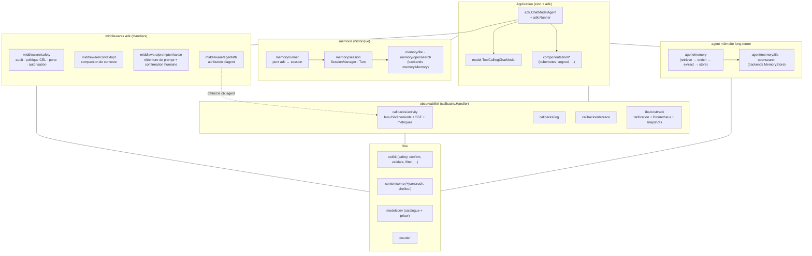
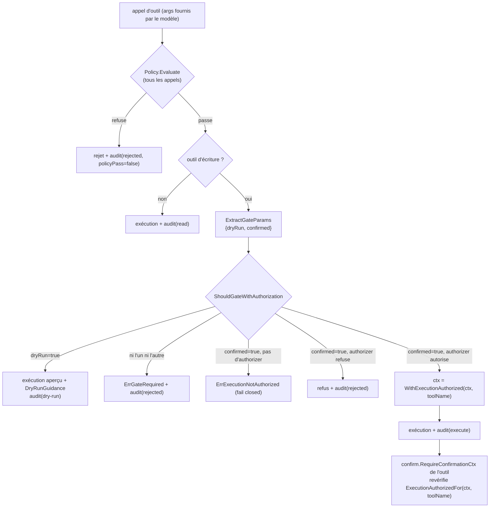
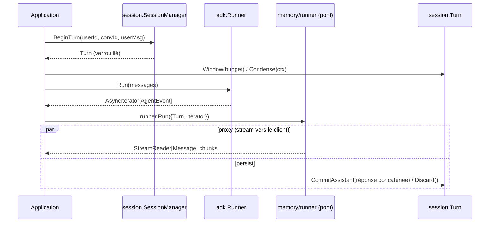
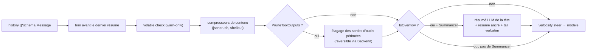
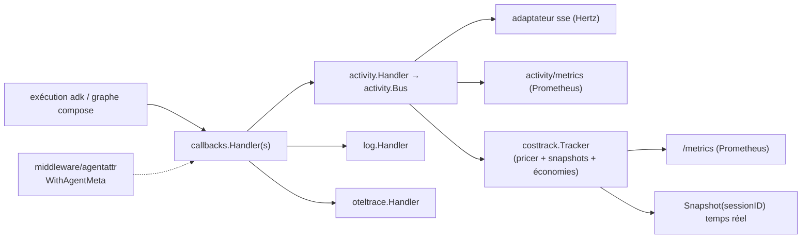
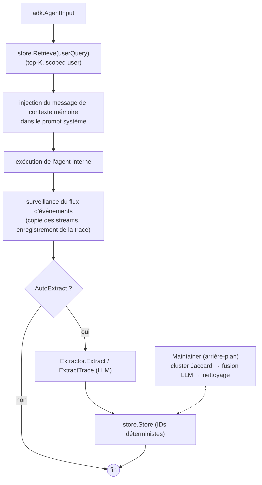
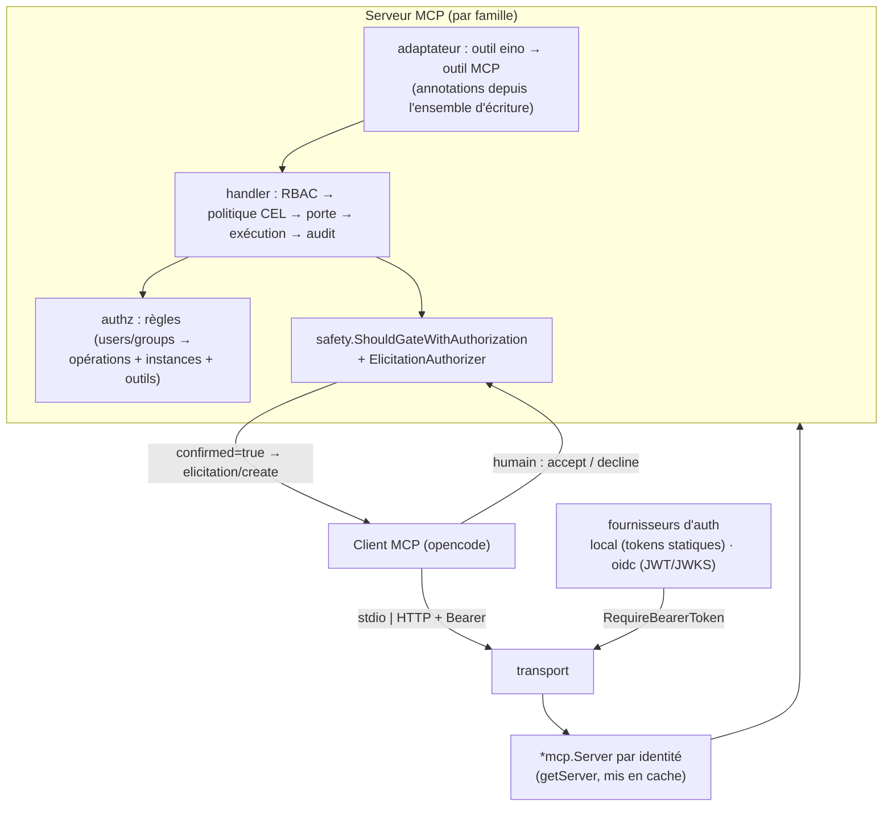

# eino-ext bibliothèques partagées — Conception technique

> **Portée :** les bibliothèques partagées d'eino-ext dans ce dépôt — la
> machinerie de sûreté / approbation / mutation, la mémoire conversationnelle
> (historique), la compaction de contexte, les économies de coûts &
> l'observabilité, l'agent de mémoire long terme, les callbacks, les helpers
> `libs/`, et l'implémentation des serveurs MCP.
>
> **Documents associés :**
> - [`01-eino-framework-and-adk.fr.md`](./01-eino-framework-and-adk.fr.md) — le
>   framework eino et son sous-package `adk` (lecture préalable).
> - Plan d'implémentation : [`.opencode/plans/mcp-servers-per-tool-family.md`](../../.opencode/plans/mcp-servers-per-tool-family.md)
> - English : [`02-eino-ext-shared-libraries.en.md`](./02-eino-ext-shared-libraries.en.md)

---

## 1. Introduction

**eino-ext** étend eino avec des briques de production. Son organisation :

```
components/   abstractions de composants eino + extensions spécifiques au projet
  tool/       familles d'outils (kubernetes, argocd, prometheus, grafana, …)
  model/      composants modèle (copilot, chatmodel, …)
  middleware/ middlewares adk (safety, contextopt, promptenhance, agentattr)  ← extension projet
  memory/     historique conversationnel (memory, session, runner, file, opensearch)
  agent/      agents adk (memory, profilesupervisor)
  document/ indexer/ retriever/ prompt/   (composants eino)
callbacks/    implémentations de callbacks.Handler (activity, log, oteltrace)
libs/         bibliothèques partagées non liées à un composant
  toolkit/    helpers transverses (safety, confirm, validate, filter, …)
  contentcomp costtrack  counter  docid  modelsdev  otelmetrics
  promptenhance  summarizer
```

**Principes de conception** (depuis `CONTRIBUTING.md` / `AGENTS.md`) :

- Chaque `Config` porte des tags `validate` + `jsonschema` ; chaque `New...`
  appelle `libs/toolkit/validate.Struct` **après** avoir appliqué les défauts.
- Chaque constructeur prend `ctx context.Context` en premier paramètre et le
  propage.
- Les erreurs sont enveloppées avec `emperror.dev/errors`.
- Chaque package fournit un `*_test.go` table-driven et un `README.md` ; chaque
  composant fournit un probe `check.go` retournant `checkup.Results`.
- Pas d'en-tête de licence. Nommage : `ToJSON`, `URL`, `OpenSearch`, `GitHub`, `ID`.
- La logique partagée vit dans `libs/toolkit/` ; la duplication entre packages
  d'outils y est extraite.

---

## 2. Vue d'architecture



---

## 3. Familles d'outils — `components/tool/*`

Chaque famille d'outils suit le même contrat :

| Élément | Rôle |
|---|---|
| `Configs` | `map[string]Config` — instances nommées (clusters pour kubernetes, instances pour argocd/prometheus/grafana) |
| `NewAllTools(ctx, configs, …)` | construit tous les outils (lecture + écriture) en `[]tool.InvokableTool` |
| `NewReadOnlyTools(ctx, configs, …)` | construit uniquement les outils en lecture |
| `WriteToolNames()` | liste statique des noms d'outils d'écriture (pilote la porte de sûreté) |
| `NewAllToolsWithSafety(ctx, configs, …, safetyCfg)` | outils + middleware de sûreté pré-configuré |
| `Check(ctx, configs)` | probe de connectivité/RBAC → `checkup.Results` |
| `check.go` + `check_test.go` | le checkup, selon CONTRIBUTING |

L'**argument cible** diffère selon la famille et est réutilisé par les couches de
sûreté/authz : `cluster` pour kubernetes, `instance` pour argocd / prometheus /
grafana.

| Famille | Arg. instance | Outils lecture | Outils écriture |
|---|---|---|---|
| `kubernetes` | `cluster` | cluster_list, list, describe, pod_log | pod_exec, resource_create, resource_patch, resource_delete, resource_apply |
| `argocd` | `instance` | instance_list, application_list/describe, certificate_list, cluster_list/describe, project_list/describe, repository_list/describe | application_create, application_delete, application_sync |
| `prometheus` | `instance` | instance_list, metric, target_list | — (aucun) |
| `grafana` | `instance` | instance_list, dashboard, datasource, query, dashboard_validate | dashboard_write |

Autres familles présentes dans le dépôt : `alertmanager`, `github` (15 outils
d'écriture), `shell` (backé par Dagger), `file`, `s3`, `websearch`, `opensearch`,
`opensearch_retriever`, `pipe`, `convertor`.

**Contrat pour les outils d'écriture** (documenté sur chaque `WriteToolNames()`) :
chaque nom listé **DOIT honorer `dryRun=true` comme un aperçu sans effet de
bord** — la porte de sûreté traite le dry-run comme toujours sûr, donc un outil
qui mutait pendant le dry-run permettrait à un appel non confirmé du modèle de
contourner la porte.

---

## 4. Machinerie de sûreté / approbation / mutation

Trois couches, toutes réutilisées par les serveurs MCP (§12). L'invariant
central : **l'exécution réelle d'un outil d'écriture requiert une autorisation de
l'application hôte portée dans `context.Context` — jamais l'argument
`confirmed=true` fourni par le modèle.**

### 4.1 `libs/toolkit/safety` — primitives partagées

| Fichier | Contenu |
|---|---|
| `types.go` | `OperationType` (create/update/delete/sync/exec), `Phase` (`read`/`dry-run`/`execute`/`rejected`), `MutabilityLevel` |
| `audit.go` | `AuditEvent{Timestamp, ToolName, CallID, Phase, Operation, Arguments, Result, Error, PolicyPass, Metadata}`, interface `AuditSink`, `AuditSinkFunc`, `LogSink` (logrus), `ChannelSink` (bufferisé, non bloquant) |
| `policy.go` | interface `Policy` (`Evaluate(ctx, toolName, params)`), `CELPolicy` + `CELRule{Name, Expression, ToolNames}` (cel-go), `PolicyChain` (premier échec arrête) |
| `gate.go` | `GateParams{DryRun, Confirmed}`, `ExtractGateParams(rawJSON)`, `NewWriteToolSet(names)`, `ShouldGateWithAuthorization(ctx, toolName, writeTools, gp, args, auth)`, `ErrGateRequired`, `DryRunGuidance` (texte de guidage exporté, ajouté aux résultats dry-run) |
| `authorization.go` | interface `ExecutionAuthorizer` (`AuthorizeExecute(ctx, toolName, args) error` — DOIT dériver la décision d'un état serveur, jamais des args), `ErrExecutionNotAuthorized` (sentinelle fail-closed), `WithExecutionAuthorized(ctx, toolName)`, `ExecutionAuthorizedFor(ctx, toolName)` |
| `ownership.go` | `CheckOwnership(obj)` — détecte les annotations managed-by (ArgoCD, Helm, Flux, kubectl) et les owner references de contrôleurs |
| `blocklist.go` | helpers de blocklist de commandes robustes (outil shell) |

**Règles de la porte** (`ShouldGateWithAuthorization`), dans l'ordre :

1. Outil en lecture seule (absent de `writeTools`) → autorisé.
2. `DryRun` → autorisé (les aperçus sont sûrs ; voir le contrat `WriteToolNames`).
3. Ni l'un ni l'autre → `ErrGateRequired` (le modèle doit d'abord faire un dry-run).
4. `Confirmed` et `auth == nil` → `ErrExecutionNotAuthorized` (**fail closed**).
5. `Confirmed` et l.authorizer refuse → l'erreur de l.authorizer, enveloppée
   avec le nom de l'outil (`errors.Is`/`errors.As` préservés).
6. Sinon → autorisé.

### 4.2 `libs/toolkit/confirm` — seconde couche par outil

```go
confirm.RequireConfirmationCtx(ctx, toolName, dryRun, confirmed bool) error
confirm.RequireConfirmationForActionCtx(ctx, toolName, action string, confirmed bool) error
```

Chaque outil d'écriture appelle l'une d'elles en tête de son `Invoke`. Lors de
l'exécution (`dryRun=false, confirmed=true`), elles exigent de plus
`safety.ExecutionAuthorizedFor(ctx, toolName)` — ainsi un outil invoqué
**directement** (hors middleware) est aussi protégé. Défense en profondeur : même
si l'enveloppe middleware est contournée, l'outil lui-même refuse.

### 4.3 `components/middleware/safety` — le middleware adk

Un `adk.ChatModelAgentMiddleware` (embarque `*adk.BaseChatModelAgentMiddleware`)
enregistré sur `adk.ChatModelAgentConfig.Handlers` :

```go
type Config struct {
    WriteToolNames        []string                    // outils d'écriture (la porte s'applique)
    AuditSink             safety.AuditSink            // défaut LogSink ; reçoit TOUS les appels
    Policy                safety.Policy               // CEL ; évaluée pour TOUS les appels
    ExecutionAuthorizer   safety.ExecutionAuthorizer  // pilote l'exécution réelle ; nil ⇒ dry-run seul
    AllowModelConfirmation bool                       // échappatoire INSECURE (tests/sandwiches seulement)
    CheckOwnership        bool                        // réservé
}
```

Il enveloppe les quatre hooks d'appel d'outil (`WrapInvokableToolCall`,
`WrapStreamableToolCall`, `WrapEnhancedInvokableToolCall`,
`WrapEnhancedStreamableToolCall`) et laisse `WrapModel` traverser. Par appel :
**politique → porte → endpoint → audit** ; les résultats dry-run reçoivent
`DryRunGuidance` en annexe ; en cas d'autorisation il marque le ctx avec
`safety.WithExecutionAuthorized(ctx, toolName)` pour que la couche par outil
passe.



### 4.4 La frontière de confiance (pourquoi le LLM ne peut pas s'auto-approuver)

| Canal | Contrôlé par | Fiable comme autorisation ? |
|---|---|---|
| Arguments de l'outil (dont `confirmed=true`) | LLM | **Non** — `confirmed=true` ne fait que *déclencher* l'authorizer |
| Texte de conversation (« l'utilisateur a dit oui ») | LLM | **Non** — l'approbation n'est jamais lue dans le texte de la conversation |
| Décision de l'`ExecutionAuthorizer` | Application hôte (état serveur : store d'approbation, token signé, politique opérateur) | **Oui — la seule source d'approbation** |
| Grant `context.Context` | Serveur uniquement | Oui — le modèle ne peut pas écrire dans le ctx |

`AllowModelConfirmation` n'est délibérément **pas** utilisé dans les chemins de
production ; les serveurs MCP (§12) ne le câblent pas du tout.

---

## 5. Mémoire conversationnelle (historique) — `components/memory`

Stockage conversationnel inter-requêtes, indépendant d'adk (sauf `runner`).

### 5.1 Cœur — `memory.go`, `conversation.go`, `markers.go`

```go
type Memory interface {
    GetConversation(userId, id string, createIfNotExist bool) (Conversation, error)
    ListConversations(userId string) ([]string, error)
    DeleteConversation(userId, id string) error
}
type Conversation interface {
    Append(msg *schema.Message)
    GetFullMessages() []*schema.Message
    GetMessages() []*schema.Message
    Load() error
    Save(msg *schema.Message) error
    AppendSummary(summary *schema.Message)
    GetWindow(budget int) []*schema.Message
    CountTokens() int
    LastSummaryIndex() int
    GetActivities() []json.RawMessage
    SetActivities(raw []json.RawMessage)
    GetUpdatedAt() string
}
```

- **Fenêtrage :** `SelectWindow(msgs, count, budget, maxWindowTokens)` — retourne
  `[dernier résumé + messages suivants]` borné par un budget de tokens ;
  élagage par recherche binaire (O(log N) appels de comptage) ; préserve toujours
  le résumé initial et le dernier message.
- **Marqueurs** (marqueurs booléens `Extra`) : `SummaryMarkerKey`
  (`IsSummary`/`NewSummaryMessage`), `IncompleteMarkerKey`
  (`MarkIncomplete`/`IsIncomplete` — génération interrompue),
  `EphemeralMarkerKey` (`NewEphemeralMessage`/`IsEphemeral` — streamé mais jamais
  persisté).
- `TokenCounter` = alias de `libs/counter.TokenCounter`
  (`DefaultTokenCounter` ≈ 4 caractères/token).

### 5.2 Backends

- **`memory/file`** — `memory.Memory` fichier JSONL ; un fichier par conversation
  à `<dir>/<userId>/<id>.jsonl`, activités dans un fichier `.activities` voisin.
  `FileMemoryConfig{Dir, MaxWindowSize, TokenCounter, MaxWindowTokens}`.
- **`memory/opensearch`** — `memory.Memory` backed OpenSearch ; un document par
  conversation, ID de doc `{userId}:{conversationId}`, upsert du document
  complet à chaque `Append`, création auto de l'index. `Config{URLs, Username,
  Password, TLSSkipVerify, IndexName, MaxWindowSize, MaxWindowTokens,
  TokenCounter}`. Utilise `libs/toolkit/osclient.New`.

### 5.3 Cycle de vie de session — `memory/session`

```go
type Config struct {
    Memory            memory.Memory          // requis
    Summarizer        Summarizer             // = libs/summarizer.Summarizer
    CondenseThreshold int                    // seuil de tokens pour la condensation
    WindowBudget      int
    TokenCounter      memory.TokenCounter
}
sm, _ := session.NewSessionManager(cfg)
turn, _ := sm.BeginTurn(userId, conversationId, userMsg)   // verrouille la session (ref-counted)
msgs := turn.Window(budget)                                // [dernier résumé + tail]
condensed, _ := turn.Condense(ctx)                         // résumé ancré optionnel au seuil
// ... exécuter l'agent ...
turn.CommitAssistant(assistantMsg)                         // persiste user + réponse, libère le verrou
turn.Discard()                                             // abandonne le message utilisateur en attente
```

`Turn` est l'unité de travail entre deux requêtes : `BeginTurn → [Condense] →
Window → exécution agent → CommitAssistant | Discard`. La condensation est
**non destructive** (message résumé ancré avec `SummaryMarkerKey`), interopérable
avec `contextopt` (`trimBeforeLastSummary`).

### 5.4 Pont adk — `memory/runner`

```go
type Config struct {
    Turn       *session.Turn                        // requis ; le pont en prend possession
    Iterator   *adk.AsyncIterator[*adk.AgentEvent]  // requis ;来自 adk.Runner.Run
    Predicate  MessagePredicate                     // défaut : assistant uniquement
    OnError    func(err error) *schema.Message      // notice éphémère (streamée, non persistée)
    OnSkip     func(event *adk.AgentEvent)           // observateur debug/trace
    BufferSize int                                  // défaut 1000
}
stream, _ := runner.Run(cfg)   // *schema.StreamReader[*schema.Message] à transmettre au client
```

`Run` scinde l'itérateur d'événements adk sur un stream dupliqué
(`schema.Pipe` + `Copy(2)`) : un goroutine **proxy** streame les messages
assistant sélectionnés vers l'appelant ; un goroutine **persistence** draine la
seconde copie, concatène la réponse complète (`schema.ConcatMessages`), et la
valide via le `Turn`. Garanties :

- **no-dangling-user :** si aucun contenu assistant n'est produit, le tour est
  `Discard()`é (le message utilisateur en attente n'est jamais persisté seul).
- **incomplete :** une erreur d'itérateur ou un stream tronqué marque la réponse
  validée avec `memory.MarkIncomplete`.
- **ephemeral :** les notices `OnError` (`memory.NewEphemeralMessage`) sont
  streamées mais non persistées ; les messages d'appel d'outil sont exclus de la
  persistance.
- L'exécution est pilotée sous `context.Background()` pour qu'une déconnexion
  client n'aborte ni la génération ni la persistance.

Prédicats : `runner.Role(schema.Assistant)`, `runner.AgentRole(name, role)`,
`runner.And/Or/Not(...)`.



---

## 6. Compaction de contexte — `components/middleware/contextopt` + `libs/contentcomp`

Garde les historiques longs sous la fenêtre de contexte du modèle. L'`Optimizer`
central est **pur** (pas de LLM, pas d'I/O) ; l'accès LLM n'entre que via le
`Summarizer` optionnel.

### 6.1 `contextopt.Optimizer`

```go
type Config struct {
    ContextLimit          int                     // fenêtre de contexte totale du modèle (tokens)
    MaxInputTokens        int                     // >0 prend le pas sur ContextLimit-ReservedTokens
    ReservedTokens        int                     // tampon de sortie, défaut 20_000
    TailTurns             int                     // tours les plus récents préservés verbatim, défaut 2
    PreserveRecentTokens  int                     // budget de tokens du tail, défaut clamp(usable*0.25, 2k, 8k)
    PruneToolOutputs      bool
    PruneProtectTokens    int                     // fenêtre récente protégée, défaut 40_000
    PruneMinimum          int                     // min de tokens éligibles avant élagage, défaut 20_000
    ToolOutputMaxChars    int                     // défaut 2_000
    ProtectedTools        []string                // jamais élagués
    TokenCounter          memory.TokenCounter     // défaut memory.DefaultTokenCounter
    Summarizer            Summarizer              // compaction LLM au dépassement ; nil désactive
    Backend               contentcomp.Store       // élagage réversible (offload content-addressed)
    ContentCompressors    []contentcomp.Compressor // déterministes, appliqués avant troncature
    VolatileCheck         bool                    // détection warn-only de tokens volatils
    VolatileObserver      func(context.Context, VolatileFinding)
    VerbositySteer        string                  // ajouté au premier message système (cache-safe)
}
opt, _ := contextopt.NewOptimizer(cfg)
msgs, _ := opt.Optimize(ctx, msgs)
overflow := opt.IsOverflow(msgs)
orig, _ := opt.RestorePruned(ctx, prunedMsg)
```

Pipeline (`Optimize`), du moins cher au plus cher :

1. **trim** de tout ce qui précède le dernier résumé (`trimBeforeLastSummary`) ;
2. **volatile check** (warn-only : timestamps ISO-8601, UUIDs, champs `*_id` dans
   le préfixe mis en cache) ;
3. **compression lossless** des sorties d'outils (`ContentCompressors`) ;
4. **prune** des sorties d'outils périmées au-delà de la fenêtre protégée
   (réversible quand `Backend` est défini — original offloadé, handle dans
   `Extra[PruneRefKey]`) ;
5. **au dépassement avec un Summarizer :** remplacer la tête résumable par un
   résumé ancré (`memory.NewSummaryMessage`) et garder le tail verbatim ;
6. **verbosity steer** (append-only sur le premier message système).

Marqueurs : `PruneMarkerKey`, `PruneRefKey`, `CompressedMarkerKey` (idempotence
d'un tour à l'autre). Ne mute jamais les messages d'entrée (clone seulement ceux
modifiés).

### 6.2 Deux surfaces sur le même optimiseur

- **`contextopt.Middleware`** — un `adk.ChatModelAgentMiddleware` réécrivant
  `state.Messages` dans `BeforeModelRewriteState` (intra-run, à chaque appel
  modèle).
- **`contextopt.ChatModel` / `contextopt.ToolCallingChatModel`** — décorateurs
  `model.BaseChatModel` optimisant l'entrée avant `Generate`/`Stream` (niveau
  compose, portable hors adk).

### 6.3 `libs/contentcomp` — compresseurs déterministes

```go
type Ref struct { Key string; Size int }              // handle content-addressed
type Store interface { Put(ctx, content string) (Ref, error); Get(ctx, Ref) (string, error) }
type Compressor interface { Name() string; Compress(ctx, content string) (out string, changed bool, err error) }
contentcomp.NewMemoryStore()                          // Store en mémoire
```

Contraintes de conception : **déterminisme** (fonctions pures, préfixe de cache
prompt byte-stable) et **réversibilité** (les réductions avec perte déplacent les
octets originaux derrière un `Ref`/`Store`, ne les jettent jamais).

- **`jsoncrush`** — crush lossless de tableaux JSON d'objets : remonte les clés
  communes à toutes les lignes dans un bloc `_defaults` partagé ; étage lossy
  optionnel offloadant les colonnes haute entropie derrière des handles Store.
  `Crush`, `Expand`, `ExpandWithStore`, `IsCrushed`, `NewCompressor()`.
- **`shellout`** — compaction déclarative par table de motifs des sorties
  bruyantes CLI/log/diff (barres de progression, redraws CR, runs de lignes
  vides, lignes répétées) ; le contenu non reconnu passe octet par octet.
  `Compress`, `NewCompressor()`, `DefaultPatterns()`.

### 6.4 `libs/summarizer` — abstraction de résumé

```go
type Summarizer interface {
    Summarize(ctx context.Context, history []*schema.Message, previousSummary string) (string, error)
}
type SummarizerFunc func(...) // adaptateur
```

`contextopt.NewModelSummarizer(model, opts...)` construit un `Summarizer` adossé
à un LLM (template embarqué `prompts/summary_template.md`) ;
`session.Summarizer` et `contextopt.Summarizer` sont des alias de la même
interface, donc une instance alimente les deux. **Invariant anti-double-coût :**
partager le même `TokenCounter` entre `session.Config`, le store mémoire et le
middleware contextopt, et garder `WindowBudget ≤` la fenêtre utilisable du
middleware.



---

## 7. Économies de coûts & observabilité

### 7.1 `callbacks/activity` — le flux d'activité live

Un bus d'événements typés style Kilocode faisant le pont entre le cycle de vie
des composants eino et un flux d'événements transport-agnostic (fan-out vers des
UI en SSE ou autre). Trois couches :

1. **Modèle d'événement** (`event.go`) — `Event{ID, SessionID, Type, Agent,
   Timestamp, Data}` plus le catalogue de payloads typés : `step.started/ended/failed`,
   `agent.switched`, `model.switched`, `prompted`, `text.started/delta/ended`,
   `reasoning.started/delta/ended`, `tool.input.started/delta/ended`,
   `tool.called/progress/success/failed`, `retried`, `compaction.started/delta/ended`,
   `session.ended`. Payloads notables : `StepEnded{Finish, Cost, Tokens, Estimated}`,
   `Tokens{Input, Output, Reasoning, Cache{Read, Write}}`,
   `SessionEnded{Duration, Cost, Steps, Tools}`. `MarshalSSEData(e)` rend le
   corps `data:` SSE (fusionne la clé `agent` dans le payload).
2. **Bus** (`bus.go`) — fan-out en mémoire par session avec tampon circulaire
   borné pour le rejeu `Last-Event-ID` :
   ```go
   type Bus interface {
       Publish(ctx context.Context, e Event)
       Subscribe(ctx context.Context, sessionID, lastEventID string) (<-chan Event, func())
       Replay(sessionID string) ([]Event, error)
       Close() error
   }
   // Config{BufferSize(256), SubscriberQueueSize(64), SlowPolicy(DropEvent|DropSubscriber), MaxSessions(4096), Clock}
   // HasSubscribers(sessionID) bool  (SubscriberCounter)
   ```
3. **Producteur** (`handler.go`) — `Handler` implémente `callbacks.Handler` +
   `callbacks.TimingChecker`, traduisant le cycle de vie modèle/outil en
   événements : `OnStart/OnEnd/OnError/OnStartWithStreamInput/OnEndWithStreamOutput`
   + `Needed` (saute les timings de stream coûteux quand le bus n'a pas
   d'abonnés).
   ```go
   type Pricer interface { Cost(model string, t Tokens) float64 }
   type TokenCounter func(msgs []*schema.Message) int
   h := activity.NewHandlerWithConfig(bus, activity.WithPricer(pricer), activity.WithTokenCounter(tc))
   callbacks.AppendGlobalHandlers(h)            // ou compose.WithCallbacks(h)
   ```
   Streaming : deltas de texte, deltas de raisonnement (started/delta/ended avec
   un `ReasoningID`), deltas d'entrée d'outil (avec un `CallID`), fin d'étape
   avec finish reason + usage + coût. Quand la gateway ne reporte pas d'usage,
   le fallback `TokenCounter` estime les tokens (marqués `Estimated: true`).
   L'attribution session/agent vient du contexte : `activity.WithSession(ctx, id)`,
   `activity.WithAgent(ctx, name)`, `activity.WithAgentMeta(ctx, AgentMeta{Name, Model, Description})`
   (voir `middleware/agentattr`).

**Cost-saver** (`costsaver.go`) : à la fin de session, `SessionSummarizer` rejoue
le bus en un `SessionSummary{Duration, TotalCost, TotalTokens, Steps, ToolsCalled,
TextOutput, ReasoningContent, FinishReasons, HadFailures}` ;
`CompositeComplexityAnalyzer` tente une analyse LLM (`ComplexityAnalyzer`,
prompt embarqué) et retombe sur une formule (`FallbackComplexityAnalyzer` :
facteurs tokens/outil/étape, ×0.8 en cas d'échecs, plancher zéro sans outils) →
`ComplexityAnalysis{ComplexityRatio, HumanTimeSavedSeconds, MoneySavedUSD}`.

**Sous-package `sse/` :** adaptateur SSE Hertz (`sse.NewHandler(cfg)` →
`app.HandlerFunc`) fan-out d'un `Bus` en `text/event-stream` (session depuis un
paramètre de requête, rejeu `Last-Event-ID`, heartbeats). Le seul package dépendant
d'un framework web.

**Sous-package `metrics/` :** collecteur Prometheus optionnel consommant les
événements `step.ended` (`llm_tokens_total`, `llm_cost_usd_total`, variantes
économies/composants, jauges cost-saver).

### 7.2 `libs/costtrack` — la façade de coût

```go
type Config struct {
    Bus             activity.Bus
    Resolve         modelsdev.NameResolver
    CatalogHolder   *atomic.Pointer[modelsdev.Catalog]
    PricingProvider string                              // requis
    TokenCounter    activity.TokenCounter               // défaut counter.DefaultTokenCounter
    Savings         activity.ComplexityAnalyzerConfig
    TerminalTypes   []activity.Type                     // défaut {"answer.ended", "question"}
    Registry        prometheus.Registerer               // défaut : registre privé
    Recorder        Recorder                            // défaut : PrometheusRecorder
}
tracker, _ := costtrack.NewTracker(ctx, cfg)
callbacks.AppendGlobalHandlers(tracker.ActivityHandler())   // le activity.Handler
tracker.Watch(ctx, sessionID)                               // goroutine par session
snap := tracker.Snapshot(sessionID)                         // totaux temps réel par session + globaux
http.Handle("/metrics", tracker.PrometheusHandler())
```

`Recorder` abstrait le backend de métriques (nil-receiver safe) ; le
`PrometheusRecorder` par défaut enregistre `agent_tasks_total`,
`agent_task_cost_usd`, `llm_compactions_total`, `llm_realtime_cost_usd`,
`human_savings_usd_total`, `llm_cost_savings_usd_total`,
`llm_cost_usd_by_component_total` plus les `metrics.Collector` /
`metrics.CostSaverCollector`. `Watch` agrège les totaux temps réel par session,
et à l'événement terminal publie un `session.ended` synthétique (pour déclencher
le cost-saver) et enregistre les métriques de tâche.

### 7.3 `libs/counter` & `libs/modelsdev`

- **`counter`** : `TokenCounter func(msgs []*schema.Message) int` ;
  `DefaultTokenCounter` ≈ len(content)/4 (heuristique, compte aussi les arguments
  d'appels d'outils). Utilisé comme fallback partout où l'usage manque.
- **`modelsdev`** : le catalogue [models.dev](https://models.dev) — limites de
  contexte/sortie par modèle et coût en USD par million de tokens.
  `Load(ctx, LoadOptions)` récupère `api.json` (retombe sur le snapshot embarqué ;
  n'échoue jamais). `CatalogPricer{Catalog, Resolve}` implémente
  `activity.Pricer` : `Cost(gatewayModel, tokens)` et
  `Breakdown(...) (CostBreakdown{Input, Output, CacheRead, CacheWrite, Total, Savings}, ok)`.
  `NameResolver` mappe les noms de modèles gateway → `(provider, id)` ; les
  modèles inconnus donnent `ok=false` (ne devine jamais). `Catalog.Limits` /
  `Catalog.Usage` sont des helpers de requête pour les déclencheurs de compaction.

### 7.4 `callbacks/log` & `callbacks/oteltrace`

- **`callbacks/log`** — `callbacks.Handler` journalisant le cycle de vie via
  logrus avec champs structurés (`component`, `component_name`,
  `component_type`, `agent`) ; les entrées chat-model ajoutent
  `content`/`reasoning`/`finish_reason`/usage de tokens ; les entrées outil
  ajoutent `input`/`output` ; contenu tronqué (`maxContentLen=500`,
  `maxInputLen=2000`).
- **`callbacks/oteltrace`** — `callbacks.Handler` + `TimingChecker` enregistrant
  des spans OpenTelemetry : `chat_model.generate` (INTERNAL ;
  `gen_ai.request.model`, `gen_ai.usage.*`, `gen_ai.response.finish_reason`) et
  `tool.<name>` (CLIENT ; `tool.name`) ; erreurs via `RecordError` +
  `codes.Error` ; I/O d'outils masquées par défaut.
  `Config{TracerProvider, TracerName, SpanKindClient, IncludeToolIO, MaxSpanIO}`.
  Lit `activity.AgentFromContext`/`SessionFromContext` pour les attributs
  `agent`/`session.id`.

### 7.5 `libs/otelmetrics` — scope de métriques OTel

Enveloppe fine sur le `MeterProvider` global : `NewScope(ctx, *Config)` →
`Scope` avec instruments nil-receiver-safe `FloatCounter`, `IntCounter`,
`Histogram`, `Gauge` (observable, adossé à un store thread-safe), plus
`Attrs(kv ...string)`. Les composants embarquent un `*Scope` et enregistrent des
métriques qui remontent à l'exportateur de l'application hôte.



---

## 8. Agent de mémoire long terme — `components/agent/memory`

Un **décorateur** `adk.Agent` ajoutant la mémoire long terme autour d'un agent
interne :

- **Avant chaque tour :** récupère les mémoires pertinentes depuis un
  `MemoryStore` (BM25/kNN via `indexer`/`retriever` d'eino) et les injecte dans
  le prompt système comme message de contexte marqué (`NewMemoryContextMessage` /
  `MemoryContextMarkerKey`).
- **Après chaque tour :** un `Extractor` LLM extrait les mémoires structurées de
  l'échange et les persiste (IDs déterministes `sha256(category+content)[:32]` ⇒
  réapprendre écrase au lieu de dupliquer).
- **`Maintainer` en arrière-plan :** clustering Jaccard + fusion LLM optionnelle
  pour la compaction, et nettoyage basé sur l'âge.
- **`EndSession` :** compacte les mémoires de portée session en résumés.

```go
type Config struct {
    InnerAgent             adk.Agent          // requis
    Store                  MemoryStore
    Model                  model.BaseChatModel // pour l'extraction
    UserID, SessionID      string              // défauts ; surchargés par adk.AddSessionValue
    AutoExtract            bool                // défaut true quand Store+Model définis
    MaintenanceInterval    time.Duration       // 0 désactive le maintainer arrière-plan
    MaxAge                 time.Duration       // horizon de nettoyage
    MaxMemoriesPerRetrieve int                 // défaut 5
    MaxQueryChars          int
    SystemPromptPrefix     string
    Trace                  TraceConfig         // extraction basée sur la trace (opt-in)
    ExtractTimeout         time.Duration       // défaut 30s
    AsyncExtract           bool
    RetrieveTopK           int
    QueryMessageFilter     func(*schema.Message) bool
    ShouldRetrieve         func(ctx) bool
    ShouldExtract          func(ctx) bool
}
agent, _ := memory.NewAgent(ctx, cfg)
agent.SetUserID(...) / agent.SetSessionID(...)
agent.EndSession(ctx)
```

- **`Extractor`** : `Extract(ctx, userContent, assistantContent) []ExtractionResult`,
  `ExtractTrace(ctx, userContent, renderedTrace)`, `Summarize(...)`.
  `ExtractionResult{Content, Category, Source, Confidence, Scope}` — résultats
  filtrés à `Confidence >= 0.7`.
- **Catégories :** `fact`, `preference`, `learning`, `summary`, `procedure`
  (savoir-faire opérationnel réutilisable, surfacé en premier à la récupération).
  **Sources :** `user`, `assistant`, `observation`, `session`.
- **`MemoryStore`** : `indexer.Indexer` + `retriever.Retriever` + `Delete`,
  `DeleteByFilter`, `List`, `Count`. Backends : `agent/memory/file` (JSONL) et
  `agent/memory/opensearch` (BM25 + kNN optionnel).
- **`Entry`** ⇄ `schema.Document` (`ToDocument` / `EntryFromDocument`) ; le scope
  est replié dans le contenu pour que BM25 le voie, et gardé en métadonnée.
- **Mode trace** (`trace.go`) : `RunTrace []TraceStep{Kind: assistant_text |
  tool_call | tool_result | terminal_answer, Agent, Name, Text}` ;
  `RenderTrace(trace, TraceConfig)` (borné, rédaction, élagage par priorité de
  conservation) ; `TerminalTools` mappe les noms d'outils → le champ d'argument
  portant la réponse finale.

L'agent surveille l'itérateur d'événements du run interne
(`adk.AsyncIterator`), copie les streams (`Copy(2)`) pour à la fois transmettre
et enregistrer, concatène les chunks par tour (`schema.ConcatMessages`), et extrait
après la fermeture du run (synchrone par défaut, `AsyncExtract` opt-in, détaché
du ctx du run pour que les runs annulés soient quand même appris).



---

## 9. Autres agents — `components/agent/profilesupervisor`

`NewProfileSupervisor(ctx, *SupervisorConfig)` construit un **agent superviseur de
profils** : un sous-agent `adk.ChatModelAgent` par profil de projet détecté
(golang/node/python/java/rust/php), chacun adossé à un outil
`components/tool/shell` configuré avec l'image OCI de base du profil, exposé à un
ChatModelAgent `profile_supervisor` de premier niveau sous forme d'outils
`adk.NewAgentTool`. Le superviseur sélectionne dynamiquement le bon sous-agent
spécifique au langage par tâche (`EmitInternalEvents: true`). Attache
optionnellement `components/middleware/safety` au superviseur et à chaque
sous-agent (outils d'écriture = `shell.WriteToolNames()` par défaut).

```go
type SupervisorConfig struct {
    Model        model.BaseChatModel     // requis
    Workdir      string                  // requis
    NetworkPolicy *egress.Policy         // garde SSRF pour les sandboxes shell
    Profiles     []profile.Profile       // auto-détectés si vide
    Resolver     *profile.Resolver
    SafetyCfg    *safety.Config          // porte optionnelle
    SystemPrompt string
}
```

---

## 10. `libs/toolkit` — helpers partagés

| Package | Rôle | Symboles clés |
|---|---|---|
| `validate` | wrapper partagé de go-playground/validator ; messages LLM-friendly | `Struct(s any) error` |
| `checkup` | types de résultat de probe connectivité/RBAC ; chaque composant fournit `Check()` | `Result{Component, Instance, Status, Error, Message}`, `Results`, `StatusOK/Error/Limited`, `DependencyFailed`, `Merge`, `OK()`, `JSON()` |
| `safety` | primitives de sûreté (§4.1) | `ShouldGateWithAuthorization`, `ExecutionAuthorizer`, `WithExecutionAuthorized`, `AuditSink`, `CELPolicy`, `CheckOwnership` |
| `confirm` | porte de confirmation par outil (§4.2) | `RequireConfirmationCtx`, `RequireConfirmationForActionCtx` |
| `toolutil` | helpers d'outils partagés | `NotFoundError(kind, name, known)`, `EmptyJSONUnmarshaler[T]()`, `SortedKeys[V]` |
| `filter` | filtrage regex + sélecteur JSON pour la sortie d'outils | `CompileMatcher(pattern)`, `Matcher`, `Selector`, `Compile(pattern)` |
| `marshal` | helpers de marshaling JSON | `MustMarshal(v)`, `Outputs(outputs)` |
| `strutil` | helpers de chaînes | `Truncate`, `StripMarkdownFences`, `ExtractJSONBlock` |
| `kretry` | helper de retry pour les erreurs API Kubernetes transitoires | `Retry(ctx, fn)`, `Do(ctx, backoff, fn)`, `IsTransient(err)`, `DefaultBackoff` |
| `fileutil` | helpers de sûreté filesystem (validation de chemins, rejet de symlinks CWE-59/22, détection de binaires, exclusion `.git`) | `ValidateRelativePath`, `ResolveSymlinkSafe`, `IsWithinPath`, `IsBinary`, `RejectDotGitPath`, `ValidateRootDir`, `CopyDir`, `WalkDirFiles`, `SanitizePathSegment`, `SessionDirName`, `SweepStaleDirs` |
| `egress` | proxy egress HTTP/HTTPS CONNECT par politique — « réseau local interdit par défaut » (blocs RFC1918/link-local/loopback/cloud-metadata) avec allowlist ; pour les conteneurs Dagger | `Policy{AllowHosts, AllowCIDRs, AllowLocalNetwork, DefaultDeny}`, `Policy.Allows(host, ip)`, `NewProxy(pol)`, `Proxy.Serve(ctx, ln)` |
| `osclient` | constructeur partagé du client OpenSearch v4 entre indexer/retriever/loader/memory | `Config{URLs, Username, Password, TLSSkipVerify}`, `New(ctx, cfg, timeout)` |
| `dagger` | wrapper du client moteur Dagger (conteneurs OCI, volumes de cache partagés, bindings de proxy egress) | `EngineConfig{RegistryAuth, LogOutput, Workdir}`, `NewClient(ctx, cfg)`, `Client.Container(ctx, baseImage, opts...)`, `WithWorkdir/WithCacheVolume/WithEgressPolicy/WithUser/WithRegistryAuth`, `CacheKeyForProfile/Tool` |
| `profile` | détection de type de projet + sélection d'image de base pour les sandboxes shell Dagger (fichiers marqueurs : go.mod, package.json, pyproject.toml, pom.xml, Cargo.toml, composer.json, …) | `Profile{Name, BaseImage, SystemPrompt, InstallCmd, ToolPresets, Env}`, `Resolver{ImageMap}`, `NewResolver(opts...)`, `Resolver.Resolve(ctx, workdir)`, `DefaultImageMap`, `WithImageOverrides` |

Autres `libs/` :

| Package | Rôle |
|---|---|
| `contentcomp` | contrats de compresseurs déterministes (`Store`, `Compressor`, `Ref`, `MemoryStore`) — §6.3 |
| `costtrack` | façade de suivi des coûts — §7.2 |
| `counter` | comptage de tokens — §7.3 |
| `docid` | IDs de documents déterministes et hashes de contenu (xxh3) : `ComputeBaseID(identifier)`, `ComputeContentHash(content)` |
| `modelsdev` | catalogue models.dev + pricer — §7.3 |
| `otelmetrics` | scope de métriques OTel — §7.5 |
| `promptenhance` | réécriture de prompt avec un petit modèle (kilocode « Enhance Prompt ») : `NewEnhancer(ctx, *Config)`, `Enhancer.Enhance/EnhanceInContext` ; échappe les délimiteurs `<context>`/`<draft>` et retire les caractères de contrôle du contenu embarqué |
| `summarizer` | interface `Summarizer` + `SummarizerFunc` — §6.4 |

---

## 11. Catalogue des middlewares — `components/middleware`

Tous sont des `adk.ChatModelAgentMiddleware` (embarquent
`*adk.BaseChatModelAgentMiddleware`), enregistrés sur
`adk.ChatModelAgentConfig.Handlers` :

| Middleware | Hook(s) | Rôle |
|---|---|---|
| `safety` | `Wrap*ToolCall` ×4 | audit + politique CEL + porte dry-run/confirmed + autorisation hôte (§4.3) |
| `contextopt` | `BeforeModelRewriteState` | réécrit `state.Messages` avec l'historique optimisé (§6.2) |
| `promptenhance` | `BeforeModelRewriteState` | réécrit le dernier message utilisateur via `libs/promptenhance` ; quand `AutoAccept=false`, retourne un `InterruptError` (`InterruptInfo{Original, Enhanced}`) pour que le consommateur présente le prompt amélioré et reprenne avec un `Choice{Action: original\|enhanced\|modified\|skip_always, Text}` (`WithChoice(ctx, choice)`) ; idempotent via un marqueur ; ne mute jamais les messages de l'appelant |
| `agentattr` | `BeforeAgent`, `BeforeModelRewriteState`, `Wrap*ToolCall` ×4 | propage `activity.WithAgentMeta(ctx, {Name, Model, Description})` pour que les événements activity/log/otel soient attribués à l'agent (`Config{AgentName requis, Model, Description}`) |

---

## 12. Serveurs MCP — `libs/mcp` + `components/mcp/*`

Plan d'implémentation complet :
[`.opencode/plans/mcp-servers-per-tool-family.md`](../../.opencode/plans/mcp-servers-per-tool-family.md).

**Objectif :** exposer les familles d'outils locales comme serveurs MCP
(consommables depuis opencode ou tout client MCP), avec une authentification par
fournisseur (local + OIDC), un RBAC granulaire, et la machinerie d'approbation de
sûreté reproduite sur MCP pour qu'une action d'écriture requière toujours une
approbation humaine réelle que le LLM ne peut pas contourner.

### 12.1 Organisation

```
libs/mcp/                  — toolkit générique partagé (package mcp)
  config.go  server.go  adapter.go  identity.go
  auth.go  auth_local.go  auth_oidc.go
  authz.go  approval.go  transport.go
components/mcp/            — serveurs MCP par famille (extension spécifique au projet)
  kubernetes/  argocd/  prometheus/  grafana/
```

### 12.2 Comment la machinerie existante est réutilisée

- **Adaptateur :** chaque `tool.InvokableTool` → outil MCP (`Info()` → nom /
  description / schéma d'entrée via `ParamsOneOf.ToJSONSchema()` ; annotations
  depuis l'ensemble d'écriture : outils lecture `readOnlyHint:true`, outils
  écriture `readOnlyHint:false, destructiveHint:true`). Handler → `InvokableRun`
  avec les arguments JSON bruts.
- **Porte :** le handler reproduit le preflight du middleware de sûreté —
  `safety.ShouldGateWithAuthorization` avec un `ExecutionAuthorizer` implémenté
  via **élicitation MCP** (`approval.go` — `ElicitationAuthorizer`) : sur
  `confirmed=true`, le serveur envoie `elicitation/create` au client (opencode
  affiche à l'humain une invite d'approbation montrant le nom de l'outil, la
  cible, l'utilisateur, et les **arguments réels de cet appel d'exécution**) ;
  acceptation → `safety.WithExecutionAuthorized(ctx, toolName)` → le
  `confirm.RequireConfirmationCtx` de l'outil passe → exécution. Refus/annulation/
  timeout/client sans élicitation → fail closed (outils d'écriture en dry-run
  seul). `AllowModelConfirmation` **n'est pas** câblé.
- **Audit :** chaque appel émet un `safety.AuditEvent` (phase
  read/dry-run/execute/rejected + métadonnées d'identité) via `safety.AuditSink`.
- **Politique CEL :** `safety.Policy` évaluée à chaque appel.

### 12.3 AuthN — par fournisseur

Le transport HTTP est enveloppé par le middleware `auth.RequireBearerToken` du
go-sdk ; les fournisseurs implémentent `auth.TokenVerifier` :

- **`local`** — tokens bearer statiques → identité ; comparaison à temps constant
  (`crypto/subtle`) des condensés SHA-256 sur tous les tokens (condensés de
  longueur fixe → pas de fuite par timing ni sur la longueur des tokens ; tous
  les tokens toujours comparés → pas de fuite d'existence).
- **`oidc`** — vérifie les tokens d'accès JWT émis par un OIDC avec
  `github.com/coreos/go-oidc/v3` (signature JWKS, issuer, audience, expiry) ;
  claims → identité (`UserClaim` défaut `preferred_username`, repli `sub` ;
  `GroupsClaim` défaut `groups`) ; le claim `scope` → les scopes du token.

Identité = `{User, Groups}`, portée dans `auth.TokenInfo` (`UserID` + `Extra`).
Les scopes du token (`LocalToken.Scopes` en local, le claim `scope` en OIDC)
sont portés dans `auth.TokenInfo.Scopes` et vérifiés contre
`AuthConfig.RequiredScopes` par le middleware du SDK (403 avant tout handler).
Stdio = processus local de confiance → `Config.LocalIdentity` (toujours soumis au
RBAC).

### 12.4 AuthZ — RBAC

```go
type AccessRule struct {
    Users      []string // correspond à Identity.User (exact) ; vide = tout
    Groups     []string // correspond à l'un des Identity.Groups ; vide = tout
    Operations []string // « read », « write » ; vide = tous
    Instances  []string // noms de cluster/instance ; vide ou « * » = tous
    Tools      []string // noms exacts ou glob « prefix_* » ; vide = tous
}
```

Dans une règle, les conditions `Users` et `Groups` sont ET-ées ; entre les
règles, l'union accorde. **Fail closed : aucune correspondance → refus.** Appliqué
à `tools/list` (un `*mcp.Server` par identité via `getServer`, mis en cache —
chaque identité ne voit que les outils qu'elle peut appeler, et la pagination SDK
reste correcte) et à `tools/call` (catégorie + instance extraite de l'argument
`cluster`/`instance`).

### 12.5 Transports

- **stdio :** `Server.ServeStdio(ctx)` (`srv.Run(ctx, &mcpsdk.StdioTransport{})`).
- **HTTP (streamable) :** `Server.HTTPHandler()` —
  `mcpsdk.NewStreamableHTTPHandler(getServer, …)` enveloppé par
  `auth.RequireBearerToken` quand l'auth est configurée ;
  `Server.ListenAndServeHTTP(ctx, addr)` avec arrêt gracieux. **Mode stateful
  uniquement** (le mode stateless rejette les requêtes serveur→client, ce qui
  casserait l'élicitation).



**Pourquoi le LLM ne peut pas s'auto-approuver sur MCP :** `confirmed=true` est
fourni par le modèle et ne fait que *déclencher* l.authorizer ; la seule source
d'approbation de l.authorizer est la réponse d'élicitation, qui est une requête
serveur→client à laquelle l'humain répond dans l'UI du client ; le LLM ne voit
jamais la requête d'élicitation, seulement le résultat final de l'outil ; le grant
ctx est par appel et par nom d'outil ; et le `confirm.RequireConfirmationCtx`
par outil le revérifie. Fail closed sans client capable d'élicitation.

---

## 13. Conventions des composants (checklist)

Chaque nouveau composant/middleware/lib suit :

- Struct `Config` avec tags `validate` + `jsonschema` ; `New...` applique les
  défauts puis appelle `validate.Struct(cfg)`.
- `ctx context.Context` en premier paramètre, propagé partout.
- `emperror.dev/errors` pour l'enveloppement ; sentinelles comparées avec
  `errors.Is`.
- Vérification d'interface à la compilation `var _ Iface = (*T)(nil)`.
- `*_test.go` table-driven (pas de service externe live ; mocks/httptest/envtest).
- `README.md` (rôle, extrait de constructeur, câblage).
- Commentaire de package `// Package xxx ...`.
- `check.go` + `check_test.go` avec `Check(ctx, cfg) checkup.Results` sondant la
  connectivité/les RBAC par instance.
- Prompts dans `prompts/*.md` embarqués avec `//go:embed`.
- Pas d'en-tête de licence. Nommage : `ToJSON`, `URL`, `OpenSearch`, `GitHub`, `ID`.
- Portes : `make test` (pas un `go test` nu), `make lint`,
  `bash scripts/check_components.sh`.

---

## 14. Résumé

| Besoin | Où | Mécanisme |
|---|---|---|
| Sûreté d'approbation / mutation | `libs/toolkit/safety`, `libs/toolkit/confirm`, `components/middleware/safety` | porte dry-run/confirmed + `ExecutionAuthorizer` (côté hôte) + seconde couche par outil ; fail closed ; audité |
| Historique conversationnel | `components/memory` (+ `session`, `runner`, `file`, `opensearch`) | `Memory`/`Conversation`, fenêtrage (`SelectWindow`), marqueurs, tours de session, pont adk |
| Compaction de contexte | `components/middleware/contextopt`, `libs/contentcomp`, `libs/summarizer` | optimiseur pur (trim/compress/prune/summarize), compresseurs déterministes, summariseur LLM |
| Économies de coûts & observabilité | `callbacks/activity`, `libs/costtrack`, `libs/counter`, `libs/modelsdev`, `callbacks/log`, `callbacks/oteltrace`, `libs/otelmetrics` | bus d'événements typé + SSE/Prometheus/OTel, tarification catalogue, analyse de complexité |
| Mémoire long terme | `components/agent/memory` | retrieve → enrich → extract → store ; maintainer ; mode trace |
| Qualité de prompt | `components/middleware/promptenhance`, `libs/promptenhance` | réécriture par petit modèle + interruption de confirmation humaine |
| Attribution d'agent | `components/middleware/agentattr` | métadonnées agent/modèle dans le contexte des callbacks |
| MCP | `libs/mcp`, `components/mcp/*` | outils eino sur MCP ; auth local/OIDC ; RBAC ; approbation par élicitation |

---

## 15. Plongées dans l'implémentation

Les sections précédentes décrivent les concepts et l'API publique. Cette
section explique **comment l'implémentation fonctionne réellement** — les
chemins de code internes et les algorithmes — pour qu'un développeur puisse lire,
modifier et déboguer les bibliothèques.

### 15.1 Dans la porte de sûreté : le chemin de code preflight
(`components/middleware/safety/middleware.go` ; le handler MCP dans `libs/mcp` partage la même logique)

Par appel d'outil :

1. **Parser les args** → `map[string]any` (pour la politique) ; la chaîne JSON
   brute est gardée pour la porte.
2. **Politique** (`safety.Policy.Evaluate`) : expressions CEL sur `params` +
   `toolName`. Le premier échec rejette et audite `PhaseRejected` avec
   `PolicyPass=false`.
3. **Porte** (outils d'écriture uniquement) : `safety.ExtractGateParams(args)`
   désérialise `{dryRun, confirmed}`. Puis `safety.ShouldGateWithAuthorization` :
   - pas un outil d'écriture → autorisé ;
   - `dryRun` → autorisé (phase `dry-run`) ;
   - pas `confirmed` → `ErrGateRequired` ;
   - `confirmed` + pas d'authorizer → `ErrExecutionNotAuthorized` (fail closed) ;
   - `confirmed` + l'authorizer refuse → refus ;
   - `confirmed` + l'authorizer autorise → autorisé, et le ctx est marqué
     `safety.WithExecutionAuthorized(ctx, toolName)` (phase `execute`).
4. **Exécution** : `tool.InvokableRun(execCtx, args)`. Le
   `confirm.RequireConfirmationCtx` de l'outil revérifie
   `safety.ExecutionAuthorizedFor(ctx, toolName)` — une **seconde couche** qui
   protège aussi l'invocation directe (hors middleware).
5. **Audit** : un `safety.AuditEvent` (phase, args, résultat/erreur,
   `PolicyPass`, métadonnées d'identité) est écrit dans l'`AuditSink`
   (best-effort).

Le mécanisme du grant ctx : `WithExecutionAuthorized` stocke
`map[string]struct{}{toolName}` sous une clé de ctx non exportée ;
`ExecutionAuthorizedFor` la lit (fail-closed si ctx nil / nom vide). Le modèle ne
peut pas écrire dans le ctx, donc l'injection de prompt ne peut pas fabriquer un
grant.

### 15.2 Dans `SelectWindow` : le fenêtrage par recherche binaire
(`components/memory/conversation.go`)

`SelectWindow(msgs, count, budget, maxWindowTokens)` retourne
`[dernier résumé + messages suivants]` dans un budget de tokens :

1. `budget <= 0` → utiliser `maxWindowTokens` ; toujours `<= 0` → pas de
   plafond.
2. `startIdx` = index du dernier message résumé (`LastSummaryIndex`), sinon 0.
   `window = msgs[startIdx:]`.
3. Si `count(window) <= budget` → retourner tel quel (fast path).
4. Si `n == 1` → retourner (rien à élaguer).
5. **Sans résumé** : recherche binaire du `trimStart` le plus à gauche tel que
   `count(window[trimStart:]) <= budget`, en gardant toujours le dernier message.
   Si même le dernier message dépasse le budget, ne retourner que lui.
6. **Avec un résumé** : préserver `window[0]` (le résumé) et le dernier message ;
   recherche binaire de `trimStart` dans `[1, n-1]` ; si même `[résumé, dernier]`
   dépasse le budget, retourner cette fenêtre minimale.

La recherche binaire rend l'élagage en O(log N) appels de comptage de tokens au
lieu de O(N).

### 15.3 Dans le pont runner : proxy + persist
(`components/memory/runner/runner.go`)

`runner.Run(cfg)` duplique le flux d'événements adk une fois (`schema.Pipe` +
`Copy(2)`) et lance deux goroutines :

- **proxy** (streame vers le client) : lit `cfg.Iterator`
  (`adk.AsyncIterator[*adk.AgentEvent]`) ; pour chaque événement correspondant au
  `Predicate` (défaut : `Role(Assistant)`), le transmet au `StreamReader`
  retourné — token par token pour les événements streamés (`proxyStream`),
  entier pour les non-streamés. Les erreurs positionnent le drapeau
  `incomplete` et sont transmises ; `OnError` peut construire une notice
  éphémère.
- **persist** (écrit l'historique) : draine la seconde copie ; saute les messages
  nil/éphémères/appel-d'outil ; `schema.ConcatMessages` réassemble la réponse ;
  si aucun contenu assistant → `turn.Discard()` (pas d'utilisateur orphelin) ;
  si `incomplete` → `memory.MarkIncomplete` ; puis `turn.CommitAssistant(msg)`.

Le run est piloté sous `context.Background()` pour qu'une déconnexion client
n'aborte ni la génération ni la persistance.

### 15.4 Dans `Optimize` : le pipeline de compaction
(`components/middleware/contextopt/optimizer.go`)

`Optimize(ctx, msgs)` (du moins cher au plus cher), sans jamais muter l'entrée
(clone seulement les messages modifiés) :

1. `trimBeforeLastSummary` — abandonner tout ce qui précède le dernier message
   `IsSummary`.
2. `runVolatileCheck` — scan warn-only des tokens volatils (ISO-8601, UUIDs,
   `*_id`) dans le préfixe en cache ; les trouvailles vont à
   `VolatileObserver`.
3. `applyContentCompressors` — exécuter chaque `contentcomp.Compressor` sur les
   sorties d'outils (sauter pruned/compressed/vide) ; marquer les résultats avec
   `CompressedMarkerKey` (idempotent).
4. `pruneToolOutputs` (si activé) — parcourir à rebours depuis la fin ; compter
   les tours utilisateur ; protéger les `max(TailTurns, 2)` tours les plus
   récents ; s'arrêter à un résumé ou un message déjà élagué ; sauter
   `ProtectedTools` ; accumuler les estimations de tokens jusqu'à dépasser
   `PruneProtectTokens`, puis marquer ces messages d'outils. Si le total élagué
   `<= PruneMinimum`, ne rien faire. Avec `Backend` défini, le contenu original
   est offloadé (`Backend.Put` → `Ref`) et le message garde `PruneRefKey`
   (réversible via `RestorePruned`) ; sinon le contenu est tronqué à
   `ToolOutputMaxChars`. Les messages élagués sont marqués `PruneMarkerKey`.
5. Au dépassement (`IsOverflow`) avec un `Summarizer` : `selectTail` scinde en
   une tête résumable et un tail verbatim (par `TailTurns` /
   `PreserveRecentTokens`, avec `splitTurn` pour un tail partiel) ; la tête est
   résumée (`Summarizer.Summarize(head, previousSummary)`) en un
   `memory.NewSummaryMessage` ancré ; résultat = `[résumé] + tail`.
6. `applyVerbositySteer` — ajouter `VerbositySteer` à la fin du premier message
   système (append-only, cache-safe).

### 15.5 Dans `jsoncrush` : le remontage de `_defaults`
(`libs/contentcomp/jsoncrush`)

Pour un tableau JSON d'objets, `Crush` produit un tableau équivalent plus petit :

1. Parser l'entrée ; vérifier que c'est un tableau d'objets.
2. Calculer les clés présentes dans **chaque** ligne (intersection), dans l'ordre
   trié.
3. Émettre `_defaults` : un objet avec ces clés communes et leurs valeurs
   (identiques).
4. Émettre par ligne des objets ne contenant que les clés dont la valeur
   **diffère** de `_defaults` (déviations).
5. Retourner la forme écrasée seulement si elle est réellement plus petite ;
   sinon retourner l'entrée inchangée (`changed=false`).
6. Idempotent : `IsCrushed` détecte un tableau déjà écrasé (`_defaults` présent),
   donc `Compress(Compress(x)) == Compress(x)`.

Avec `WithStore`, les colonnes haute entropie quasi uniques sont offloadées
derrière des handles `contentcomp.Ref` (avec perte mais réversible). `Expand` /
`ExpandWithStore` inversent la transformation.

### 15.6 Dans le `Handler` d'activity : callback → événement
(`callbacks/activity/handler.go`)

Le handler implémente `callbacks.Handler` et traduit le cycle de vie des
composants en `activity.Event` sur le `Bus` :

- **Modèle `OnStart`** → `step.started` + `text.started` ; stocke les messages
  d'entrée dans le ctx (pour le fallback du compteur de tokens).
- **Modèle `OnEndWithStreamOutput`** → un goroutine draine le stream de sortie
  copié : accumule le texte (`text.delta` … `text.ended`), le raisonnement
  (`reasoning.started/delta/ended` avec un `ReasoningID`), l'usage et le finish
  reason ; à l'EOF émet `step.ended` (`StepEnded{Finish, Cost, Tokens,
  Estimated}`) ; en cas d'erreur émet `step.failed`. Le coût vient du `Pricer` ;
  quand l'usage est nil et qu'un `TokenCounter` est défini, les tokens sont
  estimés (`Estimated: true`).
- **Outil `OnStart` / `OnStartWithStreamInput`** → `tool.input.started`,
  `tool.input.delta`…, `tool.input.ended`, `tool.called` (un `CallID` est généré
  et stocké dans le ctx pour la corrélation).
- **Outil `OnEnd` / erreur** → `tool.success` / `tool.failed`.
- `Needed` (TimingChecker) saute les timings de stream quand le bus n'a pas
  d'abonnés pour la session (`SubscriberCounter`).

L'attribution session/agent est lue depuis le ctx (`activity.WithSession`,
`activity.WithAgentMeta` — définis par `middleware/agentattr`) ; un seul
`agent.switched` est émis par transition.

### 15.7 Dans le pricer : la formule de coût (`libs/modelsdev/pricer.go`)

`CatalogPricer.Cost(gatewayModel, tokens)` :

1. `Resolve(gatewayModel)` → `(provider, id)` ; inconnu → `ok=false` (ne devine
   jamais).
2. `Catalog.Model(provider, id)` →
   `Model{Cost *Cost{Input, Output, CacheRead, CacheWrite}}` (USD par million de
   tokens) ; coût nil → 0.
3. `Cost = Σ (tokens.type / 1e6) × cost.type` sur `input`, `output`, `cache_read`,
   `cache_write`. Les tokens de raisonnement sont un sous-ensemble de la sortie
   (jamais tarifiés séparément).
4. `Savings = (cacheRead / 1e6) × max(0, cost.Input − cost.CacheRead)`
   (informatif ; non soustrait du total).

### 15.8 Dans l'agent mémoire : extracteur + maintainer
(`components/agent/memory`)

- **Extracteur** : construit un prompt depuis un template embarqué
  (`prompts/*.md`) avec le contenu utilisateur + le contenu assistant (ou une
  trace de run rendue en mode trace), appelle le modèle, extrait le premier bloc
  JSON équilibré (`strutil.ExtractJSONBlock`), désérialise
  `[]ExtractionResult`, et garde les résultats avec `Confidence >= 0.7`. Les
  résultats sont stockés comme `Entry` → `schema.Document` avec des IDs
  déterministes.
- **deterministicMemoryID** =
  `sha256(category + "\x00" + normalizedContent)[:32]` — réapprendre une mémoire
  identique écrase (même ID) au lieu de dupliquer.
- **Maintainer** (arrière-plan, `MaintenanceInterval`) : `groupBySimilarity`
  groupe les docs par catégorie, puis `clusterByTextOverlap` clusterise au sein
  d'une catégorie par similarité de Jaccard `textSimilarity` (seuil 0.8).
  `mergeGroup` demande au LLM de dédupliquer (template embarqué
  `dedup_system.md`), avec repli sur un join `« ; »` ; le doc fusionné est stocké
  et les originaux supprimés (métadonnée `merged_from`).
- **Récupération** : `buildQuery` joint les ≤2 derniers messages utilisateur
  (tronqués à `MaxQueryChars`) ; `store.Retrieve` (BM25/kNN) retourne les docs,
  filtrés par `user_id` quand scopé, plafonnés à `MaxMemoriesPerRetrieve` ; les
  mémoires sont injectées comme message système marqué
  (`NewMemoryContextMessage`) avant le premier message système (ou prépendues).

### 15.9 Dans le handler MCP : le chemin de code d'une requête
(`libs/mcp` adaptateur — voir le plan)

Par `tools/call`, le handler (`makeHandler`) exécute :

1. **Identité** : `req.Extra.TokenInfo` (bearer HTTP, vérifié par
   `auth.RequireBearerToken`) → `Identity{User, Groups}` ; sinon
   `Config.LocalIdentity` (stdio).
2. **AuthZ** : extraire l'argument d'instance (`Config.InstanceParam` =
   `cluster`/`instance`) depuis les args bruts ;
   `Authorizer.Authorize(identity, toolName, instance, isWrite)` — fail closed.
   Refus → résultat d'erreur outil + audit `rejected`.
3. **Politique** : `safety.Policy.Evaluate` sur les args parsés. Refus → erreur
   outil + audit `rejected` (`PolicyPass=false`).
4. **Porte** (outils d'écriture) : `safety.ExtractGateParams` →
   `safety.ShouldGateWithAuthorization` avec l'`ElicitationAuthorizer` (ou un
   `Config.ExecutionAuthorizer` custom).
   - `dryRun` → exécuter l'aperçu, ajouter `safety.DryRunGuidance`, auditer
     `dry-run`.
   - `confirmed` → l'authorizer appelle `req.Session.Elicit(...)` avec un message
     construit depuis les **args réels** (outil, instance cible, utilisateur,
     args complets) ; `accept` →
     `safety.WithExecutionAuthorized(ctx, toolName)` ; tout le reste
     (refus/annulation/timeout/pas de capacité d'élicitation) → fail closed.
     Les args de plus de 4000 octets sont rejetés **sans** élicitation : le
     humain ne pourrait lire qu'un préfixe tronqué alors que la charge complète
     s'exécuterait — l'approbation doit couvrir exactement ce qui sera exécuté.
   - ni l'un ni l'autre → `ErrGateRequired`.
5. **Exécution** : `tool.InvokableRun(execCtx, args)` ; le
   `confirm.RequireConfirmationCtx` de l'outil revérifie le grant.
6. **Audit + résultat** : un `safety.AuditEvent` (phase + identité) est écrit ;
   le résultat est un `CallToolResult` avec `TextContent` (ou `SetError` →
   `IsError=true` pour les erreurs d'outil, pour que le LLM voie et
   s'auto-corrige).

Les erreurs d'outil sont retournées comme des résultats `IsError=true`, **pas**
comme des erreurs de protocole, pour que le modèle puisse réagir.
